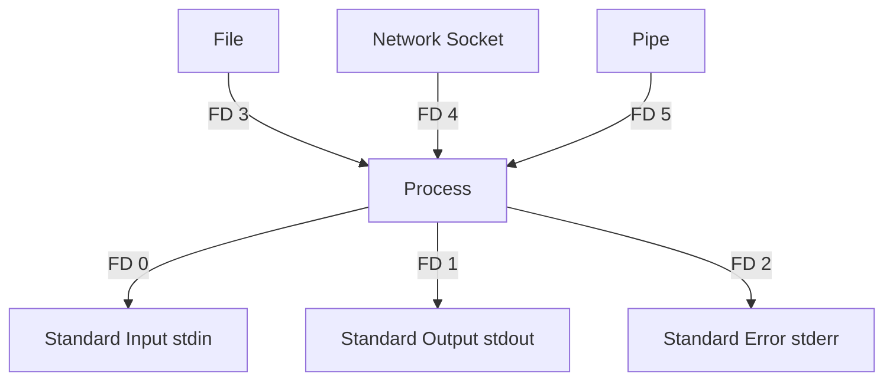

### فایل دسکریپتور چیست؟

در سیستم‌عامل‌های مبتنی بر یونیکس، از جمله لینوکس، **File Descriptor** (فایل دسکریپتور) یک عدد صحیح است که به سیستم‌عامل می‌گوید که فرآیند با چه منبعی باید ارتباط برقرار کند. این منبع می‌تواند یک فایل، یک دستگاه ورودی/خروجی (مانند کیبورد یا نمایشگر)، یک سوکت شبکه و یا حتی یک پایپ (pipe) باشد.

به‌طور ساده، فایل دسکریپتور مانند "شماره شناسه" یا "آدرس" منبعی است که فرآیند در حال استفاده از آن است. هر زمان که یک فرآیند در لینوکس یک فایل یا منبع دیگری را باز می‌کند، سیستم‌عامل به آن فرآیند یک فایل دسکریپتور اختصاص می‌دهد.

### فایل دسکریپتورهای پیش‌فرض در لینوکس:

1. **ورودی استاندارد (stdin)**:
   - عدد دسکریپتور: `0`
   - این دسکریپتور به داده‌های ورودی فرآیند اشاره می‌کند و به‌طور پیش‌فرض به صفحه‌کلید متصل است.
2. **خروجی استاندارد (stdout)**:
   - عدد دسکریپتور: `1`
   - خروجی استاندارد فرآیندها به‌طور پیش‌فرض به صفحه‌نمایش یا ترمینال متصل است.
3. **خروجی خطا (stderr)**:
   - عدد دسکریپتور: `2`
   - پیام‌های خطا یا مشکلات نیز به خروجی خطا ارسال می‌شوند و به‌طور پیش‌فرض به صفحه‌نمایش ارسال می‌شوند.

### مفهوم ساده:

وقتی شما به سیستم‌عامل می‌گویید "این فایل را بخوان" یا "این داده‌ها را بنویس"، سیستم‌عامل برای هر فایل یا منبع ارتباطی که باز می‌کنید، یک شماره (فایل دسکریپتور) تخصیص می‌دهد تا بتواند داده‌ها را از آن بخواند یا به آن بنویسد. این شماره‌ها برای مدیریت منابع بسیار ضروری هستند.

### دیاگرام File Descriptor:

در اینجا از `Mermaid` برای نمایش نحوه ارتباط فرآیندها با منابع ورودی/خروجی از طریق فایل دسکریپتورها استفاده شده است.

### توضیح دیاگرام:

- در این دیاگرام، یک **فرآیند** (Process) با چند منبع ورودی/خروجی در ارتباط است:
  - **FD 0**: به ورودی استاندارد (stdin) متصل است، که معمولاً به صفحه‌کلید مربوط می‌شود.
  - **FD 1**: به خروجی استاندارد (stdout) متصل است، که معمولاً به صفحه‌نمایش یا ترمینال مربوط می‌شود.
  - **FD 2**: به خروجی خطاهای استاندارد (stderr) متصل است، که پیام‌های خطا را به صفحه‌نمایش ارسال می‌کند.
  - **FD 3 و FD 4 و FD 5**: فایل دسکریپتورهای سفارشی هستند که می‌توانند به فایل‌ها، سوکت‌های شبکه یا پایپ‌ها (pipe) متصل شوند و توسط فرآیند استفاده شوند.

### نکته:

- سیستم‌عامل لینوکس و فرآیندها می‌توانند فایل دسکریپتورهای بیشتری را در زمان نیاز ایجاد کنند. این فایل دسکریپتورها می‌توانند به فایل‌ها، پایپ‌ها یا سوکت‌های شبکه اشاره داشته باشند و مدیریت منابع ورودی و خروجی را بسیار ساده‌تر کنند.

### چرا File Descriptor مهم است؟

فایل دسکریپتورها به شما این امکان را می‌دهند که فرآیندهای مختلف در سیستم بتوانند بدون سردرگمی به منابع مختلف دسترسی پیدا کنند. به جای اینکه هر بار آدرس یا مکان دقیق یک فایل یا منبع را بدانید، با استفاده از فایل دسکریپتور، فقط کافی است شماره آن منبع (مثلاً `3` برای یک فایل) را بدانید و سیستم‌عامل بقیه کارها را انجام می‌دهد.
