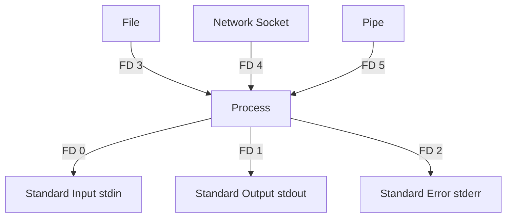

# بش ‌(Bash) چیست؟

**بش** (Bourne Again SHell) یک مفسر خط فرمان و زبان اسکریپت‌نویسی است که به طور گسترده در سیستم‌عامل‌های شبه یونیکس مانند لینوکس و macOS استفاده می‌شود. بش یک نسخه بهبود یافته از شل اصلی Bourne (sh) است که قابلیت‌های اضافی مانند بهبود توانایی‌های اسکریپت‌نویسی، ساختارهای کنترلی (if, while, for)، تاریخچه دستورات و کنترل وظایف (job control) را فراهم می‌کند.

بش به کاربران اجازه می‌دهد تا از طریق تایپ دستورات یا ایجاد اسکریپت‌ها با سیستم‌عامل تعامل داشته باشند و وظایف تکراری را خودکار کنند. این شل از توابع، متغیرها و کنترل جریان پشتیبانی می‌کند و آن را به ابزاری قدرتمند برای مدیریت سیستم و همچنین برنامه‌نویسی عمومی تبدیل می‌کند.

به طور خلاصه، بش یک شل همه‌کاره است که هم به عنوان یک مفسر خط فرمان تعاملی و هم به عنوان یک زبان اسکریپت‌نویسی برای خودکارسازی وظایف در محیط‌های مبتنی بر یونیکس عمل می‌کند.

# شِبانگ (Shebang) چیست؟

**شبانگ** (Shebang) به دنباله کاراکتری `#!` در ابتدای فایل‌های اسکریپت اشاره دارد. این دنباله به سیستم‌عامل می‌گوید که از کدام مفسر برای اجرای اسکریپت استفاده کند. به عبارت دیگر، شبانگ مشخص می‌کند که اسکریپت باید با کدام شل یا برنامه خاص اجرا شود.

برای مثال، در یک اسکریپت بش، خط اول به صورت زیر خواهد بود:

```bash
#!/bin/bash
```

در اینجا:

- `#!` دنباله‌ای است که شبانگ را نشان می‌دهد.
- `/bin/bash` مسیری است به مفسر بش که اسکریپت باید توسط آن اجرا شود.

شبانگ به اسکریپت اجازه می‌دهد که بدون نیاز به صراحتاً اجرای مفسر (مثلاً با تایپ `bash script.sh`) تنها با اجرای مستقیم فایل (مثلاً با `./script.sh`) اجرا شود، به شرطی که فایل مجوز اجرای مناسب داشته باشد.

### اهمیت شبانگ:

1. **سازگاری**: شبانگ مشخص می‌کند که اسکریپت توسط کدام مفسر اجرا شود، که به ویژه در محیط‌های مختلف (مانند سیستم‌های لینوکس و macOS) اهمیت دارد.
2. **انعطاف‌پذیری**: با تغییر مفسر در خط شبانگ، می‌توان اسکریپت‌هایی با زبان‌های مختلف (مانند Python یا Perl) نوشت.

بنابراین، شبانگ یک ویژگی کلیدی در اسکریپت‌نویسی است که باعث می‌شود اسکریپت‌ها به طور خودکار توسط مفسر مناسب اجرا شوند.

## نمونه‌های دیگر از شبانگ (Shebang)

در اسکریپت‌نویسی، شبانگ می‌تواند به مفسرهای مختلف اشاره کند، بسته به اینکه از کدام زبان برنامه‌نویسی یا ابزار استفاده می‌کنید. در زیر چند نمونه متداول از شبانگ آورده شده است:

### 1. بش (Bash)

```bash
#!/bin/bash
```

این خط اسکریپت را با استفاده از مفسر Bash اجرا می‌کند که معمولاً در مسیر `/bin/bash` قرار دارد.

### 2. شل (Sh)

```bash
#!/bin/sh
```

این خط اسکریپت را با استفاده از مفسر sh (Bourne Shell) اجرا می‌کند که یک شل قدیمی‌تر و ساده‌تر است. این شبانگ معمولاً در اسکریپت‌های بسیار سازگار با سیستم‌های مختلف استفاده می‌شود.

### 3. پایتون (Python)

```bash
#!/usr/bin/env python3
```

این شبانگ مفسر Python 3 را از مسیر `env` پیدا کرده و اسکریپت را اجرا می‌کند. استفاده از `env` به جای مسیر دقیق مفسر (مانند `/usr/bin/python3`) انعطاف‌پذیری بیشتری دارد و به سیستم اجازه می‌دهد که مفسر پایتون را از مسیرهای مختلف پیدا کند.

### 4. پرل (Perl)

```bash
#!/usr/bin/perl
```

این شبانگ برای اجرای اسکریپت‌های نوشته شده با Perl استفاده می‌شود.

### 5. نود (Node.js)

```bash
#!/usr/bin/env node
```

این شبانگ اسکریپت‌های نوشته شده با Node.js را اجرا می‌کند. همانند پایتون، استفاده از `env` به سیستم اجازه می‌دهد تا مسیر مفسر را به صورت خودکار پیدا کند.

### 6. روبی (Ruby)

```bash
#!/usr/bin/env ruby
```

این شبانگ برای اجرای اسکریپت‌های Ruby استفاده می‌شود.

### 7. زبان سی‌شارپ (C#) با استفاده از Mono

```bash
#!/usr/bin/env mono
```

این شبانگ برای اجرای برنامه‌های نوشته شده با زبان سی‌شارپ در سیستم‌های لینوکس و مک با استفاده از مفسر Mono به کار می‌رود.

### 8. تِش (Tcsh)

```bash
#!/bin/tcsh
```

این شبانگ برای اجرای اسکریپت‌هایی که در محیط tcsh (C shell) نوشته شده‌اند استفاده می‌شود.

### 9. AWK

```bash
#!/usr/bin/awk -f
```

این شبانگ برای اجرای اسکریپت‌های AWK استفاده می‌شود. گزینه `-f` نشان می‌دهد که اسکریپت AWK از یک فایل خوانده شود.

### 10. زبان R

```bash
#!/usr/bin/env Rscript
```

این شبانگ برای اجرای اسکریپت‌های نوشته شده با زبان R استفاده می‌شود.

---

### نتیجه‌گیری:

شبانگ‌ها به کاربر این امکان را می‌دهند که با استفاده از یک خط ابتدایی مشخص کنند کدام مفسر باید اسکریپت را اجرا کند. این قابلیت در اسکریپت‌نویسی باعث سادگی و انعطاف‌پذیری بیشتر در اجرای کدها می‌شود.

# Identifier در زبان‌های برنامه‌نویسی چیست؟

**Identifier** (شناسه) در زبان‌های برنامه‌نویسی به نامی اشاره دارد که برای شناسایی موجودیت‌های مختلف در یک برنامه استفاده می‌شود. این موجودیت‌ها شامل متغیرها، توابع، کلاس‌ها، ماژول‌ها و دیگر ساختارهای قابل تعریف توسط کاربر هستند.

### ویژگی‌های یک Identifier:

1. **شروع با حروف یا زیرخط (underscore)**: یک Identifier معمولاً با حروف الفبایی (A-Z یا a-z) یا زیرخط (`_`) شروع می‌شود.
2. **ترکیب از حروف، اعداد، و زیرخط**: پس از حرف اول، از اعداد (0-9) هم می‌توان استفاده کرد، ولی نمی‌توان با عدد شروع کرد.
3. **عدم وجود کاراکترهای خاص**: نمادهای خاص مانند `@`, `#`, `-`, `!` و دیگر کاراکترهای ویژه در Identifierها استفاده نمی‌شوند.
4. **حساسیت به حروف کوچک و بزرگ**: در بسیاری از زبان‌ها (مانند جاوا، پایتون، و سی)، Identifierها به حروف بزرگ و کوچک حساس هستند. به عنوان مثال، `myVar` و `myvar` دو Identifier متفاوت محسوب می‌شوند.

### مثال‌هایی از Identifier:

- `myVariable`
- `calculateSum`
- `_user_name`
- `MAX_LIMIT`

### نکات مهم:

- **کلمات کلیدی** (Keywords) زبان نمی‌توانند به عنوان Identifier استفاده شوند (مثلاً در پایتون نمی‌توان از `for` یا `if` به عنوان نام متغیر استفاده کرد).
- **خوانایی**: انتخاب نام‌های معنادار و قابل فهم برای Identifierها اهمیت زیادی در نوشتن کدهای خوانا و نگهداشت‌پذیر دارد.

### نتیجه‌گیری:

Identifierها نام‌هایی هستند که به اشیاء و موجودیت‌های مختلف در یک برنامه اختصاص داده می‌شوند و نقش مهمی در نوشتن و درک کد ایفا می‌کنند.

# تعریف متغیرها در Bash

در Bash، متغیرها یکی از عناصر کلیدی در اسکریپت‌نویسی و مدیریت سیستم هستند. متغیرها به شما امکان می‌دهند مقادیر را ذخیره کنید و در نقاط مختلف اسکریپت از آنها استفاده کنید. این مقاله به شما کمک می‌کند تا با تعریف متغیرها، انواع آنها و روش‌های دسترسی به آنها به صورت حرفه‌ای و کامل آشنا شوید.

## قانون تعریف متغیر

در Bash، تعریف یک متغیر به این صورت انجام می‌شود:

```bash
VARIABLE_NAME=value
```

- **قانون اصلی**: متغیرها باید بدون فاصله بین نام و مقدار تعریف شوند.
- از علامت `=` برای تخصیص مقدار به متغیر استفاده می‌شود.
- متغیرها به صورت پیش‌فرض نوع داده ندارند و همه مقادیر به عنوان رشته ذخیره می‌شوند.

## اهمیت Whitespace در تعریف

استفاده از فاصله (whitespace) در تعریف متغیرها بسیار مهم است. Bash نسبت به فاصله‌ها حساس است:

- **صحیح**:

  ```bash
  VAR1="Hello"
  ```

- **غلط**:
  ```bash
  VAR1 = "Hello"  # خطا: فضای خالی قبل و بعد از علامت "=" وجود دارد.
  ```

اضافه کردن فضای خالی باعث می‌شود Bash متغیر را به اشتباه تفسیر کند.

## انواع درست و غلط نامیدن متغیرها

### نام‌های صحیح:

- باید با حروف یا زیرخط (`_`) شروع شوند.
- می‌توانند شامل حروف، اعداد و زیرخط باشند.

مثال:

```bash
MY_VAR=123
_varName="Bash"
```

### نام‌های غلط:

- شروع با عدد مجاز نیست.
- استفاده از کاراکترهای خاص مانند `@`, `#`, `-`, `!` مجاز نیست.

مثال غلط:

```bash
1stVariable="Wrong"
my-var="Invalid"
```

## انواع روش‌های دسترسی به یک متغیر

برای دسترسی به مقدار یک متغیر، باید از علامت `$` قبل از نام متغیر استفاده کنید:

```bash
echo $VARIABLE_NAME
```

### دسترسی در رشته:

می‌توانید متغیر را درون یک رشته نیز استفاده کنید:

```bash
echo "My variable is $VARIABLE_NAME"
```

در صورتی که متغیر را به درستی تعریف نکرده باشید، Bash مقدار خالی نمایش می‌دهد.

## Local Variables

متغیرهای محلی تنها در داخل یک تابع یا اسکریپت دسترسی‌پذیر هستند. این متغیرها به صورت خودکار پس از اتمام اجرای تابع یا اسکریپت از بین می‌روند.

مثال:

```bash
function my_function {
  local MY_VAR="local"
  echo $MY_VAR
}
my_function  # خروجی: local
```

## Environment Variables

متغیرهای محیطی (Environment Variables) در سراسر سیستم و در همه فرآیندهای جاری دسترسی‌پذیر هستند. برای تعریف یک متغیر محیطی از دستور `export` استفاده می‌شود:

```bash
export MY_ENV_VAR="This is an environment variable"
```

این متغیر در تمام فرآیندها و اسکریپت‌های بعدی قابل دسترسی است.

## تخصیص مقدار به متغیرها

مقداردهی به متغیرها در Bash به راحتی و بدون نیاز به نوع داده انجام می‌شود. هر متغیر به صورت رشته ذخیره می‌شود و می‌تواند هر نوع داده‌ای (عدد، متن، و غیره) را نگه دارد.

مثال:

```bash
NUMBER=42
TEXT="Hello World"
```

## read-only

با استفاده از دستور `readonly` می‌توان متغیرهایی ایجاد کرد که نمی‌توان مقدار آنها را تغییر داد:

```bash
readonly MY_CONSTANT="This is constant"
```

پس از تعریف متغیر به صورت `readonly`، هر تلاشی برای تغییر مقدار آن با خطا مواجه خواهد شد.

## نکات کار با readonly

- بعد از اینکه یک متغیر به صورت `readonly` تعریف شد، نمی‌توانید آن را مجدداً مقداردهی کنید.
- می‌توانید لیستی از متغیرهای `readonly` را با دستور زیر مشاهده کنید:
  ```bash
  readonly
  ```

## حذف متغیرها

برای حذف یک متغیر از دستور `unset` استفاده می‌شود:

```bash
unset VARIABLE_NAME
```

این دستور متغیر را از حافظه حذف می‌کند و دیگر قابل دسترسی نخواهد بود.

## حذف متغیرهای read-only

متغیرهای `readonly` را نمی‌توان به سادگی با دستور `unset` حذف کرد. تلاش برای حذف چنین متغیری منجر به خطا می‌شود:

```bash
unset MY_CONSTANT  # خطا: نمی‌توان متغیر readonly را حذف کرد.
```

## ترفند حذف متغیرهای read-only

به طور کلی، در سیستم‌های لینوکسی حذف متغیرهای `readonly` با استفاده از ابزارهای استاندارد مانند `unset` امکان‌پذیر نیست. اما یک ترفند می‌تواند این کار را انجام دهد؛ با استفاده از دستورات سطح پایین‌تر یا دستکاری مستقیم فضای حافظه:

### استفاده از Bash Debugger:

یکی از ترفندهای پیشرفته این است که از Bash Debugger برای حذف یا بازنشانی متغیرهای `readonly` استفاده کنید. این تکنیک نیازمند تغییر فضای حافظه فرآیند یا اجرای شل به صورت غیراستاندارد است که برای اکثر کاربران توصیه نمی‌شود.

### استفاده از Subshell:

می‌توانید از یک `subshell` استفاده کنید تا در یک محیط جدید، متغیر `readonly` شما از بین برود و تاثیرات آن محدود به محیط جدید باشد:

```bash
(
  unset MY_CONSTANT
  # این متغیر تنها در داخل این ساب‌شل unset می‌شود
)
```

این ترفند باعث می‌شود در محیط ساب‌شل متغیر `readonly` حذف شود، اما همچنان در محیط اصلی شما قابل دسترسی باقی بماند.

# عملیات‌های ریاضی در Bash

در Bash، انجام عملیات‌های ریاضی می‌تواند با روش‌های مختلفی انجام شود. هر چند که Bash به عنوان یک شل اسکریپت‌نویسی اصلی برای دستورات متنی طراحی شده است، اما امکانات قدرتمندی برای انجام محاسبات عددی نیز فراهم می‌کند. در این آموزش، به انواع روش‌های انجام عملیات‌های ریاضی در Bash می‌پردازیم و نکات و ترفندهای جالبی را بررسی خواهیم کرد.

## انواع روش‌های انجام عملیات ریاضی

### 1. استفاده از `let`

دستور `let` یکی از ساده‌ترین روش‌ها برای انجام عملیات‌های ریاضی در Bash است. این دستور به صورت مستقیم روی متغیرها عمل می‌کند و نیازی به علامت `$` برای دسترسی به متغیرها ندارد.

مثال:

```bash
let RESULT=5+3
echo $RESULT  # خروجی: 8
```

شما می‌توانید از تمامی عملگرهای استاندارد ریاضی (جمع، تفریق، ضرب، تقسیم) استفاده کنید:

```bash
let RESULT=10-4
let RESULT=6*3
let RESULT=10/2
```

### 2. استفاده از `expr`

دستور `expr` یک ابزار قدیمی‌تر در Bash است که برای انجام عملیات ریاضی و همچنین پردازش رشته‌ها استفاده می‌شود. برخلاف `let`، نیاز به فاصله‌گذاری بین عملگرها دارد.

مثال:

```bash
RESULT=$(expr 5 + 3)
echo $RESULT  # خروجی: 8
```

نکته: از فاصله‌گذاری صحیح بین عملگرها و مقادیر اطمینان حاصل کنید، وگرنه با خطا مواجه خواهید شد.

### 3. استفاده از `$(( ... ))` (محاسبه درون‌شل)

یک روش بسیار رایج و کاربردی در Bash استفاده از دستور `$(( ... ))` است. این روش به شما امکان می‌دهد که محاسبات را مستقیماً در داخل شل انجام دهید.

مثال:

```bash
RESULT=$((5 + 3))
echo $RESULT  # خروجی: 8
```

می‌توانید از این روش برای محاسبات پیچیده‌تری نیز استفاده کنید:

```bash
RESULT=$(( (5 + 3) * 2 ))
echo $RESULT  # خروجی: 16
```

نکته: در این روش می‌توانید بدون نگرانی از فاصله‌گذاری، عملیات‌های ریاضی را در داخل پرانتزها بنویسید.

### 4. استفاده از `bc` برای محاسبات اعشاری

یکی از محدودیت‌های روش‌های بالا این است که تنها از اعداد صحیح پشتیبانی می‌کنند. اگر نیاز به محاسبات اعشاری دارید، می‌توانید از دستور `bc` استفاده کنید. `bc` یک ماشین حساب خط فرمان است که از محاسبات دقیق و اعشاری پشتیبانی می‌کند.

مثال:

```bash
RESULT=$(echo "scale=2; 10/3" | bc)
echo $RESULT  # خروجی: 3.33
```

در این مثال، `scale=2` تعداد ارقام اعشاری را مشخص می‌کند.

### 5. استفاده از `awk` برای محاسبات پیچیده

ابزار `awk` علاوه بر پردازش داده‌ها، برای انجام عملیات‌های ریاضی پیچیده نیز استفاده می‌شود. این ابزار برای محاسبات بزرگ‌تر و مدیریت داده‌های ستون‌بندی شده مناسب است.

مثال:

```bash
RESULT=$(echo "10 3" | awk '{print $1 / $2}')
echo $RESULT  # خروجی: 3.33333
```

### 6. استفاده از `declare` برای اعداد صحیح

می‌توانید متغیرها را به صورت اعداد صحیح تعریف کنید تا Bash آنها را به عنوان رشته پردازش نکند. برای این کار از دستور `declare` استفاده کنید:

```bash
declare -i NUM1=10
declare -i NUM2=3
RESULT=$((NUM1 + NUM2))
echo $RESULT  # خروجی: 13
```

### 7. استفاده از مقایسه‌های ریاضی

Bash امکان انجام مقایسه‌های ریاضی را نیز فراهم می‌کند. می‌توانید از `-eq`, `-ne`, `-lt`, `-le`, `-gt`, `-ge` برای مقایسه اعداد استفاده کنید:

مثال:

```bash
if [ $NUM1 -gt $NUM2 ]; then
  echo "$NUM1 بزرگتر از $NUM2 است."
else
  echo "$NUM1 کوچکتر یا مساوی $NUM2 است."
fi
```

## عملگرهای ریاضی در Bash

Bash از مجموعه‌ای از عملگرهای ریاضی استاندارد پشتیبانی می‌کند:

- **جمع**: `+`
- **تفریق**: `-`
- **ضرب**: `*`
- **تقسیم**: `/`
- **باقی‌مانده تقسیم (مدول)**: `%`

مثال:

```bash
NUM1=10
NUM2=3
SUM=$((NUM1 + NUM2))
DIFF=$((NUM1 - NUM2))
PRODUCT=$((NUM1 * NUM2))
QUOTIENT=$((NUM1 / NUM2))
MOD=$((NUM1 % NUM2))

echo "جمع: $SUM"
echo "تفریق: $DIFF"
echo "ضرب: $PRODUCT"
echo "تقسیم: $QUOTIENT"
echo "باقی‌مانده: $MOD"
```

## عملیات‌های افزایش و کاهش (Increment و Decrement)

در Bash می‌توانید متغیرها را به راحتی افزایش یا کاهش دهید:

- **افزایش (Increment)**:

  ```bash
  let COUNT=COUNT+1
  ```

  یا با استفاده از:

  ```bash
  ((COUNT++))
  ```

- **کاهش (Decrement)**:

  ```bash
  let COUNT=COUNT-1
  ```

  یا با استفاده از:

  ```bash
  ((COUNT--))
  ```

## ترفندهای جالب در عملیات ریاضی

### 1. محاسبه توان

برای محاسبه توان در Bash از `**` استفاده کنید:

```bash
RESULT=$((2 ** 3))  # 2 به توان 3
echo $RESULT  # خروجی: 8
```

### 2. محاسبه ریشه‌ مربعی با `bc`

می‌توانید از `bc` برای محاسبه ریشه مربعی استفاده کنید:

```bash
RESULT=$(echo "scale=2; sqrt(16)" | bc)
echo $RESULT  # خروجی: 4.00
```

### 3. تغییر مبنای عدد

Bash امکان تغییر مبنای عدد را نیز فراهم می‌کند. برای مثال، تبدیل اعداد دودویی به ده‌دهی:

```bash
RESULT=$((2#1010))  # عدد دودویی 1010 به ده‌دهی
echo $RESULT  # خروجی: 10
```

### 4. تولید اعداد تصادفی

برای تولید اعداد تصادفی می‌توانید از متغیر داخلی `$RANDOM` استفاده کنید:

```bash
echo $RANDOM
```

### 5. ایجاد محدوده برای اعداد تصادفی

برای محدود کردن عدد تصادفی به یک محدوده مشخص، از `mod` استفاده کنید:

```bash
echo $((RANDOM % 100))  # عدد تصادفی بین 0 تا 99
```

در اینجا یک جدول کامل از انواع عملگرهای ریاضی و منطقی در Bash قرار داده شده است. این جدول شامل عملگرهای اصلی، مقایسه‌ای، منطقی و عملگرهای افزایش/کاهش می‌باشد:

## جدول عملگرهای ریاضی و منطقی در Bash

### 1. Basic Arithmetic Operators (عملگرهای ریاضی پایه)

| عملگر | عملیات                | مثال            | توضیحات                 |
| ----- | --------------------- | --------------- | ----------------------- |
| `+`   | جمع                   | `a=$((5 + 3))`  | جمع دو عدد              |
| `-`   | تفریق                 | `a=$((5 - 3))`  | تفریق دو عدد            |
| `*`   | ضرب                   | `a=$((5 * 3))`  | ضرب دو عدد              |
| `/`   | تقسیم                 | `a=$((6 / 3))`  | تقسیم دو عدد            |
| `%`   | باقی‌مانده (مدول)     | `a=$((5 % 3))`  | باقی‌مانده تقسیم دو عدد |
| `**`  | توان (Exponentiation) | `a=$((2 ** 3))` | ۲ به توان ۳ (یعنی ۸)    |

### 2. Relational (Comparison) Operators (عملگرهای مقایسه‌ای)

| عملگر | عملیات             | مثال           | توضیحات                                       |
| ----- | ------------------ | -------------- | --------------------------------------------- |
| `-eq` | برابر با           | `[ 5 -eq 5 ]`  | بررسی اینکه آیا دو عدد برابر هستند یا خیر     |
| `-ne` | نابرابر با         | `[ 5 -ne 3 ]`  | بررسی نابرابری بین دو عدد                     |
| `-lt` | کوچکتر از          | `[ 5 -lt 10 ]` | بررسی اینکه آیا عدد اول کوچکتر از عدد دوم است |
| `-le` | کوچکتر یا برابر با | `[ 5 -le 10 ]` | بررسی کوچکتر یا برابر بودن عدد اول با عدد دوم |
| `-gt` | بزرگتر از          | `[ 5 -gt 3 ]`  | بررسی اینکه آیا عدد اول بزرگتر از عدد دوم است |
| `-ge` | بزرگتر یا برابر با | `[ 5 -ge 3 ]`  | بررسی بزرگتر یا برابر بودن عدد اول با عدد دوم |

### 3. Logical Operators (عملگرهای منطقی)

| عملگر  | عملیات             | مثال                         | توضیحات                                           |
| ------ | ------------------ | ---------------------------- | ------------------------------------------------- |
| `&&`   | منطقی "و" (AND)    | `[ $a -lt 5 && $b -gt 3 ]`   | بررسی اینکه هر دو شرط درست هستند یا خیر           |
| `\|\|` | منطقی "یا" (OR)    | `[ $a -lt 5 \|\| $b -gt 3 ]` | بررسی اینکه حداقل یکی از شرایط درست است           |
| `!`    | منطقی "نقیض" (NOT) | `[ ! $a -lt 5 ]`             | نقیض کردن یک شرط (بررسی اینکه شرط غلط است یا خیر) |

### 4. Increment and Decrement (عملگرهای افزایش و کاهش)

| عملگر | عملیات                    | مثال      | توضیحات                                                            |
| ----- | ------------------------- | --------- | ------------------------------------------------------------------ |
| `++`  | افزایش یک واحدی (پیشوندی) | `((++a))` | مقدار متغیر `a` را یک واحد افزایش می‌دهد، سپس استفاده می‌کند       |
| `--`  | کاهش یک واحدی (پیشوندی)   | `((--a))` | مقدار متغیر `a` را یک واحد کاهش می‌دهد، سپس استفاده می‌کند         |
| `++`  | افزایش یک واحدی (پسوندی)  | `((a++))` | از مقدار متغیر `a` استفاده می‌کند، سپس آن را یک واحد افزایش می‌دهد |
| `--`  | کاهش یک واحدی (پسوندی)    | `((a--))` | از مقدار متغیر `a` استفاده می‌کند، سپس آن را یک واحد کاهش می‌دهد   |

### توضیحات اضافی:

- **عملگرهای ریاضی پایه**: این عملگرها برای انجام محاسبات ساده ریاضی مانند جمع، تفریق، ضرب، تقسیم و توان استفاده می‌شوند.
- **عملگرهای مقایسه‌ای**: این عملگرها برای مقایسه اعداد به کار می‌روند و معمولاً در شروط (مثل `if` یا `while`) استفاده می‌شوند.
- **عملگرهای منطقی**: برای ترکیب چندین شرط منطقی در یک عبارت استفاده می‌شوند.
- **عملگرهای افزایش و کاهش**: برای افزایش یا کاهش مقدار یک متغیر به کار می‌روند و معمولاً در حلقه‌ها استفاده می‌شوند.

این جدول شامل تمامی عملگرهای اصلی و پیشرفته است که در Bash می‌توانید از آنها استفاده کنید.

## نتیجه‌گیری

در Bash، شما می‌توانید از چندین روش مختلف برای انجام عملیات‌های ریاضی استفاده کنید. ابزارهایی مانند `let`, `expr`, `$(( ... ))`, و `bc` همگی امکان انجام محاسبات ساده و پیچیده را فراهم می‌کنند. همچنین ترفندهای جالبی مانند تغییر مبنا، تولید اعداد تصادفی و محاسبه توان نیز Bash را به یک ابزار قدرتمند برای عملیات‌های ریاضی تبدیل می‌کند. مهم است که در پروژه‌های پیچیده‌تر از ابزار مناسب برای نیازهای خود استفاده کنید تا بهترین نتیجه را بگیرید.

# عملیات‌های ریاضی در Bash (پیشرفته)

در ادامه به بررسی عمیق‌تر عملیات‌های ریاضی در Bash پرداخته و روش‌های رسم جدول و نکات پیشرفته‌تری از کار با اعداد و عملیات‌های ریاضی در Bash را توضیح خواهیم داد.

## رسم جدول در Bash

شما می‌توانید با استفاده از دستورات `for` و `printf` جداول ساده‌ای در Bash رسم کنید. این جداول می‌توانند شامل مقادیر مختلف، مانند اعداد یا نتایج عملیات ریاضی، باشند. در این بخش، نحوه رسم یک جدول ضرب را بررسی خواهیم کرد.

### مثال: رسم جدول ضرب

```bash
#!/bin/bash

# رسم جدول ضرب تا 10x10
echo "جدول ضرب 10x10"
echo "-----------------------"

# هدر جدول
printf "%4s" "X"
for i in {1..10}; do
  printf "%4d" $i
done
echo ""

echo "-----------------------"

# بدنه جدول
for i in {1..10}; do
  printf "%4d" $i  # چاپ عدد ستون اول
  for j in {1..10}; do
    printf "%4d" $((i * j))  # محاسبه و چاپ ضرب اعداد
  done
  echo ""  # خط جدید پس از هر ردیف
done
```

### خروجی:

```
جدول ضرب 10x10
-----------------------
   X   1   2   3   4   5   6   7   8   9  10
-----------------------
   1   1   2   3   4   5   6   7   8   9  10
   2   2   4   6   8  10  12  14  16  18  20
   3   3   6   9  12  15  18  21  24  27  30
   4   4   8  12  16  20  24  28  32  36  40
   5   5  10  15  20  25  30  35  40  45  50
   6   6  12  18  24  30  36  42  48  54  60
   7   7  14  21  28  35  42  49  56  63  70
   8   8  16  24  32  40  48  56  64  72  80
   9   9  18  27  36  45  54  63  72  81  90
  10  10  20  30  40  50  60  70  80  90 100
```

در این مثال، از حلقه‌های `for` برای محاسبه ضرب اعداد 1 تا 10 و رسم یک جدول ضرب ساده استفاده کردیم.

### نکته: استفاده از `printf`

استفاده از `printf` به شما امکان می‌دهد تا اعداد را با فرمت‌بندی خاص و فاصله‌های یکنواخت چاپ کنید. این ابزار برای ساخت جداول و تنظیمات نمایشگر بسیار مفید است.

## انجام محاسبات پیچیده با `bc`

برای محاسبات پیچیده‌تر، همان‌طور که قبلاً گفته شد، ابزار `bc` بسیار مفید است. بیایید نحوه محاسبه عبارات پیچیده‌تری مانند انتگرال یا توابع مثلثاتی را بررسی کنیم.

### مثال: محاسبه توابع مثلثاتی

با استفاده از `bc`، شما می‌توانید توابع مثلثاتی مانند سینوس و کسینوس را محاسبه کنید:

```bash
#!/bin/bash

# محاسبه سینوس و کسینوس یک زاویه (در رادیان)
angle=1.0  # زاویه به رادیان
sin_value=$(echo "scale=4; s($angle)" | bc -l)
cos_value=$(echo "scale=4; c($angle)" | bc -l)

echo "سینوس زاویه $angle: $sin_value"
echo "کسینوس زاویه $angle: $cos_value"
```

### خروجی:

```
سینوس زاویه 1.0: 0.8415
کسینوس زاویه 1.0: 0.5403
```

### نکته: استفاده از `-l` در `bc`

گزینه `-l` به `bc` امکان می‌دهد که کتابخانه ریاضی پیشرفته را بارگذاری کند، که شامل توابع مثلثاتی و لگاریتم‌هاست.

## محاسبات ترکیبی با استفاده از `bc`

شما می‌توانید از `bc` برای انجام محاسبات ترکیبی مانند توان، لگاریتم و ریشه‌های عددی استفاده کنید.

### مثال: محاسبه ریشه سوم و لگاریتم

```bash
#!/bin/bash

# محاسبه ریشه سوم یک عدد
number=27
cube_root=$(echo "scale=3; e( l($number)/3 )" | bc -l)

# محاسبه لگاریتم طبیعی (ln)
log_value=$(echo "scale=3; l($number)" | bc -l)

echo "ریشه سوم $number: $cube_root"
echo "لگاریتم طبیعی $number: $log_value"
```

### خروجی:

```
ریشه سوم 27: 3.000
لگاریتم طبیعی 27: 3.296
```

## کار با اعداد بزرگ در Bash

در محاسبات پیچیده و یا کار با اعداد بزرگ، Bash محدودیت‌هایی دارد، اما با استفاده از `bc` می‌توانیم به راحتی با اعداد بزرگ کار کنیم.

### مثال: محاسبه فاکتوریل یک عدد بزرگ

محاسبه فاکتوریل یک عدد بزرگ با استفاده از یک اسکریپت ساده امکان‌پذیر است:

```bash
#!/bin/bash

# محاسبه فاکتوریل یک عدد با استفاده از bc
factorial=1
number=20
for (( i=1; i<=number; i++ ))
do
  factorial=$(echo "$factorial * $i" | bc)
done

echo "فاکتوریل $number: $factorial"
```

### خروجی:

```
فاکتوریل 20: 2432902008176640000
```

## جمع‌بندی

در این آموزش به بررسی عملیات‌های مختلف ریاضی در Bash پرداختیم. در این میان به روش‌های زیر اشاره کردیم:

- استفاده از `let`، `expr` و `$(( ... ))` برای انجام عملیات ساده.
- استفاده از `bc` و `awk` برای محاسبات پیشرفته‌تر و دقیق‌تر.
- رسم جدول ضرب با استفاده از `printf` و حلقه‌های `for`.
- انجام محاسبات پیچیده مانند توابع مثلثاتی، لگاریتم‌ها و ریشه‌ها با استفاده از `bc`.
- کار با اعداد بزرگ و فاکتوریل‌گیری.

### نکات پیشرفته و ترفندها:

- **فرمت‌دهی اعداد**: برای نمایش اعداد با تعداد مشخصی رقم اعشار از `printf` یا `scale` در `bc` استفاده کنید.
- **محاسبات اعشاری**: برای دقت بیشتر در محاسبات اعشاری همیشه از `bc` استفاده کنید.
- **تغییر مبنا**: در `bc` می‌توانید از `ibase` و `obase` برای تغییر مبنا استفاده کنید (مثلاً تبدیل بین مبناهای 2 و 10).

```bash
echo "obase=10; ibase=2; 1010" | bc  # تبدیل عدد دودویی 1010 به ده‌دهی
```

# نحوه استفاده از متغیرها در رشته‌ها (Strings) در Bash

در Bash، متغیرها به راحتی می‌توانند در رشته‌ها (Strings) استفاده شوند. این قابلیت به شما این امکان را می‌دهد که متن‌های پویا و قابل تنظیم ایجاد کنید. در این مقاله، نحوه استفاده از متغیرها در رشته‌ها را به صورت حرفه‌ای و با ذکر مثال‌های کاربردی بررسی خواهیم کرد.

## استفاده از متغیر در رشته‌ها

برای استفاده از متغیرها در یک رشته، کافی است نام متغیر را با علامت `$` فراخوانی کنید. این کار باعث می‌شود که مقدار متغیر به جای نام آن در خروجی قرار گیرد.

### مثال ساده:

```bash
NAME="Ali"
echo "Hello, $NAME!"
```

خروجی:

```
Hello, Ali!
```

در اینجا، مقدار متغیر `NAME` که برابر با `Ali` است، در رشته جایگزین شده است.

## استفاده از متغیرها در داخل رشته‌های دابل کوتیشن (Double Quotes)

زمانی که از متغیرها در داخل دابل کوتیشن (`" "`) استفاده می‌کنید، Bash مقدار متغیر را به درستی درون رشته جایگزین می‌کند.

### مثال:

```bash
GREETING="Hello"
NAME="Sara"
echo "$GREETING, $NAME!"
```

خروجی:

```
Hello, Sara!
```

### نکته: استفاده از رشته‌های دابل کوتیشن

- استفاده از `" "` باعث می‌شود که Bash متغیرها را پردازش کرده و مقدار آنها را جایگزین کند.
- اگر متغیرها یا رشته‌ها دارای فاصله یا کاراکترهای خاص باشند، استفاده از دابل کوتیشن الزامی است.

## استفاده از متغیرها در رشته‌های سینگل کوتیشن (Single Quotes)

در مقابل، وقتی که از سینگل کوتیشن (`' '`) استفاده می‌کنید، متغیرها پردازش نمی‌شوند و به عنوان رشته خام چاپ می‌شوند.

### مثال:

```bash
NAME="Sara"
echo 'Hello, $NAME!'
```

خروجی:

```
Hello, $NAME!
```

در این حالت، متغیر `$NAME` به عنوان یک رشته ساده بدون جایگزینی چاپ می‌شود.

### نکته: استفاده از رشته‌های سینگل کوتیشن

- از `' '` برای جلوگیری از پردازش متغیرها و کاراکترهای خاص در Bash استفاده کنید.

## استفاده از کروشه‌ها برای جدا کردن متغیرها

گاهی اوقات نیاز است که متغیر را درون رشته با کاراکترهای دیگر ترکیب کنیم. در این موارد، از کروشه‌ها (`{}`) برای مشخص کردن مرزهای متغیر استفاده می‌شود.

### مثال:

```bash
NAME="World"
echo "Hello, ${NAME}!"
```

خروجی:

```
Hello, World!
```

### مثال با کاراکترهای اضافی:

```bash
NAME="Ali"
echo "Hello, ${NAME}123!"
```

خروجی:

```
Hello, Ali123!
```

در اینجا، استفاده از کروشه‌ها تضمین می‌کند که Bash متغیر `NAME` را به درستی تشخیص دهد و رشته‌ای مانند `NAME123` به اشتباه پردازش نشود.

## ترکیب رشته‌ها و متغیرها

می‌توانید به راحتی رشته‌ها و متغیرها را با هم ترکیب کنید. ترکیب رشته‌ها در Bash بسیار ساده است و کافی است که متغیرها و رشته‌ها را به هم بچسبانید.

### مثال:

```bash
FIRST_NAME="Ali"
LAST_NAME="Rezaei"
FULL_NAME="$FIRST_NAME $LAST_NAME"
echo "Full name: $FULL_NAME"
```

خروجی:

```
Full name: Ali Rezaei
```

### ترکیب با متن ثابت:

```bash
NUMBER=5
echo "You have $NUMBER new messages."
```

خروجی:

```
You have 5 new messages.
```

## استفاده از متغیرها در دستورات پیچیده

در Bash، می‌توانید از متغیرها درون دستورات پیچیده نیز استفاده کنید. به عنوان مثال، می‌توانید از آنها درون حلقه‌ها و دستورات شرطی بهره ببرید.

### مثال با حلقه:

```bash
for i in 1 2 3; do
  echo "Loop iteration: $i"
done
```

خروجی:

```
Loop iteration: 1
Loop iteration: 2
Loop iteration: 3
```

## ترفندهای پیشرفته برای استفاده از متغیرها

### 1. پیش‌فرض قرار دادن مقدار متغیر (Default Value)

می‌توانید برای متغیرهایی که ممکن است مقداردهی نشده باشند، یک مقدار پیش‌فرض تعیین کنید. از `${VARIABLE:-default_value}` برای این کار استفاده می‌شود.

### مثال:

```bash
NAME=${NAME:-"Guest"}
echo "Hello, $NAME!"
```

خروجی اگر متغیر `NAME` تعریف نشده باشد:

```
Hello, Guest!
```

خروجی اگر متغیر `NAME` مقدار داشته باشد:

```
Hello, Ali!
```

### 2. جایگزینی مقادیر متغیرها

می‌توانید از `${VARIABLE:=default_value}` برای جایگزینی مقدار متغیر استفاده کنید، در صورتی که متغیر هنوز مقداردهی نشده باشد.

### مثال:

```bash
: ${NAME:="Ali"}
echo "Hello, $NAME!"
```

در این مثال، اگر `NAME` مقدار نداشته باشد، مقدار `Ali` به آن اختصاص داده می‌شود.

### 3. استفاده از طول متغیر

برای به دست آوردن طول یک متغیر، می‌توانید از `${#VARIABLE}` استفاده کنید.

### مثال:

```bash
STRING="Hello"
echo "Length of STRING is: ${#STRING}"
```

خروجی:

```
Length of STRING is: 5
```

### 4. استخراج زیررشته (Substring)

برای استخراج بخشی از یک رشته، می‌توانید از `${VARIABLE:position:length}` استفاده کنید.

### مثال:

```bash
STRING="Hello, World"
SUBSTRING=${STRING:0:5}
echo "Substring is: $SUBSTRING"
```

خروجی:

```
Substring is: Hello
```

## جمع‌بندی

در این آموزش، نحوه استفاده از متغیرها در رشته‌ها در Bash را بررسی کردیم. شما می‌توانید متغیرها را به راحتی در داخل رشته‌ها جایگذاری کنید، متغیرها را با هم ترکیب کنید، یا از ترفندهای پیشرفته برای مدیریت بهتر متغیرها استفاده کنید. همچنین یاد گرفتید که چگونه با استفاده از escape sequences و کروشه‌ها متغیرها را به طور صحیح و در محیط‌های پیچیده‌تر به کار ببرید.

### نکات کلیدی:

- استفاده از `$VARIABLE` برای دسترسی به مقدار متغیرها.
- استفاده از دابل کوتیشن برای جایگذاری متغیرها درون رشته‌ها.
- استفاده از سینگل کوتیشن برای نمایش متغیرها به عنوان متن خام.
- استفاده از ترفندهایی مانند مقدار پیش‌فرض و استخراج زیررشته‌ها برای مدیریت بهتر متغیرها.

# راهنمای جامع و حرفه‌ای دستور `echo` در Bash

دستور `echo` یکی از پرکاربردترین دستورات در Bash برای چاپ متن یا مقادیر در خروجی استاندارد (مانند ترمینال) است. با استفاده از این دستور می‌توان رشته‌های متنی، متغیرها، نتایج عملیات ریاضی و حتی کاراکترهای کنترلی را به نمایش درآورد. در این راهنمای جامع و حرفه‌ای، تمامی جنبه‌های استفاده از `echo` و نکات پیشرفته مربوط به آن را بررسی خواهیم کرد.

## 1. استفاده ساده از `echo`

ساده‌ترین کاربرد `echo`، نمایش مستقیم یک رشته در خروجی است:

```bash
echo "Hello, World!"
```

خروجی:

```
Hello, World!
```

در این مثال، رشته `"Hello, World!"` در خروجی چاپ می‌شود و در انتهای خروجی، به طور پیش‌فرض، یک خط جدید (newline) اضافه می‌شود.

## 2. جلوگیری از خط جدید با `-n`

به طور پیش‌فرض، `echo` پس از چاپ یک خط جدید اضافه می‌کند. اگر بخواهید این رفتار را متوقف کنید و خروجی را در همان خط نگه دارید، می‌توانید از گزینه `-n` استفاده کنید:

```bash
echo -n "Hello, "
echo "World!"
```

خروجی:

```
Hello, World!
```

در اینجا، به دلیل استفاده از `-n`، `Hello,` و `World!` در یک خط چاپ می‌شوند.

## 3. استفاده از `-e` برای تفسیر کاراکترهای کنترلی

دستور `echo` به طور پیش‌فرض کاراکترهای escape (مانند `\n` برای خط جدید یا `\t` برای tab) را تفسیر نمی‌کند، مگر اینکه از گزینه `-e` استفاده کنید. این گزینه باعث می‌شود که `echo` کاراکترهای escape را تفسیر کند و در خروجی اعمال کند.

### مثال:

```bash
echo -e "Line 1\nLine 2\nLine 3"
```

خروجی:

```
Line 1
Line 2
Line 3
```

### کاراکترهای کنترلی پرکاربرد:

- `\n`: خط جدید
- `\t`: tab
- `\r`: بازگشت به ابتدای خط
- `\\`: چاپ یک بک‌اسلش
- `\a`: صدای زنگ (bell)

### مثال دیگر با استفاده از `\t` (tab):

```bash
echo -e "Column1\tColumn2\tColumn3"
```

خروجی:

```
Column1   Column2   Column3
```

## 4. جلوگیری از تفسیر کاراکترهای escape با `-E`

در برخی از نسخه‌های Bash، `echo` ممکن است به طور پیش‌فرض کاراکترهای escape را تفسیر کند. اگر بخواهید این رفتار را غیرفعال کنید و متن را به صورت خام و بدون تفسیر کاراکترهای escape نمایش دهید، از گزینه `-E` استفاده کنید:

```bash
echo -E "Line 1\nLine 2"
```

خروجی:

```
Line 1\nLine 2
```

در اینجا، کاراکترهای escape به عنوان متن خام چاپ شده‌اند.

## 5. استفاده از متغیرها در `echo`

شما می‌توانید از `echo` برای نمایش مقادیر متغیرها استفاده کنید. به سادگی نام متغیر را با `$` فراخوانی کنید تا مقدار آن چاپ شود.

### مثال:

```bash
NAME="Ali"
echo "Hello, $NAME!"
```

خروجی:

```
Hello, Ali!
```

### ترکیب چندین متغیر:

```bash
FIRST_NAME="Ali"
LAST_NAME="Rezaei"
echo "Full Name: $FIRST_NAME $LAST_NAME"
```

خروجی:

```
Full Name: Ali Rezaei
```

## 6. استفاده از کروشه‌ها برای مرزبندی متغیرها

اگر متغیر شما به کاراکترهای مجاور متصل شود یا در حالتی نیاز به جدا کردن آن از سایر کاراکترها باشد، می‌توانید از کروشه‌ها `{}` استفاده کنید تا محدوده متغیر مشخص شود.

### مثال:

```bash
NAME="Ali"
echo "Hello, ${NAME}123!"
```

خروجی:

```
Hello, Ali123!
```

در اینجا، استفاده از کروشه‌ها تضمین می‌کند که `123` بخشی از نام متغیر نیست و فقط مقدار `NAME` به عنوان `Ali` چاپ می‌شود.

## 7. استفاده از echo برای محاسبات ریاضی

با استفاده از `$(( ))` می‌توانید عملیات ریاضی را انجام دهید و نتیجه را با `echo` چاپ کنید.

### مثال:

```bash
echo "Sum: $((5 + 3))"
```

خروجی:

```
Sum: 8
```

این دستور عملیات ریاضی را انجام داده و نتیجه را به عنوان یک رشته به `echo` ارسال می‌کند.

## 8. استفاده از echo برای نوشتن در فایل

شما می‌توانید با استفاده از `echo` محتوایی را در یک فایل ذخیره کنید. این کار با استفاده از اپراتور `>` یا `>>` برای نوشتن یا اضافه کردن به فایل انجام می‌شود.

### مثال: نوشتن در فایل

```bash
echo "This is a test file" > test.txt
```

این دستور متن `"This is a test file"` را در فایل `test.txt` می‌نویسد. اگر فایل از قبل وجود داشته باشد، محتویات آن بازنویسی می‌شود.

### مثال: اضافه کردن به فایل

```bash
echo "Additional content" >> test.txt
```

این دستور متن `"Additional content"` را به انتهای فایل `test.txt` اضافه می‌کند، بدون اینکه محتویات قبلی فایل بازنویسی شود.

## 9. استفاده از `echo` برای چاپ رنگی متن

شما می‌توانید از `echo` به همراه کدهای رنگ ANSI برای چاپ متن‌های رنگی در ترمینال استفاده کنید.

### مثال:

```bash
echo -e "\e[31mThis is red text\e[0m"
echo -e "\e[32mThis is green text\e[0m"
```

خروجی:

```
(This is red text in red color)
(This is green text in green color)
```

### توضیح کدهای ANSI:

- **`\e[31m`**: رنگ قرمز
- **`\e[32m`**: رنگ سبز
- **`\e[0m`**: بازنشانی رنگ به حالت پیش‌فرض

## 10. چاپ کاراکترهای خاص با `echo`

برای چاپ کاراکترهای خاص مانند بک‌اسلش (`\`) یا دابل کوتیشن (`"`) می‌توانید از بک‌اسلش (`\`) استفاده کنید.

### مثال:

```bash
echo "This is a backslash: \\"
echo "This is a double quote: \""
```

خروجی:

```
This is a backslash: \
This is a double quote: "
```

## 11. استفاده از echo برای نمایش خروجی دستورات دیگر

می‌توانید از `$(COMMAND)` برای جایگذاری خروجی یک دستور دیگر درون `echo` استفاده کنید.

### مثال:

```bash
echo "Current directory: $(pwd)"
```

خروجی:

```
Current directory: /home/user
```

در این مثال، دستور `pwd` مسیر جاری را چاپ می‌کند و `echo` آن را نمایش می‌دهد.

## 12. ترفندهای پیشرفته با `echo`

### 1. چاپ یک زنگ صوتی (bell)

برای ایجاد یک صدای زنگ (bell) در ترمینال می‌توانید از `\a` استفاده کنید:

```bash
echo -e "\a"
```

این دستور بسته به تنظیمات ترمینال، ممکن است صدای زنگ ایجاد کند.

### 2. چاپ چند خط متن در یک خط

اگر بخواهید چندین خط متن را بدون تغییر خط در خروجی نمایش دهید، می‌توانید از `-n` برای جلوگیری از اضافه شدن خط جدید استفاده کنید.

### مثال:

```bash
echo -n "Hello, "
echo -n "World!"
echo " How are you?"
```

خروجی:

```
Hello, World! How are you?
```

### 3. ایجاد الگوهای تکراری با `echo`

شما می‌توانید با استفاده از `echo` و حلقه‌ها، الگوهای تکراری ایجاد کنید:

```bash
for i in {1..5}; do
  echo -n "*"
done
echo ""
```

خروجی:

```
*****
```

### 4. ایجاد فاصله‌های افقی و عمودی

برای ایجاد فاصله‌های افقی (tab) و عمودی (خط جدید) در متن‌های خروجی، می‌توانید از کاراکترهای escape استفاده کنید:

```bash
echo -e "Item 1\tItem 2\tItem 3\nItem A\tItem B\tItem C"
```

خروجی:

```
Item 1  Item 2  Item 3
Item A  Item B  Item C
```

## جمع‌بندی

دستور `echo` یکی از ابزارهای قدرتمند و پرکاربرد در Bash است که امکانات زیادی برای چاپ متن، متغیرها و حتی خروجی دستورات دیگر فراهم می‌کند

. با استفاده از گزینه‌ها و ترفندهای مختلف مانند `-n`, `-e` و ترکیب با escape sequences می‌توانید خروجی‌های دلخواه خود را به راحتی ایجاد کنید.

### نکات کلیدی:

- **`-n`**: جلوگیری از اضافه شدن خط جدید.
- **`-e`**: تفسیر کاراکترهای escape.
- **`-E`**: غیرفعال کردن تفسیر کاراکترهای escape.
- استفاده از متغیرها و دستورات درون `echo` برای نمایش داده‌های پویا.

# راهنمای جامع و حرفه‌ای دستور `printf` در Bash

دستور `printf` در Bash یک ابزار قدرتمند برای فرمت‌دهی و چاپ متن‌ها، متغیرها و نتایج دستورات است. برخلاف `echo` که برای موارد ساده‌تر مناسب است، `printf` به شما این امکان را می‌دهد که کنترل بیشتری روی فرمت و چیدمان خروجی داشته باشید. این راهنمای جامع به شما نحوه استفاده از `printf`، گزینه‌های فرمت‌دهی، و نکات پیشرفته را نشان می‌دهد.

## 1. ساختار کلی `printf`

ساختار کلی دستور `printf` در Bash به شکل زیر است:

```bash
printf FORMAT [ARGUMENT]...
```

- **FORMAT**: رشته قالب (format string) که تعیین می‌کند چگونه خروجی چاپ شود.
- **ARGUMENT**: مقادیر یا متغیرهایی که بر اساس قالب فرمت‌دهی شده و چاپ می‌شوند.

### مثال ساده:

```bash
printf "Hello, %s!\n" "World"
```

خروجی:

```
Hello, World!
```

در این مثال، `%s` نشانگر یک رشته است که با مقدار `"World"` جایگزین می‌شود. `\n` برای افزودن خط جدید استفاده می‌شود.

## 2. Placeholders (جایگزین‌ها) در `printf`

`printf` از placeholderها یا جایگزین‌هایی برای فرمت‌دهی استفاده می‌کند. این placeholderها مشخص می‌کنند که چه نوع داده‌ای در خروجی چاپ شود و چگونه نمایش داده شود. برخی از placeholderهای مهم عبارتند از:

- **%s**: رشته (String)
- **%d**: عدد صحیح (Integer)
- **%f**: عدد اعشاری (Float)
- **%x**: عدد در مبنای شانزده (Hexadecimal)
- **%%**: علامت درصد `%`

### مثال:

```bash
NAME="Ali"
AGE=30
printf "Name: %s, Age: %d\n" "$NAME" "$AGE"
```

خروجی:

```
Name: Ali, Age: 30
```

در این مثال، `%s` برای چاپ رشته و `%d` برای چاپ عدد صحیح استفاده شده است.

## 3. فرمت‌دهی اعداد اعشاری (Floating-Point)

برای چاپ اعداد اعشاری با کنترل تعداد ارقام اعشار، می‌توانید از `%f` استفاده کنید. همچنین می‌توانید تعداد ارقام اعشار را مشخص کنید.

### مثال:

```bash
NUMBER=3.141592
printf "Pi: %.2f\n" "$NUMBER"
```

خروجی:

```
Pi: 3.14
```

در اینجا، `.2` تعیین می‌کند که دو رقم بعد از اعشار نمایش داده شود.

## 4. کنترل عرض فیلدها (Field Width)

با استفاده از `printf` می‌توانید عرض فیلدها را کنترل کنید. این ویژگی برای ایجاد جداول و چیدمان منظم داده‌ها بسیار مفید است. می‌توانید یک عدد را قبل از placeholder قرار دهید تا مشخص کنید که فیلد چه عرضی داشته باشد.

### مثال:

```bash
printf "%10s %10s\n" "Name" "Age"
printf "%10s %10d\n" "Alice" 25
printf "%10s %10d\n" "Bob" 30
```

خروجی:

```
      Name        Age
     Alice         25
       Bob         30
```

در این مثال، `%10s` و `%10d` عرض فیلد را برای رشته‌ها و اعداد به 10 کاراکتر تنظیم می‌کنند.

### نکته: تراز کردن به سمت چپ

برای تراز کردن به سمت چپ، می‌توانید از علامت منفی استفاده کنید:

```bash
printf "%-10s %-10s\n" "Name" "Age"
```

خروجی:

```
Name       Age
Alice      25
Bob        30
```

## 5. استفاده از `printf` برای اعداد در مبناهای مختلف

`printf` این امکان را فراهم می‌کند که اعداد را در مبناهای مختلف چاپ کنید. برای مثال، می‌توانید اعداد را در مبنای شانزده (Hexadecimal) یا مبنای هشت (Octal) چاپ کنید.

### مثال: چاپ عدد در مبنای شانزده

```bash
NUMBER=255
printf "Hexadecimal: %x\n" "$NUMBER"
```

خروجی:

```
Hexadecimal: ff
```

### مثال: چاپ عدد در مبنای هشت

```bash
NUMBER=64
printf "Octal: %o\n" "$NUMBER"
```

خروجی:

```
Octal: 100
```

## 6. چاپ چندین مقدار با `printf`

یکی از ویژگی‌های قدرتمند `printf` این است که می‌توانید چندین مقدار را به صورت همزمان چاپ کنید. `printf` با استفاده از placeholderها و مقادیر متوالی، به ازای هر placeholder، مقدار مربوطه را جایگزین می‌کند.

### مثال:

```bash
printf "Name: %s, Age: %d, Score: %.1f\n" "John" 25 95.7
```

خروجی:

```
Name: John, Age: 25, Score: 95.7
```

### تکرار قالب برای مقادیر بیشتر:

اگر تعداد مقادیر بیشتر از placeholderها باشد، `printf` به صورت چرخشی از قالب برای مقادیر اضافی استفاده می‌کند:

```bash
printf "%s %d\n" "Alice" 25 "Bob" 30 "Charlie" 35
```

خروجی:

```
Alice 25
Bob 30
Charlie 35
```

## 7. استفاده از `printf` برای چاپ در فایل

با استفاده از `printf` می‌توانید خروجی را به یک فایل هدایت کنید. این کار با استفاده از اپراتور `>` یا `>>` برای نوشتن یا اضافه کردن به فایل انجام می‌شود.

### مثال:

```bash
printf "Hello, World!\n" > output.txt
```

این دستور متن `"Hello, World!"` را در فایل `output.txt` ذخیره می‌کند.

برای اضافه کردن به فایل (بدون بازنویسی محتوا):

```bash
printf "Additional text\n" >> output.txt
```

## 8. Escape Sequences (کاراکترهای فراری)

با استفاده از `printf` می‌توانید از escape sequences برای چاپ کاراکترهای خاص مانند newline، tab، و غیره استفاده کنید. برخی از پرکاربردترین escape sequences عبارتند از:

- **\n**: خط جدید
- **\t**: tab
- **\\**: بک‌اسلش
- **\r**: بازگشت به ابتدای خط

### مثال:

```bash
printf "Line 1\nLine 2\n"
```

خروجی:

```
Line 1
Line 2
```

### مثال با tab:

```bash
printf "Column1\tColumn2\tColumn3\n"
```

خروجی:

```
Column1  Column2  Column3
```

## 9. مدیریت خطاها با `printf`

شما می‌توانید خروجی `printf` را به خروجی استاندارد خطا (stderr) هدایت کنید. برای این کار، از `>&2` استفاده کنید:

### مثال:

```bash
printf "Error: Something went wrong!\n" >&2
```

این دستور خطای `"Error: Something went wrong!"` را در خروجی خطا چاپ می‌کند.

## 10. چاپ یک علامت درصد (%)

برای چاپ یک علامت درصد در خروجی، باید از `%%` استفاده کنید. یک `%` به تنهایی به عنوان placeholder شناخته می‌شود و نیاز به escape دارد.

### مثال:

```bash
printf "Success rate: %d%%\n" 90
```

خروجی:

```
Success rate: 90%
```

## 11. ترفندهای پیشرفته با `printf`

### 1. محاسبات ریاضی

شما می‌توانید با استفاده از `$(( ))` عملیات ریاضی را انجام دهید و نتیجه را با `printf` چاپ کنید.

### مثال:

```bash
NUMBER=$((5 + 3))
printf "Sum: %d\n" "$NUMBER"
```

خروجی:

```
Sum: 8
```

### 2. چاپ محتوای فایل با `printf`

با استفاده از `cat` می‌توانید محتوای یک فایل را درون `printf` جایگذاری کرده و به شکلی خاص چاپ کنید.

### مثال:

```bash
printf "%s\n" "$(cat file.txt)"
```

این دستور محتوای فایل `file.txt` را چاپ می‌کند.

### 3. تولید خروجی‌های مرتب با `printf`

`printf` بسیار مفید است برای تولید جداول مرتب یا فرمت‌های مرتب دیگر. مثلاً برای تولید جدولی از داده‌ها:

```bash
printf "%-10s %-10s %-10s\n" "Name" "Age" "Score"
printf "%-10s %-10d %-10.1f\n" "Alice" 25 89.5
printf "%-10s %-10d %-10.1f\n" "Bob" 30 72.3
```

خروجی:

```
Name       Age        Score
Alice      25         89.5
Bob        30         72.3
```

### نکات کلیدی:

- **%s** برای چاپ رشته‌ها، **%d** برای اعداد صحیح، **%f** برای اعداد اعشاری.
- کنترل عرض فیلدها با `%10s`, `%-10s`, و غیره.
- استفاده از escape sequences برای کنترل دقیق‌تر چاپ.
- چاپ خروجی در فایل یا هدایت به خروجی استاندارد خطا.

## مثال: نوار بارگذاری به همراه درصد

در این بخش یک مثال از استفاده حرفه‌ای از دستور `printf` برای ایجاد یک نوار بارگذاری به همراه درصد نمایش داده می‌شود. این نوار به طور پیوسته در پایین ترمینال نمایش داده شده و همراه با پیشرفت عملیات، درصد بارگذاری نیز به‌روز می‌شود.

### اسکریپت نوار بارگذاری:

```bash
#!/bin/bash

# تابع برای بدست آوردن عرض ترمینال
get_terminal_width() {
    tput cols # تعداد ستون‌ها (عرض ترمینال) را بدست می‌آورد
}

# تابعی برای انتقال مکان‌نما به پایین صفحه
move_to_bottom() {
    local terminal_height
    terminal_height=$(tput lines)       # تعداد سطرهای ترمینال را بدست می‌آورد
    tput cup $((terminal_height - 1)) 0 # مکان‌نما را به آخرین خط می‌برد
}

# تابعی برای نمایش نوار بارگذاری به همراه درصد
show_loading_bar() {
    local progress=0
    local terminal_width
    terminal_width=$(get_terminal_width)         # عرض ترمینال (طول نوار بارگذاری)
    local loading_width=$((terminal_width - 10)) # طول نوار بارگذاری به همراه فضای درصد و کروشه‌ها

    move_to_bottom # انتقال مکان‌نما به پایین صفحه

    while [ "$progress" -le "$loading_width" ]; do
        # محاسبه درصد پیشرفت
        local percent=$((progress * 100 / loading_width))

        # رسم نوار بارگذاری
        printf "\r["
        local i=0
        while [ $i -lt $progress ]; do
            printf "="
            ((i++))
        done

        # رسم فلش و فضای خالی پس از نوار
        printf ">"
        local spaces=$((loading_width - progress))
        while [ $spaces -gt 0 ]; do
            printf " "
            ((spaces--))
        done

        # نمایش درصد به صورت ثابت در انتهای نوار
        printf "] %3d%%" "$percent"

        sleep 0.05 # تأخیر برای شبیه‌سازی عملیات
        ((progress++))
    done
    printf "\n" # اضافه کردن خط جدید پس از اتمام نوار
}

# شبیه‌سازی یک عملیات طولانی
clear # پاک کردن صفحه
echo "Running the proccess..."
show_loading_bar
echo "Operation is done!"
```

### توضیحات:

این اسکریپت از `printf` برای نمایش یک نوار بارگذاری استفاده می‌کند که به‌طور پیوسته در پایین ترمینال حرکت کرده و درصد پیشرفت عملیات را نشان می‌دهد.

1. **عرض نوار بارگذاری**: عرض نوار بارگذاری به اندازه عرض فعلی ترمینال تنظیم می‌شود. از تابع `tput cols` برای به دست آوردن تعداد ستون‌های ترمینال استفاده می‌شود. عرض نوار بارگذاری به گونه‌ای تنظیم شده که فضا برای نمایش درصد پیشرفت باقی بماند.

2. **محاسبه درصد پیشرفت**: درصد پیشرفت با استفاده از فرمول `(progress * 100 / loading_width)` محاسبه می‌شود و به صورت عددی در کنار نوار بارگذاری چاپ می‌شود.

3. **فلش و فضای خالی**: در نوار بارگذاری، یک فلش (`>`) برای نمایش پیشرفت نوار بعد از `=` ها قرار داده می‌شود، و بقیه‌ی فضای نوار با فاصله‌های خالی پر می‌شود تا در هر لحظه طول نوار با طول کل ترمینال همخوانی داشته باشد.

4. **استفاده از `tput` برای کنترل مکان‌نما**: این اسکریپت با استفاده از دستور `tput` مکان‌نما را به پایین صفحه منتقل کرده و به‌طور مرتب نوار بارگذاری را به‌روزرسانی می‌کند، به‌طوری که نوار همیشه در پایین ترمینال باقی بماند.

### نکات مهم:

- `tput cols` برای به دست آوردن عرض ترمینال و `tput lines` برای تعداد سطرهای ترمینال استفاده می‌شود.
- `%3d%%` در `printf`، درصد پیشرفت را با عرض ثابت (سه رقم) و همراه با علامت `%` نمایش می‌دهد.
- از `\r` برای بازگشت مکان‌نما به ابتدای خط استفاده شده تا نوار بارگذاری بازنویسی شود و خروجی آن به‌طور پیوسته به‌روزرسانی گردد.

### خروجی نهایی:

```
Running the proccess...

[============>                                  ] 23%
```

## جمع‌بندی

دستور `printf`یکی از ابزارهای قدرتمند برای فرمت‌دهی خروجی در Bash است. با استفاده از placeholderها، می‌توانید رشته‌ها، اعداد صحیح، اعداد اعشاری و مقادیر دیگر را به شکل دقیق و کنترل‌شده چاپ کنید. علاوه بر این،`printf`به شما امکان کنترل کامل روی عرض فیلدها، تراز کردن خروجی، و چاپ اعداد در مبناهای مختلف را می‌دهد. این ویژگی‌ها`printf` را به ابزاری عالی برای تولید خروجی‌های حرفه‌ای در اسکریپت‌های Bash تبدیل می‌کند.

# راهنمای جامع و کامل درباره Special Variables در Bash

در Bash، متغیرهای خاص (Special Variables) متغیرهایی هستند که Bash به صورت داخلی برای مدیریت رفتار اسکریپت‌ها و فرامین استفاده می‌کند. این متغیرها مقادیر خاصی مانند آرگومان‌های خط فرمان، وضعیت خروجی دستورات، و PID (شناسه فرآیند) را در خود نگه می‌دارند و به کاربران و اسکریپت‌نویسان اجازه می‌دهند که به اطلاعات مهمی دسترسی پیدا کنند.

در این راهنما، به تمامی Special Variables موجود در Bash پرداخته و نکات و ترفندهای مرتبط با آنها را توضیح خواهیم داد.

## لیست متغیرهای خاص (Special Variables)

### 1. `$0`

این متغیر نام اسکریپت جاری را نگه می‌دارد. وقتی یک اسکریپت Bash اجرا می‌شود، `$0` نام فایل اسکریپت را باز می‌گرداند.

### مثال:

```bash
#!/bin/bash
echo "Script name: $0"
```

### نکته:

- اگر اسکریپت با مسیر کامل اجرا شود، `$0` نیز مسیر کامل را نشان می‌دهد. به عنوان مثال، اگر اسکریپت به شکل `/home/user/script.sh` اجرا شود، مقدار `$0` برابر با `/home/user/script.sh` خواهد بود.

### 2. `$1`, `$2`, ..., `$N`

این متغیرها آرگومان‌های خط فرمان را نگه می‌دارند. `$1` اولین آرگومان، `$2` دومین آرگومان و به همین ترتیب تا `$N` که Nام آرگومان را نشان می‌دهد.

### مثال:

```bash
#!/bin/bash
echo "First argument: $1"
echo "Second argument: $2"
```

### نکته:

- اگر تعداد آرگومان‌ها بیشتر از 9 باشد، می‌توانید از `${10}` و بالاتر برای دسترسی به آرگومان‌های بعدی استفاده کنید.

### 3. `$#`

این متغیر تعداد آرگومان‌های پاس داده شده به اسکریپت را نشان می‌دهد. این متغیر برای بررسی اینکه آیا تعداد کافی آرگومان به اسکریپت داده شده است یا خیر بسیار مفید است.

### مثال:

```bash
#!/bin/bash
echo "Number of arguments: $#"
```

### نکته:

- این متغیر تنها تعداد آرگومان‌ها را بازمی‌گرداند و مقادیر آنها را نشان نمی‌دهد.

### 4. `$@` و `$*`

این متغیرها تمام آرگومان‌های خط فرمان را به صورت یک رشته نمایش می‌دهند، اما با تفاوت‌های ظریف:

- **`$@`**: آرگومان‌ها را به صورت جداگانه درون دابل کوتیشن‌ها (`""`) باز می‌گرداند.
- **`$*`**: تمام آرگومان‌ها را به عنوان یک رشته واحد باز می‌گرداند.

### مثال:

```bash
#!/bin/bash
echo "Using \$@:"
for arg in "$@"; do
  echo "$arg"
done

echo "Using \$*:"
for arg in "$*"; do
  echo "$arg"
done
```

### نکته:

- **`$@`** بیشتر برای استفاده در حلقه‌های `for` مناسب است، چرا که هر آرگومان به صورت جداگانه پردازش می‌شود.
- **`$*`** تمام آرگومان‌ها را به عنوان یک رشته واحد بازمی‌گرداند و برای کاربردهای خاص مناسب‌تر است.

### 5. `$?`

این متغیر وضعیت خروجی آخرین دستور اجرا شده را نگه می‌دارد. اگر دستور قبلی موفقیت‌آمیز باشد، مقدار `$?` برابر با `0` است، و اگر با خطا مواجه شده باشد، مقدار آن یک عدد غیر صفر خواهد بود.

### مثال:

```bash
#!/bin/bash
ls /nonexistent_directory
echo "Exit status of last command: $?"
```

### نکته:

- `$?` به طور معمول برای بررسی وضعیت اجرای دستورات و اسکریپت‌ها استفاده می‌شود تا مشخص شود که آیا دستورات با موفقیت اجرا شده‌اند یا خیر.

### 6. `$$`

این متغیر شناسه فرآیند (PID) اسکریپت جاری را نشان می‌دهد. هر فرآیند در سیستم لینوکس یک شناسه فرآیند منحصربه‌فرد دارد و با استفاده از `$$` می‌توانید به آن دسترسی پیدا کنید.

### مثال:

```bash
#!/bin/bash
echo "Process ID: $$"
```

### نکته:

- از این متغیر می‌توانید برای ایجاد فایل‌های موقت که نام آنها بر اساس شناسه فرآیند منحصر به فرد باشد، استفاده کنید.

### 7. `$!`

این متغیر PID آخرین فرآیندی که به صورت پس‌زمینه اجرا شده است را برمی‌گرداند. وقتی دستوری را به پس‌زمینه منتقل می‌کنید، `$!` شناسه آن را نگه می‌دارد.

### مثال:

```bash
#!/bin/bash
sleep 60 &
echo "PID of the background process: $!"
```

### نکته:

- `$!` بسیار مفید است وقتی می‌خواهید فرآیندهای پس‌زمینه را کنترل یا متوقف کنید.

### 8. `$_`

این متغیر آخرین آرگومان استفاده شده توسط دستور قبلی را نشان می‌دهد. به طور معمول، `$_` آخرین مقدار چاپ شده یا آخرین آرگومان از دستوری که اجرا شده است را باز می‌گرداند.

### مثال:

```bash
#!/bin/bash
echo "First argument: $1"
echo "Using \$_: $_"
```

### نکته:

- این متغیر برای استفاده در دستورات تکراری یا برای دسترسی سریع به آخرین آرگومان کاربردی است.

## نکات و ترفندها در استفاده از Special Variables

### 1. بررسی تعداد آرگومان‌ها

با استفاده از `$#` می‌توانید بررسی کنید که آیا تعداد درستی از آرگومان‌ها به اسکریپت داده شده است یا خیر.

```bash
#!/bin/bash
if [ $# -lt 2 ]; then
  echo "Usage: $0 <arg1> <arg2>"
  exit 1
fi
```

### 2. استفاده از `$@` برای پردازش آرگومان‌ها

وقتی می‌خواهید آرگومان‌ها را به صورت جداگانه پردازش کنید، استفاده از `$@` بسیار مناسب است.

```bash
for arg in "$@"; do
  echo "Processing argument: $arg"
done
```

### 3. استفاده از `$$` برای ایجاد فایل‌های موقت

از `$$` می‌توانید برای ایجاد فایل‌های موقت با نام منحصربه‌فرد استفاده کنید تا از تداخل با دیگر فایل‌ها جلوگیری شود.

```bash
#!/bin/bash
temp_file="/tmp/tempfile_$$.txt"
echo "Creating temporary file: $temp_file"
touch "$temp_file"
```

### 4. کنترل فرآیندهای پس‌زمینه با `$!`

می‌توانید از `$!` برای کنترل و مدیریت فرآیندهای پس‌زمینه استفاده کنید.

```bash
#!/bin/bash
long_running_task &
task_pid=$!
echo "Task is running in background with PID: $task_pid"
wait $task_pid
echo "Task finished."
```

### 5. بررسی وضعیت خروجی با `$?`

از `$?` می‌توانید برای بررسی وضعیت اجرای دستورات و تصمیم‌گیری در ادامه اسکریپت استفاده کنید.

```bash
#!/bin/bash
command
if [ $? -eq 0 ]; then
  echo "Command succeeded."
else
  echo "Command failed."
fi
```

## جدول Special Variables در Bash

| متغیر           | توضیحات                                                                                      | مثال                                          |
| --------------- | -------------------------------------------------------------------------------------------- | --------------------------------------------- |
| `$0`            | نام اسکریپت جاری را نگه می‌دارد                                                              | `echo "Script name: $0"`                      |
| `$1`, `$2`, ... | آرگومان‌های خط فرمان را نگه می‌دارند. `$1` اولین آرگومان و `$N` آرگومان Nام را نمایش می‌دهد. | `echo "First argument: $1"`                   |
| `$#`            | تعداد آرگومان‌های پاس داده شده به اسکریپت را نشان می‌دهد.                                    | `echo "Number of arguments: $#"`              |
| `$@`            | تمام آرگومان‌ها را به صورت جداگانه درون دابل کوتیشن‌ها باز می‌گرداند.                        | `for arg in "$@"; do echo "$arg"; done`       |
| `$*`            | تمام آرگومان‌ها را به عنوان یک رشته واحد باز می‌گرداند.                                      | `for arg in "$*"; do echo "$arg"; done`       |
| `$?`            | وضعیت خروجی آخرین دستور را باز می‌گرداند.                                                    | `ls /nonexistent_dir; echo "Exit status: $?"` |
| `$$`            | شناسه فرآیند (PID) اسکریپت جاری را نشان می‌دهد.                                              | `echo "Process ID: $$"`                       |
| `$!`            | شناسه آخرین فرآیندی که به پس‌زمینه ارسال شده است را نگه می‌دارد.                             | `sleep 60 & echo "Background PID: $!"`        |
| `$_`            | آخرین آرگومان از دستور قبلی یا آخرین مقدار چاپ شده را نشان می‌دهد.                           | `echo "Last argument: $_"`                    |

### توضیحات تکمیلی:

- **`$0`**: می‌تواند مسیر کامل اسکریپت را نمایش دهد.
- **`$#`**: برای بررسی تعداد صحیح آرگومان‌ها قبل از اجرای عملیات اصلی استفاده می‌شود.
- **`$@`**: هر آرگومان را جداگانه درون یک حلقه پردازش می‌کند.
- **`$?`**: برای بررسی موفقیت یا شکست یک دستور استفاده می‌شود.
- **`$$`**: برای ایجاد فایل‌های موقت با نام منحصربه‌فرد براساس PID کاربرد دارد.

این جدول متغیرهای خاص Bash را به‌طور خلاصه توضیح می‌دهد و مثال‌های کاربردی برای هرکدام ارائه می‌دهد.

## جمع‌بندی

Special Variables در Bash ابزارهایی قدرتمند برای مدیریت و کنترل اسکریپت‌ها هستند. آنها اطلاعات مهمی مانند آرگومان‌های خط فرمان، وضعیت اجرای دستورات، شناسه فرآیندها، و بسیاری از داده‌های دیگر را فراهم می‌کنند که در بهبود کیفیت و کارایی اسکریپت‌های شما مؤثرند.

# راهنمای جامع درباره Environment Variables در Bash

متغیرهای محیطی (Environment Variables) در Bash، متغیرهایی هستند که مقادیر آنها به طور گسترده در سیستم‌عامل و در بین فرآیندها و شل‌های مختلف به اشتراک گذاشته می‌شوند. این متغیرها می‌توانند تنظیمات سیستم، مسیرها، و پارامترهای مهمی را نگه‌دارند که برای اجرای نرم‌افزارها و اسکریپت‌ها لازم هستند.

در این راهنما، نحوه کار با متغیرهای محیطی، ارث‌بری آنها در فرآیندها و شل‌های مختلف، و ترفندها و نکات مفیدی برای استفاده از آنها را بررسی خواهیم کرد.

## تعریف متغیرهای محیطی (Environment Variables)

### 1. تعریف یک متغیر محیطی

برای تعریف یک متغیر محیطی از دستور `export` استفاده می‌شود. این دستور متغیری که تعریف می‌شود را به شل و همه فرآیندهای فرزند آن معرفی می‌کند.

### مثال:

```bash
export MY_VARIABLE="Hello, World"
```

### نکته:

- در اینجا، متغیر `MY_VARIABLE` به تمام فرآیندها و اسکریپت‌هایی که در این شل یا از این شل اجرا می‌شوند، منتقل می‌شود.

### 2. نمایش متغیرهای محیطی

برای نمایش متغیرهای محیطی تعریف شده در شل جاری، می‌توانید از دستور `printenv` یا `env` استفاده کنید:

```bash
printenv
```

یا:

```bash
env
```

برای مشاهده مقدار یک متغیر خاص می‌توانید از `echo` استفاده کنید:

```bash
echo $MY_VARIABLE
```

## ارث‌بری متغیرهای محیطی در فرآیندها

متغیرهای محیطی در Bash از والد به فرزند به ارث می‌رسند. به عبارت دیگر، وقتی یک فرآیند جدید در شل ایجاد می‌شود (مثلاً با اجرای یک اسکریپت یا نرم‌افزار)، متغیرهای محیطی از شل والد به آن فرآیند جدید منتقل می‌شوند.

### مثال:

1. **تعریف یک متغیر محیطی**:

   ```bash
   export MY_VAR="Test Value"
   ```

2. **اجرای یک اسکریپت یا نرم‌افزار**:

   ```bash
   ./myscript.sh
   ```

اگر در `myscript.sh` دستور `echo $MY_VAR` وجود داشته باشد، مقدار `MY_VAR` که در شل والد تنظیم شده بود، در این اسکریپت نیز قابل دسترسی خواهد بود.

### نکته مهم:

- متغیرهای محیطی فقط به فرآیندهای فرزند منتقل می‌شوند. اگر در یک اسکریپت متغیری را تعریف کنید و آن را `export` نکنید، آن متغیر فقط در همان شل (یا فرآیند) موجود خواهد بود و به فرآیندهای فرزند ارث نمی‌رسد.

## ارث‌بری در شل‌های جدید

هنگامی که یک شل جدید از شل فعلی باز می‌کنید، متغیرهای محیطی به شل جدید نیز منتقل می‌شوند. برای مثال، اگر از شل Bash جدیدی از شل فعلی اجرا کنید:

```bash
bash
```

تمام متغیرهای محیطی تعریف‌شده در شل والد، در شل جدید نیز در دسترس خواهند بود. با این حال، متغیرهایی که `export` نشده‌اند، فقط در شل جاری موجود خواهند بود و به شل جدید منتقل نمی‌شوند.

### مثال:

```bash
MY_VAR="Local Value"  # این متغیر فقط در شل فعلی قابل دسترسی است
export MY_ENV_VAR="Exported Value"  # این متغیر به شل‌های جدید ارث می‌رسد
```

در شل جدید:

```bash
echo $MY_ENV_VAR  # این متغیر ارث‌برده شده است
echo $MY_VAR  # این متغیر موجود نیست
```

## استفاده از متغیرهای محیطی در اسکریپت‌ها

در اسکریپت‌ها می‌توانید از متغیرهای محیطی به راحتی استفاده کنید. به سادگی می‌توانید متغیرهای محیطی را تعریف کرده و با `export` آنها را در اسکریپت‌های خود به اشتراک بگذارید.

### مثال ساده:

```bash
#!/bin/bash

echo "User: $USER"
echo "Home Directory: $HOME"
```

### متغیرهای پیش‌فرض Bash

Bash تعدادی از متغیرهای محیطی را به طور پیش‌فرض تنظیم می‌کند که در بسیاری از اسکریپت‌ها و فرآیندها مورد استفاده قرار می‌گیرند. برخی از متغیرهای محیطی پیش‌فرض عبارتند از:

- **`HOME`**: مسیر دایرکتوری خانگی کاربر.
- **`USER`**: نام کاربری جاری.
- **`PATH`**: مسیرهایی که برای جستجوی فایل‌های اجرایی استفاده می‌شود.
- **`SHELL`**: مسیر شل فعلی کاربر.
- **`PWD`**: مسیر دایرکتوری فعلی.

### تغییر متغیرهای محیطی پیش‌فرض:

شما می‌توانید متغیرهای محیطی پیش‌فرض را تغییر دهید. برای مثال، تغییر مسیر `PATH` برای اضافه کردن دایرکتوری‌های جدید به جستجوگر فایل‌های اجرایی:

```bash
export PATH=$PATH:/new/directory/path
```

## متغیرهای محیطی و اسکریپت‌های login

هنگامی که یک شل login باز می‌کنید (برای مثال هنگام لاگین به سیستم یا باز کردن ترمینال در حالت login)، شل فایل‌هایی مانند `.bash_profile`, `.bashrc`, `.profile` را بارگذاری می‌کند. این فایل‌ها معمولاً برای تنظیم متغیرهای محیطی استفاده می‌شوند.

### تنظیم متغیرهای محیطی در `.bashrc`:

```bash
export EDITOR=nano
export PATH=$PATH:/usr/local/bin
```

### تفاوت بین `.bashrc` و `.bash_profile`:

- **`.bash_profile`** معمولاً برای شل‌های login اجرا می‌شود.
- **`.bashrc`** برای هر شل جدید (چه login و چه interactive) اجرا می‌شود.

## ترفندها و نکات

### 1. اضافه کردن دائمی متغیرهای محیطی

برای اضافه کردن متغیرهای محیطی به صورت دائمی، می‌توانید آنها را در فایل‌های تنظیمات شل مانند `.bashrc` یا `.bash_profile` قرار دهید. با این کار، هر بار که شل جدیدی باز می‌شود، این متغیرها به صورت خودکار تنظیم می‌شوند.

### 2. استفاده از متغیرهای محلی و جهانی

متغیرهای محلی (local) فقط در شل فعلی قابل دسترسی هستند و به فرآیندهای فرزند ارث نمی‌رسند، در حالی که متغیرهای محیطی با استفاده از `export` به فرآیندهای فرزند منتقل می‌شوند.

```bash
MY_VAR="local value"  # فقط در این شل
export MY_ENV_VAR="global value"  # به تمام فرآیندهای فرزند ارث می‌رسد
```

### 3. پاک کردن متغیرهای محیطی

برای حذف یک متغیر محیطی، می‌توانید از دستور `unset` استفاده کنید:

```bash
unset MY_ENV_VAR
```

### 4. استفاده از `env` برای اجرای موقت با متغیرهای محیطی

با استفاده از دستور `env` می‌توانید اسکریپت یا برنامه‌ای را با تنظیمات موقت متغیرهای محیطی اجرا کنید، بدون اینکه متغیرهای اصلی سیستم تغییر کنند.

### مثال:

```bash
env MY_TEMP_VAR="Temporary Value" ./myscript.sh
```

در این حالت، `MY_TEMP_VAR` فقط برای `myscript.sh` تعریف شده است و پس از پایان اجرای اسکریپت، از بین می‌رود.

### 5. تغییر `PATH` به صورت موقت

برای تغییر موقت مسیر `PATH` و اجرای یک دستور یا اسکریپت، می‌توانید از متغیرهای محیطی موقت استفاده کنید:

```bash
PATH=/new/path:$PATH ./myscript.sh
```

## جمع‌بندی

متغیرهای محیطی در Bash نقش کلیدی در کنترل و مدیریت اجرای اسکریپت‌ها و برنامه‌ها ایفا می‌کنند. با استفاده از این متغیرها می‌توانیم مقادیر مهمی را در شل و فرآیندهای مختلف به اشتراک بگذاریم و آنها را به طور مؤثری مدیریت کنیم. همچنین، با استفاده از ترفندهای مختلف مانند تنظیم دائمی متغیرها یا استفاده از `env` برای اجرای موقت، می‌توانیم انعطاف‌پذیری بیشتری در اسکریپت‌نویسی و مدیریت محیط کاری خود داشته باشیم.

# آموزش استفاده از دستور `declare` در Bash

دستور `declare` یکی از دستورات قدرتمند در Bash است که به شما امکان می‌دهد متغیرها را با ویژگی‌های خاصی تعریف و مدیریت کنید. این دستور به شما اجازه می‌دهد که نوع متغیرها را مشخص کرده، آنها را به صورت فقط خواندنی (`readonly`) تعریف کرده و حتی آرایه‌ها را مدیریت کنید.

در این راهنما، نحوه استفاده از `declare` و گزینه‌های مختلف آن را توضیح خواهیم داد.

## ساختار کلی `declare`

ساختار کلی استفاده از `declare` به این صورت است:

```bash
declare [OPTION] variable_name
```

- **`[OPTION]`**: گزینه‌هایی که ویژگی‌های خاصی به متغیر اختصاص می‌دهند (مثلاً تعریف متغیر فقط خواندنی، عدد صحیح و غیره).
- **`variable_name`**: نام متغیری که تعریف می‌کنید.

## 1. تعریف متغیرهای محلی با `declare -l`

یکی از کاربردهای اصلی `declare` تعریف متغیرهای محلی است که فقط در محدوده یک تابع قابل دسترسی باشند. برای تعریف یک متغیر محلی از گزینه `-l` استفاده می‌شود:

```bash
function my_function {
    declare -l local_var="Hello, Local"
    echo "$local_var"
}
my_function
```

### نکته:

- متغیرهای محلی تنها در محدوده تابعی که در آن تعریف شده‌اند وجود دارند و خارج از آن تابع قابل دسترسی نیستند.

## 2. تعریف متغیرهای فقط خواندنی (Readonly) با `declare -r`

با استفاده از `declare -r` می‌توانید متغیرهایی تعریف کنید که پس از مقداردهی قابل تغییر نیستند. این متغیرها به عنوان متغیرهای فقط خواندنی شناخته می‌شوند.

### مثال:

```bash
declare -r PI=3.14
echo $PI
PI=3.14159  # خطا: تلاش برای تغییر مقدار متغیر فقط خواندنی
```

### نکته:

- متغیرهای فقط خواندنی برای ثابت‌ها و مقادیر مهمی که نباید تغییر کنند مناسب هستند.

## 3. تعریف متغیرهای عدد صحیح با `declare -i`

اگر می‌خواهید متغیری فقط اعداد صحیح را قبول کند و به طور خودکار محاسبات ریاضی انجام شود، از گزینه `-i` استفاده کنید.

### مثال:

```bash
declare -i COUNT=5
COUNT=$((COUNT + 10))  # اضافه کردن عدد
echo $COUNT  # خروجی: 15
```

### نکته:

- متغیرهای عدد صحیح از محاسبات ریاضی به طور خودکار پشتیبانی می‌کنند و اگر مقداری غیرعددی به آن اختصاص داده شود، نادیده گرفته می‌شود.

## 4. تعریف آرایه‌ها با `declare -a`

برای تعریف یک آرایه می‌توانید از گزینه `-a` استفاده کنید. آرایه‌ها به شما این امکان را می‌دهند که چندین مقدار را در یک متغیر نگه دارید.

### مثال:

```bash
declare -a fruits=("Apple" "Banana" "Cherry")
echo "${fruits[0]}"  # دسترسی به عنصر اول
```

### نکته:

- با استفاده از `${fruits[@]}` می‌توانید به تمام عناصر آرایه دسترسی پیدا کنید.

### افزودن عنصر جدید به آرایه:

```bash
fruits[3]="Orange"
```

## 5. تعریف آرایه‌های مرتبط با `declare -A`

آرایه‌های مرتبط یا associative arrays به شما این امکان را می‌دهند که از کلیدهای غیر عددی برای دسترسی به عناصر استفاده کنید. برای تعریف این نوع آرایه‌ها از گزینه `-A` استفاده می‌شود.

### مثال:

```bash
declare -A capital
capital[France]="Paris"
capital[Germany]="Berlin"
capital[Italy]="Rome"

echo "Capital of France: ${capital[France]}"
```

### نکته:

- آرایه‌های مرتبط از Bash 4.0 به بعد پشتیبانی می‌شوند.

## 6. نمایش نوع متغیرها با `declare -p`

برای مشاهده نوع متغیر و مقدار آن می‌توانید از گزینه `-p` استفاده کنید. این دستور اطلاعات مربوط به متغیر را چاپ می‌کند.

### مثال:

```bash
declare -i num=10
declare -p num  # خروجی: declare -i num="10"
```

### نکته:

- این دستور مفید است زمانی که می‌خواهید نوع و ویژگی‌های متغیرها را در اسکریپت‌های خود بررسی کنید.

## 7. تبدیل رشته به حروف کوچک یا بزرگ با `declare -l` و `declare -u`

با استفاده از `declare -l` می‌توانید یک رشته را به طور خودکار به حروف کوچک تبدیل کنید و با `declare -u` می‌توانید آن را به حروف بزرگ تبدیل کنید.

### مثال:

- **تبدیل به حروف کوچک**:

```bash
declare -l my_var="HELLO"
echo $my_var  # خروجی: hello
```

- **تبدیل به حروف بزرگ**:

```bash
declare -u my_var="hello"
echo $my_var  # خروجی: HELLO
```

## 8. استفاده از `declare` در توابع

با استفاده از `declare` می‌توانید متغیرهای محلی داخل توابع تعریف کنید که فقط در محدوده آن تابع قابل استفاده هستند.

### مثال:

```bash
my_function() {
    declare -i local_var=10
    echo "Local variable: $local_var"
}

my_function
echo "Trying to access local_var: $local_var"  # local_var در خارج از تابع در دسترس نیست
```

### نکته:

- متغیرهایی که با `declare` در توابع تعریف می‌شوند، فقط در همان تابع معتبر هستند.

## 9. بررسی اینکه آیا متغیرها قبلاً تعریف شده‌اند با `declare -p`

با استفاده از `declare -p` می‌توانید بررسی کنید که آیا متغیرها قبلاً تعریف شده‌اند یا نه.

### مثال:

```bash
if declare -p my_var > /dev/null 2>&1; then
    echo "my_var is already defined."
else
    echo "my_var is not defined."
fi
```

## جمع‌بندی

دستور `declare` در Bash ابزار قدرتمندی برای تعریف و مدیریت متغیرها با ویژگی‌های خاص است. این دستور به شما اجازه می‌دهد متغیرهایی با ویژگی‌های مشخص مانند فقط خواندنی، عدد صحیح، آرایه‌ای و محلی تعریف کنید. همچنین می‌توانید متغیرها را به صورت رشته‌های حروف بزرگ یا کوچک تعریف کنید و نوع متغیرها را به راحتی بررسی کنید.

### نکات کلیدی:

- **`declare -r`**: برای تعریف متغیرهای فقط خواندنی.
- **`declare -i`**: برای تعریف متغیرهای عدد صحیح.
- **`declare -a`**: برای تعریف آرایه‌ها.
- **`declare -A`**: برای تعریف آرایه‌های مرتبط.
- **`declare -l` و `declare -u`**: برای تبدیل خودکار به حروف کوچک یا بزرگ.

# راهنمای جامع Padding در Bash

Padding در Bash به معنای اضافه کردن کاراکترهای خاص (معمولاً فضاهای خالی یا صفرها) به یک رشته یا عدد برای رسیدن به طول مشخص است. این تکنیک برای ساختن خروجی‌های مرتب و قالب‌بندی شده به‌کار می‌رود. در این مستند، به بررسی نحوه استفاده از Padding در Bash، ترفندهای مرتبط و جدول خلاصه‌ای برای یادآوری بهتر خواهیم پرداخت.

## استفاده از Padding در `printf`

دستور `printf` در Bash یکی از پرکاربردترین ابزارها برای انجام عملیات Padding است. این دستور به شما امکان می‌دهد که به رشته‌ها یا اعداد قالب خاصی بدهید و طول مشخصی برای آنها تنظیم کنید.

### ساختار کلی `printf`

```bash
printf "FORMAT" ARGUMENTS
```

- **FORMAT**: قالبی که برای نمایش داده‌ها استفاده می‌شود.
- **ARGUMENTS**: مقادیری که بر اساس قالب فرمت‌دهی شده و چاپ می‌شوند.

### 1. Padding سمت چپ با فضاها (Left Padding with Spaces)

برای اضافه کردن فضاهای خالی به سمت چپ یک رشته یا عدد، می‌توانید از `printf` به همراه یک عدد مثبت استفاده کنید که عرض فیلد (طول خروجی نهایی) را مشخص می‌کند.

#### مثال:

```bash
printf "%10s\n" "Bash"
```

خروجی:

```
      Bash
```

در این مثال، `Bash` با فضاهای خالی از سمت چپ Padding شده و طول خروجی برابر با 10 کاراکتر است.

### 2. Padding سمت چپ با صفرها (Left Padding with Zeros)

برای اضافه کردن صفرها به سمت چپ یک عدد، می‌توانید از `printf` به همراه `%0Nd` استفاده کنید که `N` عددی است که نشان می‌دهد طول نهایی باید چند کاراکتر باشد.

#### مثال:

```bash
printf "%05d\n" 42
```

خروجی:

```
00042
```

در این مثال، عدد `42` با صفرهایی از سمت چپ Padding شده تا طول آن به 5 کاراکتر برسد.

### 3. Padding سمت راست (Right Padding)

برای اضافه کردن Padding به سمت راست یک رشته، می‌توانید از `-` استفاده کنید تا مقادیر به سمت چپ تراز شوند و فضاهای خالی به سمت راست اضافه شوند.

#### مثال:

```bash
printf "%-10s\n" "Bash"
```

خروجی:

```
Bash
```

در این مثال، رشته `Bash` به سمت چپ تراز شده و فضاهای خالی در سمت راست آن اضافه شده‌اند.

### 4. ترکیب Padding با اعداد اعشاری

شما می‌توانید از Padding در ترکیب با اعداد اعشاری نیز استفاده کنید. برای این کار می‌توانید از `printf` به همراه `%N.Mf` استفاده کنید که `N` طول کل و `M` تعداد ارقام بعد از اعشار را مشخص می‌کند.

#### مثال:

```bash
printf "%8.2f\n" 3.14159
```

خروجی:

```
    3.14
```

در این مثال، عدد اعشاری `3.14159` به دو رقم اعشار گرد شده و با فضاهای خالی در سمت چپ Padding شده است تا طول کل آن 8 کاراکتر باشد.

## استفاده از Padding برای تراز کردن جداول

یکی از کاربردهای اصلی Padding در Bash، تراز کردن خروجی‌ها به‌ویژه در جداول است. برای مثال، می‌توانید ستون‌ها را با استفاده از `printf` به خوبی قالب‌بندی کنید تا خوانایی خروجی‌ها افزایش یابد.

#### مثال جدول:

```bash
printf "%-10s %-10s %-10s\n" "Name" "Age" "Score"
printf "%-10s %-10d %-10.2f\n" "Alice" 25 89.5
printf "%-10s %-10d %-10.2f\n" "Bob" 30 72.3
```

خروجی:

```
Name       Age        Score
Alice      25         89.50
Bob        30         72.30
```

در این مثال، هر ستون به طور خودکار با استفاده از Padding تراز شده است.

## ترفندها و نکات

### 1. استفاده از `%*s` برای تعیین طول به‌صورت پویا

می‌توانید از `%*s` استفاده کنید تا طول فیلد (عرض Padding) به‌صورت پویا توسط یک آرگومان تعیین شود.

#### مثال:

```bash
width=10
printf "%*s\n" $width "Bash"
```

خروجی:

```
      Bash
```

### 2. Padding با کاراکترهای دیگر به‌جای فضا یا صفر

در Bash، به صورت پیش‌فرض از فضا یا صفر برای Padding استفاده می‌شود، اما با استفاده از یک حلقه می‌توانید از کاراکترهای دیگر نیز استفاده کنید.

#### مثال:

```bash
padding_char="-"
padded_string=$(printf "%10s" "Bash" | tr " " "$padding_char")
echo "$padded_string"
```

خروجی:

```
------Bash
```

### 3. کنترل دقیق فرمت‌ها

همیشه دقت کنید که از قالب‌بندی مناسب (`%s`، `%d`، `%f`) برای رشته‌ها، اعداد صحیح و اعداد اعشاری استفاده کنید. استفاده نادرست از قالب‌بندی ممکن است باعث خطا یا نتایج غیرمنتظره شود.

## جدول خلاصه Padding در Bash

| قالب‌بندی            | توضیحات                                           | مثال                            | خروجی        |
| -------------------- | ------------------------------------------------- | ------------------------------- | ------------ |
| `%Ns`                | Padding سمت چپ با فضاها برای رشته‌ها              | `printf "%10s" "Bash"`          | ` Bash`      |
| `%0Nd`               | Padding سمت چپ با صفرها برای اعداد                | `printf "%05d" 42`              | `00042`      |
| `%-Ns`               | Padding سمت راست با فضاها برای رشته‌ها            | `printf "%-10s" "Bash"`         | `Bash `      |
| `%N.Mf`              | Padding برای اعداد اعشاری با تعداد مشخصی از ارقام | `printf "%8.2f" 3.14159`        | ` 3.14`      |
| `%*s`                | Padding پویا (تعیین طول به‌صورت آرگومان)          | `printf "%*s" 10 "Bash"`        | ` Bash`      |
| ترکیب Padding و حلقه | Padding با کاراکترهای دیگر به‌جای فضا             | `tr " " "-"` در `printf "%10s"` | `------Bash` |

### جمع‌بندی:

در این راهنما، نحوه استفاده از Padding در Bash برای رشته‌ها، اعداد صحیح و اعداد اعشاری را بررسی کردیم. دستور `printf` ابزاری قدرتمند برای قالب‌بندی و تراز کردن خروجی‌ها است و می‌تواند به شما کمک کند تا اسکریپت‌های Bash خود را حرفه‌ای‌تر و قابل خواندن‌تر بنویسید. با استفاده از تکنیک‌های Padding، می‌توانید خروجی‌های مرتب‌تری ایجاد کنید که خواندن آنها در ترمینال آسان‌تر باشد.

# راهنمای جامع درباره آرگومان‌ها، Whitespace‌ها و IFS در Bash

در این مستند، به بررسی آرگومان‌ها (Arguments)، فضاهای خالی (Whitespaces) و متغیر IFS (Internal Field Separator) در Bash می‌پردازیم. این مفاهیم اساسی نقش بسیار مهمی در نحوه پردازش ورودی‌ها، مدیریت فایل‌ها و اسکریپت‌های Bash دارند. در این راهنما با نحوه کار با آرگومان‌ها، مدیریت فضاهای خالی و استفاده از IFS آشنا می‌شوید.

## 1. آرگومان‌ها در Bash

آرگومان‌ها مقادیری هستند که به هنگام اجرای اسکریپت از طریق خط فرمان به آن پاس داده می‌شوند. آرگومان‌ها می‌توانند مقادیر مختلفی از قبیل رشته‌ها، اعداد یا مسیر فایل‌ها باشند.

### دسترسی به آرگومان‌ها

- `$0`: نام اسکریپت را نگه می‌دارد.
- `$1`, `$2`, ..., `$N`: به آرگومان‌های خط فرمان دسترسی دارند.
- `$#`: تعداد آرگومان‌های پاس داده شده به اسکریپت را برمی‌گرداند.
- `$@`: لیستی از تمامی آرگومان‌ها.
- `$*`: مشابه `$@` اما با تفاوت‌های جزیی در مدیریت فضاهای خالی.

### مثال ساده:

```bash
#!/bin/bash
echo "Name of script: $0"
echo "First argument: $1"
echo "Second argument: $2"
echo "Number of arguments: $#"
echo "All arguments: $@"
```

### تفاوت `$@` و `$*`:

- **`$@`**: آرگومان‌ها را به صورت جداگانه و مستقل مدیریت می‌کند و در حلقه‌ها کاربرد بیشتری دارد.
- **`$*`**: همه آرگومان‌ها را به عنوان یک رشته واحد پردازش می‌کند.

### مثال برای تفاوت:

```bash
#!/bin/bash
for arg in "$@"; do
    echo "Arg using \$@: $arg"
done

for arg in "$*"; do
    echo "Arg using \$*: $arg"
done
```

### جدول مقایسه‌ای `$@` و `$*`:

| نوع  | مدیریت آرگومان‌ها                                      | مناسب برای                   |
| ---- | ------------------------------------------------------ | ---------------------------- |
| `$@` | هر آرگومان را به صورت جداگانه پردازش می‌کند            | حلقه‌ها                      |
| `$*` | تمام آرگومان‌ها را به عنوان یک رشته واحد پردازش می‌کند | پردازش به عنوان یک رشته واحد |

## 2. فضاهای خالی (Whitespaces)

در Bash، فضاهای خالی (مانند space, tab, newline) نقش مهمی در جداسازی دستورات و آرگومان‌ها دارند. اگر فضاهای خالی به درستی مدیریت نشوند، ممکن است آرگومان‌ها یا دستورات به اشتباه پردازش شوند.

### مثال مشکل ناشی از Whitespace:

اگر در اسکریپتی بخواهید یک رشته با فضاهای خالی را پردازش کنید و آن را داخل دابل کوتیشن نگذارید، نتیجه ممکن است غیرمنتظره باشد.

```bash
#!/bin/bash
var=Hello World
echo $var  # فقط "Hello" چاپ می‌شود و "World" به عنوان آرگومان دوم محسوب می‌شود.
```

### راه حل:

برای پردازش صحیح فضاهای خالی، باید از دابل کوتیشن استفاده کنید:

```bash
#!/bin/bash
var="Hello World"
echo "$var"  # خروجی صحیح: "Hello World"
```

### نکته: اجتناب از تغییرات ناخواسته در مقادیر

برای جلوگیری از حذف ناخواسته فضاهای خالی، همیشه متغیرها را داخل دابل کوتیشن قرار دهید.

## 3. IFS (Internal Field Separator)

متغیر IFS (جداکننده فیلد داخلی) در Bash تعیین می‌کند که چگونه Bash فیلدها (یا آرگومان‌ها) را در دستورات و ورودی‌ها جدا کند. به طور پیش‌فرض، IFS با فاصله (space)، تب (tab) و خط جدید (newline) تنظیم شده است.

### نمایش مقدار پیش‌فرض IFS:

```bash
echo "$IFS" | cat -A
```

### تغییر مقدار IFS

شما می‌توانید مقدار IFS را تغییر دهید تا از کاراکترهای دیگری برای جداسازی فیلدها استفاده شود. این کار معمولاً هنگام پردازش فایل‌های CSV یا داده‌های جداشده با کاراکترهای خاص مفید است.

### مثال: استفاده از کاما به عنوان IFS

فرض کنید می‌خواهید یک فایل CSV را پردازش کنید که فیلدهای آن با کاما (`,`) جدا شده‌اند. برای این کار، باید مقدار IFS را به کاما تغییر دهید.

```bash
#!/bin/bash
IFS=","
input="apple,banana,cherry"
for fruit in $input; do
    echo "Fruit: $fruit"
done
```

### بازگرداندن مقدار پیش‌فرض IFS:

پس از تغییر مقدار IFS، بهتر است آن را به مقدار پیش‌فرض برگردانید تا از مشکلات احتمالی در سایر بخش‌های اسکریپت جلوگیری شود.

```bash
IFS=$' \t\n'  # مقدار پیش‌فرض IFS
```

### جدول مقایسه کاربردهای IFS:

| نوع کاربرد              | مقدار IFS | توضیحات                                         |
| ----------------------- | --------- | ----------------------------------------------- |
| پیش‌فرض                 | ` \t\n`   | جداکننده فیلدها به صورت فضای خالی، تب و خط جدید |
| پردازش فایل CSV         | `,`       | جداکننده فیلدها با کاما                         |
| جدا کردن با نقطه‌ویرگول | `;`       | برای پردازش ورودی‌های جداشده با نقطه‌ویرگول     |

### ترفندهای کار با IFS

1. **پردازش فایل‌های CSV**: با تغییر مقدار IFS به `,`، می‌توانید فایل‌های CSV را به راحتی پردازش کنید.
2. **مدیریت رشته‌ها**: اگر رشته‌ای دارید که به وسیله کاراکتر خاصی جدا شده است، با تغییر IFS می‌توانید به سادگی آن را پردازش کنید.
3. **بازگرداندن مقدار پیش‌فرض IFS**: پس از تغییر IFS، همیشه مقدار آن را به حالت پیش‌فرض برگردانید تا از مشکلات غیرمنتظره جلوگیری شود.

## جمع‌بندی

- **آرگومان‌ها**: برای دسترسی به آرگومان‌های خط فرمان از `$0`, `$1`, ... و `$@` استفاده کنید. تفاوت‌های ظریفی بین `$@` و `$*` وجود دارد که بسته به نیاز باید از آن‌ها استفاده کنید.
- **Whitespace**: مدیریت صحیح فضاهای خالی با استفاده از دابل کوتیشن‌ها ضروری است تا از جداسازی اشتباه آرگومان‌ها جلوگیری شود.
- **IFS**: تغییر مقدار IFS به شما امکان می‌دهد فیلدها را با کاراکترهای دلخواه جدا کنید. این ویژگی به ویژه برای پردازش فایل‌های CSV و داده‌های پیچیده مفید است.

### جدول خلاصه آرگومان‌ها، Whitespace و IFS:

| مفهوم           | توضیحات                                                        | مثال یا کاربرد                                                                   |
| --------------- | -------------------------------------------------------------- | -------------------------------------------------------------------------------- |
| `$0`            | نام اسکریپت جاری                                               | `echo "Script name: $0"`                                                         |
| `$1`, `$2`, ... | دسترسی به آرگومان‌های خط فرمان                                 | `echo "First argument: $1"`                                                      |
| `$@`            | لیستی از تمام آرگومان‌ها، به صورت مستقل                        | `for arg in "$@"; do echo "$arg"; done`                                          |
| `$*`            | تمام آرگومان‌ها به صورت یک رشته واحد                           | `for arg in "$*"; do echo "$arg"; done`                                          |
| Whitespace      | فضاهای خالی در خط فرمان که آرگومان‌ها را جدا می‌کنند           | `"Hello World"` برای جلوگیری از جداسازی اشتباه باید داخل دابل کوتیشن استفاده شود |
| IFS             | جداکننده داخلی فیلدها (به طور پیش‌فرض فضای خالی، تب و خط جدید) | `IFS=","` برای پردازش فایل‌های CSV با استفاده از کاما                            |

# راهنمای جامع درباره آرایه‌ها در Bash

آرایه‌ها در Bash به شما این امکان را می‌دهند که چندین مقدار را در یک متغیر ذخیره کرده و به‌راحتی به آن‌ها دسترسی پیدا کنید. برخلاف اکثر زبان‌های برنامه‌نویسی، آرایه‌ها در Bash می‌توانند مقادیری از انواع مختلف را در خود نگه‌دارند (رشته‌ها، اعداد و ...). در این مستند، به بررسی روش‌های ایجاد آرایه، ابزارهای کار با آرایه‌ها و نحوه مدیریت آن‌ها می‌پردازیم.

## 1. تعریف آرایه‌ها در Bash

در Bash، آرایه‌ها به دو نوع اصلی تقسیم می‌شوند:

- **آرایه‌های اندیسی (Indexed Arrays)**: هر عنصر یک اندیس عددی دارد.
- **آرایه‌های مرتبط (Associative Arrays)**: از کلید‌های غیرعددی برای دسترسی به عناصر استفاده می‌شود (از Bash 4.0 به بعد).

### 1.1. آرایه‌های اندیسی

آرایه‌های اندیسی، آرایه‌هایی هستند که در آن‌ها هر عنصر با یک اندیس عددی شناخته می‌شود.

#### روش‌های ایجاد آرایه اندیسی:

1. استفاده از علامت پرانتز:

   ```bash
   my_array=("apple" "banana" "cherry")
   ```

2. افزودن مقدار به یک اندیس خاص:

   ```bash
   my_array[0]="apple"
   my_array[1]="banana"
   ```

3. استفاده از `declare`:
   ```bash
   declare -a my_array
   my_array=("apple" "banana" "cherry")
   ```

### 1.2. آرایه‌های مرتبط (Associative Arrays)

آرایه‌های مرتبط به شما امکان می‌دهند که از کلیدهای غیرعددی برای دسترسی به مقادیر استفاده کنید. این ویژگی از Bash 4.0 به بعد پشتیبانی می‌شود.

#### روش ایجاد آرایه مرتبط:

1. استفاده از `declare`:

   ```bash
   declare -A my_associative_array
   my_associative_array=([name]="Alice" [age]="30" [city]="New York")
   ```

2. افزودن مقدار به یک کلید خاص:
   ```bash
   my_associative_array[name]="Alice"
   my_associative_array[age]="30"
   ```

## 2. دسترسی به عناصر آرایه

### 2.1. دسترسی به عناصر در آرایه‌های اندیسی

برای دسترسی به یک عنصر خاص از آرایه‌های اندیسی، از نام آرایه به همراه اندیس عنصر استفاده می‌شود.

#### مثال:

```bash
echo "${my_array[0]}"  # خروجی: apple
echo "${my_array[1]}"  # خروجی: banana
```

### 2.2. دسترسی به عناصر در آرایه‌های مرتبط

برای دسترسی به یک عنصر در آرایه‌های مرتبط، از کلید آن عنصر استفاده می‌شود.

#### مثال:

```bash
echo "${my_associative_array[name]}"  # خروجی: Alice
echo "${my_associative_array[city]}"  # خروجی: New York
```

## 3. افزودن و تغییر عناصر آرایه

### 3.1. افزودن عنصر جدید به آرایه‌های اندیسی

می‌توانید با تعیین اندیس جدید، عنصر جدیدی به آرایه اضافه کنید.

#### مثال:

```bash
my_array[3]="orange"
```

### 3.2. افزودن عنصر جدید به آرایه‌های مرتبط

برای افزودن عنصر جدید به آرایه‌های مرتبط، کافی است یک کلید جدید تعریف کنید.

#### مثال:

```bash
my_associative_array[country]="USA"
```

## 4. پیمایش و پردازش عناصر آرایه

### 4.1. پیمایش آرایه‌های اندیسی

با استفاده از حلقه `for` و دستور `${my_array[@]}` می‌توانید به تمام عناصر آرایه دسترسی پیدا کنید.

#### مثال:

```bash
for element in "${my_array[@]}"; do
    echo "$element"
done
```

### 4.2. پیمایش آرایه‌های مرتبط

برای پیمایش آرایه‌های مرتبط از `${!my_associative_array[@]}` استفاده می‌کنیم که لیست کلیدها را برمی‌گرداند.

#### مثال:

```bash
for key in "${!my_associative_array[@]}"; do
    echo "$key: ${my_associative_array[$key]}"
done
```

## 5. ابزارهای کار با آرایه‌ها

### 5.1. تعداد عناصر آرایه

برای به دست آوردن تعداد عناصر یک آرایه، از `${#array[@]}` استفاده می‌شود.

#### مثال:

```bash
echo "Number of elements: ${#my_array[@]}"
```

### 5.2. حذف یک عنصر از آرایه

برای حذف یک عنصر خاص از آرایه، از دستور `unset` استفاده می‌شود.

#### مثال حذف عنصر از آرایه اندیسی:

```bash
unset my_array[1]  # حذف عنصر با اندیس 1
```

#### مثال حذف عنصر از آرایه مرتبط:

```bash
unset my_associative_array[age]  # حذف عنصر با کلید age
```

### 5.3. دسترسی به تمام عناصر

برای دسترسی به تمام عناصر یک آرایه، از `${array[@]}` یا `${array[*]}` استفاده می‌شود.

#### مثال:

```bash
echo "${my_array[@]}"  # چاپ تمام عناصر
```

### 5.4. دسترسی به تمام اندیس‌ها

برای دسترسی به تمام اندیس‌های یک آرایه اندیسی، از `${!array[@]}` استفاده می‌شود.

#### مثال:

```bash
echo "${!my_array[@]}"  # چاپ تمام اندیس‌های آرایه
```

### 5.5. مقداردهی مجدد به کل آرایه

برای مقداردهی مجدد به کل آرایه می‌توانید آرایه را دوباره تعریف کنید:

```bash
my_array=("new_value1" "new_value2")
```

یا برای آرایه‌های مرتبط:

```bash
declare -A my_associative_array=([key1]="value1" [key2]="value2")
```

## 6. آرایه‌های چندبعدی در Bash

در Bash به طور مستقیم از آرایه‌های چندبعدی پشتیبانی نمی‌شود، اما می‌توان با ترکیب آرایه‌های عادی، آرایه‌های چندبعدی شبیه‌سازی کرد.

### مثال:

```bash
my_array1=("apple" "banana")
my_array2=("carrot" "tomato")

multi_array=("${my_array1[@]}" "${my_array2[@]}")
```

## 7. نکات و ترفندها

### 7.1. مقادیر پیش‌فرض آرایه‌ها

می‌توانید یک آرایه را بدون مقداردهی اولیه تعریف کنید و سپس به صورت پویا به آن مقدار اضافه کنید.

```bash
declare -a new_array
new_array[0]="value1"
```

### 7.2. بررسی وجود کلید در آرایه مرتبط

برای بررسی اینکه یک کلید در آرایه مرتبط وجود دارد یا نه، می‌توانید از ساختار زیر استفاده کنید:

```bash
if [[ -v my_associative_array[key] ]]; then
    echo "Key exists."
else
    echo "Key does not exist."
fi
```

## جدول خلاصه‌ای از ابزارها و دستورات کار با آرایه‌ها

| دستور                          | توضیحات                              | مثال                                 |
| ------------------------------ | ------------------------------------ | ------------------------------------ |
| `declare -a array`             | تعریف آرایه اندیسی                   | `declare -a my_array`                |
| `declare -A array`             | تعریف آرایه مرتبط                    | `declare -A my_associative_array`    |
| `${array[@]}`                  | دسترسی به تمام عناصر آرایه           | `echo "${my_array[@]}"`              |
| `${!array[@]}`                 | دسترسی به تمام اندیس‌های آرایه       | `echo "${!my_array[@]}"`             |
| `${#array[@]}`                 | به دست آوردن تعداد عناصر آرایه       | `echo "${#my_array[@]}"`             |
| `unset array[index]`           | حذف یک عنصر از آرایه اندیسی          | `unset my_array[1]`                  |
| `unset array[key]`             | حذف یک عنصر از آرایه مرتبط           | `unset my_associative_array[age]`    |
| `for element in "${array[@]}"` | پیمایش عناصر آرایه اندیسی            | `for element in "${my_array[@]}"`    |
| `for key in "${!array[@]}"`    | پیمایش کلیدها و عناصر در آرایه مرتبط | `for key in "${!my_associative[@]}"` |

## جمع‌بندی

در این راهنما به بررسی کامل آرایه‌ها در Bash پرداختیم. شما یاد گرفتید که چگونه آرایه‌های اندیسی و مرتبط ایجاد کرده، عناصر آن‌ها را دستکاری کرده و از ابزارهای مختلف برای مدیریت آرایه‌ها استفاده کنید. همچنین روش‌های پیمایش و حذف عناصر از آرایه‌ها و همچنین ابزارهای مختلف برای پردازش آرایه‌ها را یاد گرفتید. این دانش به شما کمک می‌کند تا اسکریپت‌های Bash خود را به شکل کارآمدتر و پیشرفته‌تری بنویسید.

# راهنمای جامع عملیات مقایسه‌ای در Bash

عملیات‌های مقایسه‌ای در Bash یکی از مهم‌ترین ابزارها برای کار با داده‌ها، متغیرها و آرایه‌ها هستند. این عملیات به شما امکان می‌دهد که مقادیر مختلف را با هم مقایسه کنید و نتایج منطقی (True یا False) دریافت کنید. در این مستند، تمام روش‌های مقایسه‌ای موجود در Bash را به‌صورت کامل و جامع بررسی می‌کنیم.

در اینجا تاکید داریم که از عبارات کنترلی مثل `if` یا `case` استفاده نکنیم و تنها از `[]` یا `[[]]` برای مقایسه استفاده شود.

## مقایسه‌های عددی

در Bash، مقایسه اعداد با استفاده از عملگرهای خاصی انجام می‌شود. برای مقایسه اعداد، باید از `[]` یا `[[]]` استفاده کنید که هرکدام ویژگی‌های خاص خود را دارند.

### عملگرهای مقایسه عددی در Bash

| عملگر | توضیحات                                 | مثال          |
| ----- | --------------------------------------- | ------------- |
| `-eq` | برابر بودن (Equal)                      | `[ 5 -eq 5 ]` |
| `-ne` | نابرابر بودن (Not Equal)                | `[ 5 -ne 3 ]` |
| `-lt` | کوچکتر بودن (Less Than)                 | `[ 3 -lt 5 ]` |
| `-le` | کوچکتر یا برابر بودن (Less or Equal)    | `[ 5 -le 5 ]` |
| `-gt` | بزرگتر بودن (Greater Than)              | `[ 7 -gt 3 ]` |
| `-ge` | بزرگتر یا برابر بودن (Greater or Equal) | `[ 7 -ge 7 ]` |

### مثال‌های کاربردی:

#### مقایسه دو عدد:

```bash
[ 10 -gt 5 ]  # صحیح: 10 بزرگتر از 5 است
[ 3 -lt 2 ]   # نادرست: 3 کوچکتر از 2 نیست
```

# راهنمای جامع عملیات مقایسه‌ای در Bash

عملیات‌های مقایسه‌ای در Bash یکی از مهم‌ترین ابزارها برای کار با داده‌ها، متغیرها و آرایه‌ها هستند. این عملیات به شما امکان می‌دهد که مقادیر مختلف را با هم مقایسه کنید و نتایج منطقی (True یا False) دریافت کنید. در این مستند، تمام روش‌های مقایسه‌ای موجود در Bash را به‌صورت کامل و جامع بررسی می‌کنیم.

در اینجا تاکید داریم که از عبارات کنترلی مثل `if` یا `case` استفاده نکنیم و تنها از `[]` یا `[[]]` برای مقایسه استفاده شود.

## مقایسه‌های عددی

در Bash، مقایسه اعداد با استفاده از عملگرهای خاصی انجام می‌شود. برای مقایسه اعداد، باید از `[]` یا `[[]]` استفاده کنید که هرکدام ویژگی‌های خاص خود را دارند.

### عملگرهای مقایسه عددی در Bash

| عملگر | توضیحات                                 | مثال          |
| ----- | --------------------------------------- | ------------- |
| `-eq` | برابر بودن (Equal)                      | `[ 5 -eq 5 ]` |
| `-ne` | نابرابر بودن (Not Equal)                | `[ 5 -ne 3 ]` |
| `-lt` | کوچکتر بودن (Less Than)                 | `[ 3 -lt 5 ]` |
| `-le` | کوچکتر یا برابر بودن (Less or Equal)    | `[ 5 -le 5 ]` |
| `-gt` | بزرگتر بودن (Greater Than)              | `[ 7 -gt 3 ]` |
| `-ge` | بزرگتر یا برابر بودن (Greater or Equal) | `[ 7 -ge 7 ]` |

### مثال‌های کاربردی:

#### مقایسه دو عدد:

```bash
[ 10 -gt 5 ]  # صحیح: 10 بزرگتر از 5 است
[ 3 -lt 2 ]   # نادرست: 3 کوچکتر از 2 نیست
```

#### مقایسه برابر بودن:

```bash
[ 5 -eq 5 ]   # صحیح: هر دو عدد برابرند
[ 4 -ne 5 ]   # صحیح: 4 با 5 نابرابر است
```

## مقایسه رشته‌ها

در Bash، برای مقایسه رشته‌ها از عملگرهای متفاوتی نسبت به مقایسه‌های عددی استفاده می‌شود.

### عملگرهای مقایسه رشته‌ای در Bash

| عملگر | توضیحات                         | مثال                      |
| ----- | ------------------------------- | ------------------------- |
| `=`   | برابر بودن دو رشته              | `[ "apple" = "apple" ]`   |
| `!=`  | نابرابر بودن دو رشته            | `[ "apple" != "banana" ]` |
| `<`   | کوچکتر بودن رشته (از لحاظ لغوی) | `[ "apple" < "banana" ]`  |
| `>`   | بزرگتر بودن رشته (از لحاظ لغوی) | `[ "banana" > "apple" ]`  |
| `-z`  | رشته خالی است                   | `[ -z "$var" ]`           |
| `-n`  | رشته غیرخالی است                | `[ -n "$var" ]`           |

### مثال‌های کاربردی:

#### مقایسه برابر بودن رشته‌ها:

```bash
[ "foo" = "foo" ]   # صحیح: دو رشته برابرند
[ "foo" != "bar" ]  # صحیح: رشته‌ها نابرابرند
```

#### مقایسه خالی یا غیرخالی بودن رشته:

```bash
[ -z "" ]     # صحیح: رشته خالی است
[ -n "hello" ]  # صحیح: رشته غیرخالی است
```

### نکته:

- برای جلوگیری از مشکلات احتمالی در مقایسه رشته‌ها، همیشه متغیرها یا مقادیر رشته‌ای را در دابل کوتیشن قرار دهید.

## مقایسه فایل‌ها

Bash همچنین ابزارهای قدرتمندی برای مقایسه ویژگی‌های فایل‌ها در اختیار دارد. با استفاده از این ابزارها می‌توانید بررسی کنید که آیا فایل یا دایرکتوری وجود دارد، آیا خواندنی یا نوشتنی است و غیره.

### عملگرهای مقایسه فایل‌ها در Bash

| عملگر | توضیحات                                       | مثال                    |
| ----- | --------------------------------------------- | ----------------------- |
| `-e`  | بررسی وجود فایل یا دایرکتوری                  | `[ -e /path/to/file ]`  |
| `-f`  | بررسی وجود فایل معمولی (نه دایرکتوری)         | `[ -f /path/to/file ]`  |
| `-d`  | بررسی وجود دایرکتوری                          | `[ -d /path/to/dir ]`   |
| `-r`  | بررسی خواندنی بودن فایل                       | `[ -r /path/to/file ]`  |
| `-w`  | بررسی نوشتنی بودن فایل                        | `[ -w /path/to/file ]`  |
| `-x`  | بررسی اجرایی بودن فایل                        | `[ -x /path/to/file ]`  |
| `-s`  | بررسی اینکه فایل خالی نیست                    | `[ -s /path/to/file ]`  |
| `-nt` | بررسی اینکه فایل اول از فایل دوم جدیدتر است   | `[ /file1 -nt /file2 ]` |
| `-ot` | بررسی اینکه فایل اول از فایل دوم قدیمی‌تر است | `[ /file1 -ot /file2 ]` |

### مثال‌های کاربردی:

#### بررسی وجود فایل:

```bash
[ -e "/home/user/file.txt" ]   # صحیح: فایل وجود دارد
```

#### بررسی خواندنی و نوشتنی بودن فایل:

```bash
[ -r "/home/user/file.txt" ]   # صحیح: فایل خواندنی است
[ -w "/home/user/file.txt" ]   # صحیح: فایل نوشتنی است
```

#### بررسی جدیدتر یا قدیمی‌تر بودن دو فایل:

```bash
[ /file1 -nt /file2 ]   # فایل اول جدیدتر از فایل دوم است
[ /file1 -ot /file2 ]   # فایل اول قدیمی‌تر از فایل دوم است
```

## مقایسه‌های ترکیبی (Logical Operators)

با استفاده از عملگرهای منطقی، می‌توانید چندین شرط مقایسه‌ای را به هم ترکیب کنید و شرایط پیچیده‌تری ایجاد کنید.

### عملگرهای منطقی:

| عملگر  | توضیحات    | مثال                                        |
| ------ | ---------- | ------------------------------------------- |
| `&&`   | AND (و)    | `[ "$var1" -gt 5 ] && [ "$var2" -lt 10 ]`   |
| `\|\|` | OR (یا)    | `[ "$var1" -gt 5 ] \|\| [ "$var2" -lt 10 ]` |
| `!`    | NOT (نقیض) | `[ ! "$var1" -eq 5 ]`                       |

### مثال‌های کاربردی:

#### ترکیب دو شرط با AND:

```bash
[ "$age" -gt 18 ] && [ "$age" -lt 60 ]
```

#### ترکیب دو شرط با OR:

```bash
[ "$age" -lt 18 ] || [ "$age" -gt 60 ]
```

#### استفاده از NOT:

```bash
[ ! "$var" -eq 0 ]
```

## استفاده از `[[ ]]` در Bash

در Bash، `[[ ]]` یک نسخه پیشرفته‌تر از `[]` است که امکانات بیشتری برای مقایسه‌های پیچیده فراهم می‌کند.

### ویژگی‌های `[[ ]]`:

1. از عملگرهای `<` و `>` برای مقایسه‌های لغوی رشته‌ها پشتیبانی می‌کند بدون نیاز به escape کردن.
2. از عملگرهای منطقی داخلی مانند `&&` و `||` پشتیبانی بهتری دارد.
3. از regex پشتیبانی می‌کند.

### مثال‌های کاربردی:

#### مقایسه رشته‌ای با `[[ ]]`:

```bash
[[ "apple" < "banana" ]]   # صحیح: "apple" از نظر لغوی کوچکتر است
```

#### استفاده از regex با `[[ ]]`:

```bash
[[ "hello123" =~ ^hello[0-9]+$ ]]   # بررسی مطابقت با یک الگوی regex
```

### جدول مقایسه‌ای `[]` و `[[ ]]`:

| ویژگی             | `[]`                          | `[[ ]]`             |
| ----------------- | ----------------------------- | ------------------- | ------------------ | ------------------------- | --- | --- |
| پشتیبانی از regex | خیر                           | بله                 |
| مقایسه لغوی       | نیاز به escape برای `<` و `>` | بدون نیاز به escape |
| عملگرهای منطقی    | پشتیبانی از `&&` و `          |                     | ` با ترکیب چند شرط | پشتیبانی بهتر از `&&` و ` |     | `   |

## جمع‌بندی

در این مستند، به‌صورت جامع به بررسی عملیات‌های مقایسه‌ای در Bash پرداختیم. این مقایسه‌ها شامل مقایسه‌های عددی، رشته‌ای، فایل‌ها و ترکیب منطقی شرایط بودند. همچنین، تفاوت‌ها و مزایای استفاده از `[]` و `[[ ]]` را مشاهده کردیم

#### مقایسه برابر بودن:

```bash
[ 5 -eq 5 ]   # صحیح: هر دو عدد برابرند
[ 4 -ne 5 ]   # صحیح: 4 با 5 نابرابر است
```

## مقایسه رشته‌ها

در Bash، برای مقایسه رشته‌ها از عملگرهای متفاوتی نسبت به مقایسه‌های عددی استفاده می‌شود.

### عملگرهای مقایسه رشته‌ای در Bash

| عملگر | توضیحات                         | مثال                      |
| ----- | ------------------------------- | ------------------------- |
| `=`   | برابر بودن دو رشته              | `[ "apple" = "apple" ]`   |
| `!=`  | نابرابر بودن دو رشته            | `[ "apple" != "banana" ]` |
| `<`   | کوچکتر بودن رشته (از لحاظ لغوی) | `[ "apple" < "banana" ]`  |
| `>`   | بزرگتر بودن رشته (از لحاظ لغوی) | `[ "banana" > "apple" ]`  |
| `-z`  | رشته خالی است                   | `[ -z "$var" ]`           |
| `-n`  | رشته غیرخالی است                | `[ -n "$var" ]`           |

### مثال‌های کاربردی:

#### مقایسه برابر بودن رشته‌ها:

```bash
[ "foo" = "foo" ]   # صحیح: دو رشته برابرند
[ "foo" != "bar" ]  # صحیح: رشته‌ها نابرابرند
```

#### مقایسه خالی یا غیرخالی بودن رشته:

```bash
[ -z "" ]     # صحیح: رشته خالی است
[ -n "hello" ]  # صحیح: رشته غیرخالی است
```

### نکته:

- برای جلوگیری از مشکلات احتمالی در مقایسه رشته‌ها، همیشه متغیرها یا مقادیر رشته‌ای را در دابل کوتیشن قرار دهید.

## مقایسه فایل‌ها

Bash همچنین ابزارهای قدرتمندی برای مقایسه ویژگی‌های فایل‌ها در اختیار دارد. با استفاده از این ابزارها می‌توانید بررسی کنید که آیا فایل یا دایرکتوری وجود دارد، آیا خواندنی یا نوشتنی است و غیره.

### عملگرهای مقایسه فایل‌ها در Bash

| عملگر | توضیحات                                       | مثال                    |
| ----- | --------------------------------------------- | ----------------------- |
| `-e`  | بررسی وجود فایل یا دایرکتوری                  | `[ -e /path/to/file ]`  |
| `-f`  | بررسی وجود فایل معمولی (نه دایرکتوری)         | `[ -f /path/to/file ]`  |
| `-d`  | بررسی وجود دایرکتوری                          | `[ -d /path/to/dir ]`   |
| `-r`  | بررسی خواندنی بودن فایل                       | `[ -r /path/to/file ]`  |
| `-w`  | بررسی نوشتنی بودن فایل                        | `[ -w /path/to/file ]`  |
| `-x`  | بررسی اجرایی بودن فایل                        | `[ -x /path/to/file ]`  |
| `-s`  | بررسی اینکه فایل خالی نیست                    | `[ -s /path/to/file ]`  |
| `-nt` | بررسی اینکه فایل اول از فایل دوم جدیدتر است   | `[ /file1 -nt /file2 ]` |
| `-ot` | بررسی اینکه فایل اول از فایل دوم قدیمی‌تر است | `[ /file1 -ot /file2 ]` |

### مثال‌های کاربردی:

#### بررسی وجود فایل:

```bash
[ -e "/home/user/file.txt" ]   # صحیح: فایل وجود دارد
```

#### بررسی خواندنی و نوشتنی بودن فایل:

```bash
[ -r "/home/user/file.txt" ]   # صحیح: فایل خواندنی است
[ -w "/home/user/file.txt" ]   # صحیح: فایل نوشتنی است
```

#### بررسی جدیدتر یا قدیمی‌تر بودن دو فایل:

```bash
[ /file1 -nt /file2 ]   # فایل اول جدیدتر از فایل دوم است
[ /file1 -ot /file2 ]   # فایل اول قدیمی‌تر از فایل دوم است
```

## مقایسه‌های ترکیبی (Logical Operators)

با استفاده از عملگرهای منطقی، می‌توانید چندین شرط مقایسه‌ای را به هم ترکیب کنید و شرایط پیچیده‌تری ایجاد کنید.

### عملگرهای منطقی:

| عملگر  | توضیحات    | مثال                                        |
| ------ | ---------- | ------------------------------------------- |
| `&&`   | AND (و)    | `[ "$var1" -gt 5 ] && [ "$var2" -lt 10 ]`   |
| `\|\|` | OR (یا)    | `[ "$var1" -gt 5 ] \|\| [ "$var2" -lt 10 ]` |
| `!`    | NOT (نقیض) | `[ ! "$var1" -eq 5 ]`                       |

### مثال‌های کاربردی:

#### ترکیب دو شرط با AND:

```bash
[ "$age" -gt 18 ] && [ "$age" -lt 60 ]
```

#### ترکیب دو شرط با OR:

```bash
[ "$age" -lt 18 ] || [ "$age" -gt 60 ]
```

#### استفاده از NOT:

```bash
[ ! "$var" -eq 0 ]
```

## استفاده از `[[ ]]` در Bash

در Bash، `[[ ]]` یک نسخه پیشرفته‌تر از `[]` است که امکانات بیشتری برای مقایسه‌های پیچیده فراهم می‌کند.

### ویژگی‌های `[[ ]]`:

1. از عملگرهای `<` و `>` برای مقایسه‌های لغوی رشته‌ها پشتیبانی می‌کند بدون نیاز به escape کردن.
2. از عملگرهای منطقی داخلی مانند `&&` و `||` پشتیبانی بهتری دارد.
3. از regex پشتیبانی می‌کند.

### مثال‌های کاربردی:

#### مقایسه رشته‌ای با `[[ ]]`:

```bash
[[ "apple" < "banana" ]]   # صحیح: "apple" از نظر لغوی کوچکتر است
```

#### استفاده از regex با `[[ ]]`:

```bash
[[ "hello123" =~ ^hello[0-9]+$ ]]   # بررسی مطابقت با یک الگوی regex
```

### جدول مقایسه‌ای `[]` و `[[ ]]`:

| ویژگی             | `[]`                                       | `[[ ]]`                        |
| ----------------- | ------------------------------------------ | ------------------------------ |
| پشتیبانی از regex | خیر                                        | بله                            |
| مقایسه لغوی       | نیاز به escape برای `<` و `>`              | بدون نیاز به escape            |
| عملگرهای منطقی    | پشتیبانی از `&&` و `\|\|` با ترکیب چند شرط | پشتیبانی بهتر از `&&` و `\|\|` |

## جمع‌بندی

در این مستند، به‌صورت جامع به بررسی عملیات‌های مقایسه‌ای در Bash پرداختیم. این مقایسه‌ها شامل مقایسه‌های عددی، رشته‌ای، فایل‌ها و ترکیب منطقی شرایط بودند. همچنین، تفاوت‌ها و مزایای استفاده از `[]` و `[[ ]]` را مشاهده کردیم

# راهنمای جامع و کامل درباره Exit Code‌ها در Bash

در Bash، هر فرمان یا اسکریپت پس از اجرا یک کد خروجی (Exit Code) تولید می‌کند. این کد خروجی یک عدد است که نشان‌دهنده وضعیت اجرای فرمان یا اسکریپت می‌باشد. بررسی Exit Code برای تشخیص موفقیت یا شکست اجرای یک دستور بسیار اهمیت دارد و یکی از ابزارهای اصلی برای کنترل جریان برنامه در اسکریپت‌نویسی Bash است.

در این مستند، به‌صورت جامع به مفهوم Exit Code، نحوه استفاده و کاربردهای آن می‌پردازیم و جدول‌هایی برای یادآوری بهتر ارائه می‌کنیم.

## 1. مفهوم Exit Code

- **Exit Code** عددی است که پس از اجرای هر دستور یا اسکریپت به سیستم بازگردانده می‌شود. این عدد مشخص می‌کند که آیا اجرای فرمان با موفقیت انجام شده یا با خطا مواجه شده است.
- مقدار پیش‌فرض برای Exit Code موفقیت‌آمیز **0** است.
- هر مقدار غیر از صفر نشان‌دهنده یک خطا یا وضعیت خاص در اجرای دستور است.

### نکته:

Exit Code در متغیر ویژه `$?` ذخیره می‌شود. این متغیر پس از اجرای هر دستور مقدار آخرین Exit Code را نگه می‌دارد.

### مثال:

```bash
#!/bin/bash
ls /home/user  # دستور موفقیت‌آمیز
echo $?  # خروجی: 0

ls /nonexistent_directory  # دستور با خطا
echo $?  # خروجی: غیر صفر (مثلاً 2)
```

## 2. انواع Exit Code‌ها

### 2.1. Exit Code‌های استاندارد

| Exit Code | توضیحات                                                                       |
| --------- | ----------------------------------------------------------------------------- |
| 0         | موفقیت‌آمیز: دستور یا اسکریپت بدون خطا اجرا شده است.                          |
| 1         | خطای عمومی: یک خطای عمومی رخ داده است.                                        |
| 2         | خطای استفاده نادرست از فرمان: دستور یا فرمان به درستی استفاده نشده است.       |
| 126       | اجازه اجرا ندارید: دستور یافت شده است اما اجازه اجرا ندارید.                  |
| 127       | دستور یافت نشد: دستور در سیستم پیدا نشده است.                                 |
| 128       | خروج غیرعادی: یک سیگنال باعث خروج غیرعادی برنامه شده است.                     |
| 130       | قطع توسط کاربر: کاربر با فشردن Ctrl+C اجرای برنامه را متوقف کرده است.         |
| 255       | خطای خروج غیرمجاز: معمولاً نشان‌دهنده یک خطای غیرمجاز در خروج از اسکریپت است. |

### 2.2. Exit Code‌های مرتبط با سیگنال‌ها

وقتی یک فرمان یا اسکریپت توسط سیگنال‌هایی مانند SIGTERM یا SIGKILL متوقف می‌شود، یک Exit Code به مقدار 128+ شماره سیگنال برگردانده می‌شود.

| سیگنال  | شماره سیگنال | Exit Code | توضیحات                        |
| ------- | ------------ | --------- | ------------------------------ |
| SIGHUP  | 1            | 129       | قطع ارتباط ترمینال             |
| SIGINT  | 2            | 130       | قطع توسط کاربر (Ctrl+C)        |
| SIGKILL | 9            | 137       | خاتمه فرآیند (غیرقابل جلوگیری) |
| SIGTERM | 15           | 143       | خاتمه فرآیند با سیگنال خاتمه   |

### 2.3. Exit Code‌های کاربر

کاربران نیز می‌توانند به‌صورت دستی در اسکریپت‌های Bash Exit Code‌های دلخواه خود را تعیین کنند. برای این کار از دستور `exit` استفاده می‌شود.

#### مثال:

```bash
#!/bin/bash
# اسکریپت با موفقیت اجرا شده
exit 0
```

```bash
#!/bin/bash
# یک خطای سفارشی را برمی‌گرداند
exit 3
```

### جدول مقایسه مقادیر استاندارد Exit Code

| Exit Code | توضیحات                                       | مثال کاربرد                                |
| --------- | --------------------------------------------- | ------------------------------------------ |
| 0         | موفقیت‌آمیز: فرمان بدون مشکل اجرا شده است.    | اجرای `ls` در یک مسیر معتبر                |
| 1         | خطای عمومی: خطایی در اجرای فرمان رخ داده است. | فرمان با ورودی نادرست                      |
| 2         | خطای استفاده نادرست از فرمان.                 | اجرای `cp` بدون مشخص کردن مقصد فایل        |
| 126       | اجازه اجرا ندارید.                            | تلاش برای اجرای یک فایل بدون دسترسی اجرایی |
| 127       | دستور یافت نشد.                               | اجرای فرمانی که در سیستم نصب نشده است      |
| 128       | خروج غیرعادی برنامه به‌خاطر دریافت سیگنال.    | سیگنال‌های خارجی مثل SIGTERM               |
| 130       | قطع توسط کاربر (Ctrl+C).                      | اجرای طولانی مدت و قطع شدن توسط Ctrl+C     |
| 255       | خطای غیرمجاز در خروج از برنامه.               | خروج غیرمجاز از یک اسکریپت                 |

## 3. کاربرد Exit Code‌ها در Bash

Exit Code‌ها ابزارهای مهمی برای کنترل جریان اجرای اسکریپت‌ها و مدیریت خطا هستند. بررسی Exit Code هر دستور به شما امکان می‌دهد تا در صورت بروز خطا، اقدامات مناسبی انجام دهید یا خروجی‌های مناسب به کاربران نمایش دهید.

### مثال: استفاده از Exit Code در شرط‌ها (بدون if)

با استفاده از `[]` یا `[[]]` و بررسی مقدار `$?` می‌توانید پس از اجرای یک دستور، وضعیت آن را بررسی کنید.

#### مثال با `[]`:

```bash
#!/bin/bash
ls /some/directory
[ $? -eq 0 ] && echo "Command succeeded" || echo "Command failed"
```

در اینجا، اگر دستور `ls` موفقیت‌آمیز باشد، پیام "Command succeeded" چاپ می‌شود؛ در غیر این صورت، پیام "Command failed" چاپ می‌شود.

### 3.1. استفاده از `exit` برای خاتمه اسکریپت

در اسکریپت‌های Bash می‌توانید از دستور `exit` برای خاتمه اسکریپت و بازگرداندن یک Exit Code مشخص استفاده کنید.

#### مثال:

```bash
#!/bin/bash
if [ -z "$1" ]; then
  echo "Error: No argument provided."
  exit 1
fi

echo "Argument provided: $1"
exit 0
```

### 3.2. اجرای دستورات با وضعیت خطا

در برخی موارد، ممکن است بخواهید چندین دستور را پشت سر هم اجرا کنید و تنها در صورتی که یکی از دستورات با خطا مواجه شد، عملیات متوقف شود. برای این منظور می‌توانید از Exit Code استفاده کنید.

#### مثال:

```bash
#!/bin/bash
cp file1.txt /destination
[ $? -ne 0 ] && exit 1  # اگر خطا باشد، خروج با کد 1

mv file2.txt /destination
[ $? -ne 0 ] && exit 2  # اگر خطا باشد، خروج با کد 2
```

## 4. ابزارهای پیشرفته کار با Exit Code

### 4.1. استفاده از `set -e`

با استفاده از دستور `set -e`، اسکریپت در صورت بروز هرگونه خطا (هر دستور با Exit Code غیر صفر) به‌طور خودکار خاتمه می‌یابد. این ویژگی برای اسکریپت‌هایی که باید بدون خطا اجرا شوند مفید است.

#### مثال:

```bash
#!/bin/bash
set -e  # فعال کردن حالت خروج خودکار در صورت خطا
command1  # اگر این دستور خطا دهد، اسکریپت متوقف می‌شود
command2
```

### 4.2. استفاده از `trap` برای مدیریت خطاها

با استفاده از `trap` می‌توانید برای خطاهای خاص یا سیگنال‌ها، دستورات خاصی تعریف کنید که در صورت وقوع اجرا شوند.

#### مثال:

```bash
#!/bin/bash
trap 'echo "Error occurred! Exit code: $?"; exit' ERR  # مدیریت خطا

command1  # اگر این دستور خطا دهد، پیام نمایش داده می‌شود
command2
```

## جمع‌بندی

- **Exit Code‌ها** یکی از اجزای کلیدی Bash برای تشخیص موفقیت یا شکست دستورات هستند.
- مقدار **0** به معنای موفقیت و مقادیر غیر صفر به معنای خطا یا وضعیت خاصی هستند.
- **Exit Code‌های استاندارد** و **کاربر** به شما امکان می‌دهند تا جریان اجرای اسکریپت‌ها را کنترل کرده و خطاها را مدیریت کنید.
- ابزارهایی مانند `set -e` و `trap` برای مدیریت پیشرفته‌تر Exit Code‌ها در Bash ارائه شده‌اند.

### جدول خلاصه Exit Code‌ها

| Exit Code | توضیحات                                   |
| --------- | ----------------------------------------- |
| 0         | موفقیت‌آمیز: فرمان بدون خطا اجرا شده است. |
| 1         | خطای عمومی: فرمان با خطا مواجه شده است.   |
| 2         | استفاده نادرست از فرمان یا ورودی نادرست   |
| 126       | اجازه اجرا ندارید.                        |
| 127       | دستور یا فایل اجرایی یافت نشد.            |
| 128       | خروج غیرعادی به دلیل دریافت سیگنال        |
| 130       | قطع توسط کاربر (Ctrl+C).                  |
| 255       | خروج غیرمجاز از یک اسکریپت                |

# راهنمای جامع و کامل برای `if`، `switch case` و `select` در Bash

در Bash، برای کنترل جریان برنامه از ساختارهای مختلفی مانند `if`، `case` (که به عنوان switch case عمل می‌کند) و `select` استفاده می‌شود. این ساختارها به شما این امکان را می‌دهند که بر اساس شرایط مختلف، تصمیمات منطقی بگیرید و اجرای کد را کنترل کنید.

## 1. ساختار `if` در Bash

### 1.1. ساختار کلی `if`

`if` یکی از پرکاربردترین عبارات کنترلی در Bash است که برای ارزیابی شرایط و انجام عملیات‌های خاص بر اساس نتیجه آن شرایط استفاده می‌شود.

### ساختار کلی:

```bash
if [ شرط ]; then
  دستوراتی که باید در صورت صحیح بودن شرط اجرا شوند
elif [ شرط دیگر ]; then
  دستوراتی که باید در صورت صحیح بودن شرط دیگر اجرا شوند
else
  دستوراتی که باید در صورت نادرست بودن همه شرایط اجرا شوند
fi
```

### مثال:

```bash
#!/bin/bash

age=25

if [ $age -lt 18 ]; then
  echo "شما زیر 18 سال دارید."
elif [ $age -ge 18 ] && [ $age -lt 30 ]; then
  echo "شما بین 18 تا 29 سال دارید."
else
  echo "شما 30 سال یا بیشتر دارید."
fi
```

### 1.2. عملگرهای منطقی در `if`

| عملگر  | توضیحات                 | مثال استفاده                      |
| ------ | ----------------------- | --------------------------------- |
| `-eq`  | برابر بودن دو عدد       | `[ $x -eq 10 ]`                   |
| `-ne`  | نابرابر بودن دو عدد     | `[ $x -ne 20 ]`                   |
| `-lt`  | کوچکتر بودن از          | `[ $x -lt 5 ]`                    |
| `-le`  | کوچکتر یا برابر بودن از | `[ $x -le 8 ]`                    |
| `-gt`  | بزرگتر بودن از          | `[ $x -gt 3 ]`                    |
| `-ge`  | بزرگتر یا برابر بودن از | `[ $x -ge 7 ]`                    |
| `&&`   | و (AND)                 | `[ $x -gt 5 ] && [ $x -lt 10 ]`   |
| `\|\|` | یا (OR)                 | `[ $x -lt 5 ] \|\| [ $x -gt 10 ]` |
| `!`    | نقیض (NOT)              | `[ ! -f "/path/to/file" ]`        |

## 2. ساختار `case` در Bash

### 2.1. ساختار کلی `case`

ساختار `case` در Bash مشابه `switch case` در زبان‌های دیگر مانند C یا Java است. این ساختار برای بررسی چندین شرط مختلف و انجام عملیات خاص بر اساس مقدار یک متغیر استفاده می‌شود.

### ساختار کلی:

```bash
case variable in
  pattern1)
    دستورات در صورت مطابقت با pattern1
    ;;
  pattern2)
    دستورات در صورت مطابقت با pattern2
    ;;
  *)
    دستورات پیش‌فرض در صورت عدم مطابقت با هیچ کدام
    ;;
esac
```

### مثال:

```bash
#!/bin/bash

read -p "یک روز هفته را وارد کنید (مثلاً Monday): " day

case $day in
  "Monday")
    echo "روز دوشنبه است."
    ;;
  "Friday")
    echo "روز جمعه است."
    ;;
  "Sunday")
    echo "روز یکشنبه است."
    ;;
  *)
    echo "روز وارد شده معتبر نیست."
    ;;
esac
```

### 2.2. عملگرهای مقایسه در `case`

- **`*`**: مطابقت با هر مقداری (Wildcard)
- **`|`**: برای ترکیب چند الگو در یک شرط
- **`?`**: مطابقت با یک کاراکتر تکی

### مثال‌های پیشرفته:

#### ترکیب چند شرط:

```bash
#!/bin/bash

read -p "یک حرف یا عدد وارد کنید: " input

case $input in
  [0-9])
    echo "شما یک عدد وارد کردید."
    ;;
  [a-zA-Z])
    echo "شما یک حرف وارد کردید."
    ;;
  *)
    echo "ورودی نامعتبر است."
    ;;
esac
```

## 3. ساختار `select` در Bash

### 3.1. ساختار کلی `select`

ساختار `select` در Bash برای ایجاد منوهای تعاملی استفاده می‌شود. این ساختار به شما امکان می‌دهد تا از کاربران ورودی بگیرید و بر اساس انتخاب آن‌ها عملیاتی را انجام دهید.

### ساختار کلی:

```bash
select variable in option1 option2 option3; do
  دستوراتی که باید بر اساس انتخاب انجام شوند
  break
done
```

### مثال:

```bash
#!/bin/bash

PS3="لطفاً یک گزینه انتخاب کنید: "

select fruit in "Apple" "Banana" "Cherry" "Quit"; do
  case $fruit in
    "Apple")
      echo "شما سیب را انتخاب کردید."
      ;;
    "Banana")
      echo "شما موز را انتخاب کردید."
      ;;
    "Cherry")
      echo "شما گیلاس را انتخاب کردید."
      ;;
    "Quit")
      echo "خروج از برنامه."
      break
      ;;
    *)
      echo "گزینه نامعتبر است."
      ;;
  esac
done
```

### 3.2. توضیح گزینه‌های `select`

- **`PS3`**: متغیری که پیام پیش‌فرض برای منوی `select` را تعیین می‌کند.
- **`break`**: برای خروج از حلقه `select`.

## مقایسه ویژگی‌های `if`، `case` و `select`

| ویژگی                   | `if`                                       | `case`                            | `select`                            |
| ----------------------- | ------------------------------------------ | --------------------------------- | ----------------------------------- |
| نوع عملیات              | بررسی شرایط خاص (عدد، رشته، فایل و ...)    | بررسی شرایط بر اساس الگوهای مختلف | ایجاد منوهای تعاملی                 |
| سطح پیچیدگی             | ساده تا پیچیده                             | ساده برای چندین شرط متفاوت        | مناسب برای ورودی‌های تعاملی         |
| نحوه عملکرد             | ارزیابی شرطی با عملگرهای منطقی و مقایسه‌ای | بررسی الگوها و انجام عملیات       | نمایش منو و گرفتن ورودی از کاربر    |
| مناسب برای              | کنترل دقیق شرایط                           | مطابقت با الگوهای خاص             | ساخت منوها و انتخاب از بین گزینه‌ها |
| قابلیت استفاده از regex | خیر                                        | بله                               | خیر                                 |

## نکات و ترفندها

### 1. بررسی چند شرط با `if`

شما می‌توانید چندین شرط را با استفاده از عملگرهای منطقی `&&` و `||` در یک دستور `if` ترکیب کنید.

#### مثال:

```bash
#!/bin/bash
if [ -d "/path/to/dir" ] && [ -w "/path/to/file" ]; then
  echo "دایرکتوری موجود است و فایل نوشتنی است."
fi
```

### 2. استفاده از Wildcard در `case`

در `case` می‌توانید از wildcard (`*`) برای مطابقت با هر مقداری استفاده کنید.

#### مثال:

```bash
case $input in
  *.txt)
    echo "این یک فایل متنی است."
    ;;
  *.jpg|*.png)
    echo "این یک فایل تصویر است."
    ;;
  *)
    echo "فرمت فایل ناشناخته است."
    ;;
esac
```

### 3. شخصی‌سازی منوی `select` با `PS3`

با تنظیم مقدار متغیر `PS3` می‌توانید پیام ورودی را برای کاربر شخصی‌سازی کنید.

#### مثال:

```bash
PS3="لطفاً یک عدد انتخاب کنید: "
```

### 4. خروج از `select` با `break`

برای خاتمه اجرای منوی `select` از دستور `break` استفاده کنید تا از حلقه خارج شوید.

#### مثال:

```bash
if [ "$fruit" == "Quit" ]; then
  break
fi
```

## جمع‌بندی

در این راهنما به‌صورت جامع به بررسی ساختارهای کنترلی `if`، `case` و `select` در Bash پرداختیم. این ساختارها ابزارهای قدرتمندی برای مدیریت جریان برنامه و تصمیم‌گیری بر اساس شرایط مختلف هستند. با استفاده از این ابزارها، شما می‌توانید اسکریپت‌های Bash خود را به‌شکل حرفه‌ای‌تر و کارآمدتری طراحی کنید.

### جدول خلاصه ساختارهای کنترلی در Bash

| ساختار   | کاربرد اصلی                            | مثال ساده                                         |
| -------- | -------------------------------------- | ------------------------------------------------- |
| `if`     | بررسی شرایط خاص با استفاده از عملگرها  | `[ $x -gt 10 ]`                                   |
| `case`   | بررسی الگوهای مختلف و انجام عملیات خاص | `case $var in "pattern1") ... ;;`                 |
| `select` | ایجاد منوهای تعاملی برای ورودی کاربر   | `select var in "Option1" "Option2"; do ...; done` |

## مثال

در مثال زیر یک برنامه CLI نوشته شده است:

```bash
#!/bin/bash

# برنامه مدیریت کتابخانه

declare -A library  # آرایه مرتبط برای ذخیره اطلاعات کتاب‌ها

# تابع برای نمایش منو
show_menu() {
    echo "-----------------------------"
    echo "مدیریت کتابخانه"
    echo "1. اضافه کردن کتاب"
    echo "2. نمایش کتاب‌ها"
    echo "3. جستجوی کتاب"
    echo "4. حذف کتاب"
    echo "5. خروج"
    echo "-----------------------------"
}

# تابع برای اضافه کردن کتاب
add_book() {
    read -p "عنوان کتاب را وارد کنید: " title
    read -p "نویسنده کتاب را وارد کنید: " author
    library["$title"]="$author"
    echo "کتاب '$title' با نویسنده '$author' به کتابخانه اضافه شد."
}

# تابع برای نمایش کتاب‌ها
show_books() {
    if [ ${#library[@]} -eq 0 ]; then
        echo "هیچ کتابی در کتابخانه وجود ندارد."
    else
        echo "کتاب‌های موجود در کتابخانه:"
        for title in "${!library[@]}"; do
            echo "- عنوان: $title، نویسنده: ${library[$title]}"
        done
    fi
}

# تابع برای جستجوی کتاب
search_book() {
    read -p "عنوان کتابی که می‌خواهید جستجو کنید را وارد کنید: " title
    if [[ -n "${library[$title]}" ]]; then
        echo "کتاب '$title' با نویسنده '${library[$title]}' یافت شد."
    else
        echo "کتاب '$title' در کتابخانه موجود نیست."
    fi
}

# تابع برای حذف کتاب
remove_book() {
    read -p "عنوان کتابی که می‌خواهید حذف کنید را وارد کنید: " title
    if [[ -n "${library[$title]}" ]]; then
        unset library["$title"]
        echo "کتاب '$title' از کتابخانه حذف شد."
    else
        echo "کتاب '$title' در کتابخانه موجود نیست."
    fi
}

# حلقه اصلی برنامه
while true; do
    show_menu
    read -p "لطفاً گزینه مورد نظر خود را انتخاب کنید: " choice

    case $choice in
        1)
            add_book
            ;;
        2)
            show_books
            ;;
        3)
            search_book
            ;;
        4)
            remove_book
            ;;
        5)
            echo "خروج از برنامه."
            break
            ;;
        *)
            echo "گزینه نامعتبر است. لطفاً دوباره تلاش کنید."
            ;;
    esac
done
```

### توضیحات برنامه:

1. **آرایه مرتبط**: از یک آرایه مرتبط به نام `library` برای ذخیره عنوان و نویسنده کتاب‌ها استفاده شده است.

2. **منو**: با استفاده از یک تابع `show_menu`، منوی مدیریتی برای برنامه نمایش داده می‌شود که گزینه‌های مختلف را به کاربر ارائه می‌دهد.

3. **عملیات‌ها**:

   - **اضافه کردن کتاب**: با استفاده از تابع `add_book`، کاربر می‌تواند عنوان و نویسنده کتاب را وارد کند.
   - **نمایش کتاب‌ها**: با استفاده از تابع `show_books`، تمام کتاب‌های موجود در کتابخانه نمایش داده می‌شود.
   - **جستجوی کتاب**: با استفاده از تابع `search_book`، کاربر می‌تواند کتاب مورد نظر را جستجو کند.
   - **حذف کتاب**: با استفاده از تابع `remove_book`، کاربر می‌تواند کتابی را از کتابخانه حذف کند.

4. **حلقه اصلی**: این حلقه از `while true` استفاده می‌کند تا برنامه به طور مداوم منو را نمایش دهد تا کاربر گزینه‌ها را انتخاب کند و عملیات مورد نظر خود را انجام دهد.

5. **استفاده از `case`**: برای مدیریت انتخاب‌های کاربر از دستور `case` استفاده شده است.

# راهنمای جامع و کامل حلقه `for` در Bash

حلقه `for` در Bash یکی از پرکاربردترین و منعطف‌ترین ابزارها برای تکرار و پیمایش داده‌ها است. این حلقه به شما اجازه می‌دهد تا به‌سادگی از میان لیستی از مقادیر، آرایه‌ها، فایل‌ها و حتی نتایج دستورات مختلف عبور کرده و عملیات مورد نظر خود را روی هر عنصر اجرا کنید. در این مستند، به بررسی کامل ساختار حلقه `for`، گزینه‌های مختلف آن، و نکات و ترفندهای کار با این حلقه خواهیم پرداخت.

## 1. ساختار کلی حلقه `for`

حلقه `for` در Bash به دو صورت استفاده می‌شود:

### 1.1. `for` ساده

در این حالت، حلقه بر روی لیستی از مقادیر کار می‌کند و برای هر مقدار یک بار بدنه حلقه اجرا می‌شود.

### ساختار کلی:

```bash
for variable in list; do
  دستورات برای هر مقدار
done
```

### مثال ساده:

```bash
#!/bin/bash
for fruit in apple banana cherry; do
  echo "میوه: $fruit"
done
```

در این مثال، برای هر مقدار از لیست (apple, banana, cherry)، حلقه یک بار اجرا شده و مقدار درون متغیر `fruit` قرار می‌گیرد.

### 1.2. حلقه `for` با شمارش

این روش حلقه زدن مشابه حلقه‌های شمارشی در زبان‌های دیگر است. با استفاده از این روش، یک شمارنده تعریف شده و مقدار آن در هر دور از حلقه تغییر می‌کند.

### ساختار کلی:

```bash
for (( initializer; condition; increment )); do
  دستورات
done
```

### مثال:

```bash
#!/bin/bash
for (( i=1; i<=5; i++ )); do
  echo "عدد: $i"
done
```

در این مثال، حلقه از مقدار `i=1` شروع می‌کند و تا زمانی که `i` کمتر یا برابر با 5 باشد، ادامه می‌یابد. در هر دور، مقدار `i` یک واحد افزایش می‌یابد.

## 2. روش‌های مختلف استفاده از `for`

### 2.1. پیمایش آرایه‌ها

حلقه `for` برای پیمایش آرایه‌ها به کار می‌رود. شما می‌توانید به‌راحتی عناصر یک آرایه را با استفاده از این حلقه پردازش کنید.

#### مثال:

```bash
#!/bin/bash
fruits=("apple" "banana" "cherry")

for fruit in "${fruits[@]}"; do
  echo "میوه: $fruit"
done
```

### 2.2. استفاده از نتایج دستورات

می‌توانید از خروجی یک دستور Bash به عنوان لیست مقادیر درون حلقه `for` استفاده کنید.

#### مثال:

```bash
#!/bin/bash
for file in $(ls /home/user); do
  echo "فایل: $file"
done
```

در این مثال، خروجی دستور `ls` به عنوان لیستی از مقادیر در حلقه `for` استفاده شده و هر فایل درون متغیر `file` قرار می‌گیرد.

### 2.3. پیمایش فایل‌ها در یک دایرکتوری

با استفاده از `for`، می‌توانید فایل‌های یک دایرکتوری خاص را پیمایش کنید.

#### مثال:

```bash
#!/bin/bash
for file in /home/user/*; do
  echo "فایل: $file"
done
```

### 2.4. استفاده از `C-style for loop`

این روش شبیه به حلقه‌های شمارشی در زبان‌هایی مانند C یا Java است. در این نوع حلقه، سه بخش (مقداردهی اولیه، شرط، و افزایش) تعریف می‌شود.

#### مثال:

```bash
#!/bin/bash
for (( i=0; i<10; i++ )); do
  echo "عدد: $i"
done
```

## 3. استفاده از `break` و `continue` در حلقه `for`

### 3.1. `break`

دستور `break` برای خاتمه دادن زودهنگام به اجرای حلقه استفاده می‌شود. وقتی این دستور اجرا شود، حلقه بلافاصله متوقف می‌شود و اجرای برنامه از دستور بعد از حلقه ادامه می‌یابد.

#### مثال:

```bash
#!/bin/bash
for (( i=1; i<=5; i++ )); do
  if [ $i -eq 3 ]; then
    break
  fi
  echo "عدد: $i"
done
```

در این مثال، وقتی `i` برابر با 3 شود، حلقه متوقف می‌شود و اعداد 1 و 2 چاپ می‌شوند.

### 3.2. `continue`

دستور `continue` باعث می‌شود که اجرای دستورات باقی‌مانده درون حلقه نادیده گرفته شده و اجرای حلقه از دور بعدی ادامه یابد.

#### مثال:

```bash
#!/bin/bash
for (( i=1; i<=5; i++ )); do
  if [ $i -eq 3 ]; then
    continue
  fi
  echo "عدد: $i"
done
```

در این مثال، وقتی `i` برابر با 3 شود، دستور `continue` اجرا می‌شود و از چاپ عدد 3 جلوگیری می‌شود. اعداد 1، 2، 4 و 5 چاپ می‌شوند.

## 4. ترفندها و نکات پیشرفته در حلقه `for`

### 4.1. استفاده از IFS برای پردازش لیست‌های خاص

IFS (Internal Field Separator) متغیری است که جداکننده فیلدها در Bash را تعیین می‌کند. برای مثال، می‌توانید از IFS برای پردازش لیست‌هایی که با کاراکترهایی مانند کاما یا نقطه‌ویرگول جدا شده‌اند استفاده کنید.

#### مثال:

```bash
#!/bin/bash
IFS=','  # جداکننده فیلدها را به کاما تغییر می‌دهیم
list="apple,banana,cherry"

for fruit in $list; do
  echo "میوه: $fruit"
done
```

### 4.2. استفاده از حلقه‌های تو در تو (Nested Loops)

در Bash، می‌توانید حلقه‌های `for` تو در تو (nested) بنویسید تا عملیات پیچیده‌تری انجام دهید.

#### مثال:

```bash
#!/bin/bash
for i in {1..3}; do
  for j in {A..C}; do
    echo "ترکیب: $i$j"
  done
done
```

### 4.3. استفاده از Range برای تولید لیست‌ها

می‌توانید با استفاده از ساختار‌های مانند `{start..end}` به‌راحتی یک لیست از اعداد یا کاراکترها تولید کرده و درون حلقه `for` از آن‌ها استفاده کنید.

#### مثال:

```bash
#!/bin/bash
for number in {1..10}; do
  echo "عدد: $number"
done
```

### 4.4. حلقه‌های بی‌نهایت

با استفاده از ساختار `for`، می‌توانید یک حلقه بی‌نهایت ایجاد کنید که تا زمانی که به‌صورت دستی متوقف نشود ادامه پیدا کند.

#### مثال:

```bash
#!/bin/bash
for (( ;; )); do
  echo "این حلقه بی‌نهایت است."
done
```

برای متوقف کردن چنین حلقه‌ای می‌توانید از `break` یا سیگنال‌های کنترل مانند Ctrl+C استفاده کنید.

## 5. جدول مقایسه روش‌های مختلف استفاده از `for`

| روش                       | توضیحات                                 | مثال                               |
| ------------------------- | --------------------------------------- | ---------------------------------- |
| `for variable in list`    | پیمایش یک لیست از مقادیر                | `for fruit in apple banana cherry` |
| `for (( i=0; i<N; i++ ))` | حلقه شمارشی با شرط و افزایش             | `for (( i=0; i<10; i++ ))`         |
| پیمایش آرایه‌ها           | پیمایش عناصر یک آرایه                   | `for item in "${array[@]}"`        |
| خروجی دستور               | استفاده از خروجی یک دستور به‌عنوان لیست | `for file in $(ls /path)`          |
| حلقه بی‌نهایت             | تکرار بدون توقف تا زمانی که متوقف شود   | `for (( ;; ))`                     |

## جمع‌بندی

حلقه `for` در Bash یکی از ابزارهای قدرتمند و منعطف است که برای انجام عملیات تکراری، پردازش لیست‌ها، پیمایش آرایه‌ها و حتی خروجی دستورات استفاده می‌شود. با تسلط بر انواع مختلف حلقه‌های `for` و استفاده از ترفندها و نکات پیشرفته، می‌توانید اسکریپت‌های Bash خود را به‌صورت حرفه‌ای و کارآمدتر طراحی کنید.

# راهنمای جامع و کامل حلقه `while` در Bash

حلقه `while` در Bash یکی از پرکاربردترین حلقه‌ها برای اجرای مکرر دستورات تا زمانی که یک شرط برقرار باشد است. این حلقه انعطاف‌پذیری بالایی برای انجام عملیات تکراری و کنترل جریان اجرای برنامه فراهم می‌کند. در این مستند به بررسی کامل ساختار حلقه `while`، گزینه‌های مختلف آن، و نکات و ترفندهای پیشرفته خواهیم پرداخت.

## 1. ساختار کلی حلقه `while`

در Bash، حلقه `while` تا زمانی که شرط برقرار باشد، دستورات درون حلقه را به صورت مکرر اجرا می‌کند.

### ساختار کلی:

```bash
while [ شرط ]; do
  دستورات
done
```

### مثال ساده:

```bash
#!/bin/bash
count=1
while [ $count -le 5 ]; do
  echo "عدد: $count"
  ((count++))
done
```

در این مثال، حلقه تا زمانی که مقدار `count` کمتر یا برابر با 5 باشد اجرا می‌شود. در هر دور از حلقه، مقدار `count` یک واحد افزایش می‌یابد و سپس چاپ می‌شود.

## 2. روش‌های استفاده از حلقه `while`

### 2.1. حلقه `while` با شرط عددی

می‌توانید از حلقه `while` برای انجام عملیات بر اساس شرایط عددی استفاده کنید. این نوع حلقه اغلب برای شمارش و کنترل‌های عددی به کار می‌رود.

#### مثال:

```bash
#!/bin/bash
number=10
while [ $number -gt 0 ]; do
  echo "شمارش معکوس: $number"
  ((number--))
done
```

### 2.2. استفاده از `while` با ورودی‌های فایل

یکی از کاربردهای مهم حلقه `while` خواندن داده‌ها از یک فایل یا ورودی‌های استاندارد است.

#### مثال:

```bash
#!/bin/bash
while read line; do
  echo "خط: $line"
done < /path/to/file.txt
```

در این مثال، هر خط از فایل `file.txt` خوانده شده و سپس درون حلقه چاپ می‌شود.

### 2.3. استفاده از `while` با دستورات

می‌توانید از خروجی یک دستور به عنوان شرط درون حلقه `while` استفاده کنید. به عنوان مثال، می‌توانید از دستور `ping` یا `curl` برای بررسی وضعیت شبکه یا سرویس‌های آنلاین استفاده کنید.

#### مثال:

```bash
#!/bin/bash
while ping -c 1 google.com &> /dev/null; do
  echo "سایت در دسترس است"
  sleep 5
done
echo "سایت از دسترس خارج شد"
```

### 2.4. حلقه بی‌نهایت با `while`

با استفاده از ساختار `while` می‌توانید یک حلقه بی‌نهایت ایجاد کنید. چنین حلقه‌ای تا زمانی که به‌طور دستی متوقف نشود (یا از `break` استفاده نشود) ادامه خواهد یافت.

#### مثال:

```bash
#!/bin/bash
while true; do
  echo "این حلقه بی‌نهایت است."
  sleep 1
done
```

برای توقف این حلقه می‌توانید از سیگنال‌های کنترلی مانند `Ctrl+C` استفاده کنید یا با استفاده از `break` آن را خاتمه دهید.

## 3. استفاده از `break` و `continue` در حلقه `while`

### 3.1. `break`

دستور `break` باعث خاتمه فوری حلقه می‌شود و اجرای کد به خارج از حلقه منتقل می‌شود. این دستور به‌ویژه زمانی که نیاز به خروج زودهنگام از حلقه دارید مفید است.

#### مثال:

```bash
#!/bin/bash
count=1
while [ $count -le 10 ]; do
  if [ $count -eq 5 ]; then
    break
  fi
  echo "عدد: $count"
  ((count++))
done
```

در این مثال، وقتی مقدار `count` برابر با 5 شود، دستور `break` اجرا شده و حلقه متوقف می‌شود.

### 3.2. `continue`

دستور `continue` باعث می‌شود که باقی دستورات در دور فعلی حلقه نادیده گرفته شوند و حلقه از دور بعدی ادامه پیدا کند.

#### مثال:

```bash
#!/bin/bash
count=1
while [ $count -le 10 ]; do
  ((count++))
  if [ $count -eq 5 ]; then
    continue
  fi
  echo "عدد: $count"
done
```

در این مثال، وقتی مقدار `count` برابر با 5 شود، دستور `continue` اجرا می‌شود و چاپ عدد 5 نادیده گرفته می‌شود. سپس حلقه با اعداد 6 به بعد ادامه پیدا می‌کند.

## 4. حلقه‌های تو در تو (Nested Loops)

در Bash می‌توانید حلقه‌های `while` را به صورت تو در تو قرار دهید تا عملیات‌های پیچیده‌تری را انجام دهید. در هر حلقه داخلی، می‌توانید از همان دستوراتی که در حلقه خارجی استفاده کرده‌اید بهره ببرید.

#### مثال:

```bash
#!/bin/bash
outer=1
while [ $outer -le 3 ]; do
  inner=1
  while [ $inner -le 3 ]; do
    echo "Outer loop: $outer, Inner loop: $inner"
    ((inner++))
  done
  ((outer++))
done
```

در این مثال، یک حلقه `while` تو در تو داریم که در هر دور از حلقه خارجی، حلقه داخلی نیز چند بار اجرا می‌شود.

## 5. گزینه‌های پیشرفته و نکات مهم

### 5.1. استفاده از IFS برای خواندن ورودی‌ها

می‌توانید از `IFS` (Internal Field Separator) برای تنظیم جداکننده ورودی‌ها در هنگام خواندن داده‌ها با `while` استفاده کنید. به‌طور پیش‌فرض `IFS` بر روی فضا و خط جدید تنظیم شده است، اما می‌توانید آن را برای پردازش داده‌های پیچیده‌تر مانند فایل‌های CSV تغییر دهید.

#### مثال:

```bash
#!/bin/bash
IFS=","
while read name age; do
  echo "نام: $name، سن: $age"
done < data.csv
```

### 5.2. حلقه بی‌نهایت با `while :`

علامت `:` در Bash به معنای یک دستور بی‌عمل است و همیشه `True` است. بنابراین با استفاده از `while :` می‌توانید یک حلقه بی‌نهایت ایجاد کنید که هیچ شرط خاصی ندارد.

#### مثال:

```bash
#!/bin/bash
while :; do
  echo "حلقه بی‌نهایت"
done
```

### 5.3. کنترل مدت زمان اجرای حلقه با `sleep`

در بسیاری از موارد، ممکن است نیاز داشته باشید که بین اجرای هر دور از حلقه مکث کنید. با استفاده از دستور `sleep` می‌توانید مدت زمان اجرای حلقه را کنترل کنید.

#### مثال:

```bash
#!/bin/bash
count=1
while [ $count -le 5 ]; do
  echo "عدد: $count"
  sleep 2  # دو ثانیه مکث
  ((count++))
done
```

### 5.4. اجرای چندین دستور در شرط `while`

در صورتی که نیاز به بررسی چندین شرط همزمان در یک حلقه `while` دارید، می‌توانید از عملگرهای منطقی مانند `&&` و `||` استفاده کنید.

#### مثال:

```bash
#!/bin/bash
count=1
while [ $count -le 5 ] && [ $count -ne 3 ]; do
  echo "عدد: $count"
  ((count++))
done
```

در این مثال، حلقه تا زمانی که `count` کمتر یا برابر با 5 باشد و مقدار آن برابر با 3 نباشد، اجرا می‌شود.

## 6. جدول مقایسه دستوراتی که در حلقه `while` استفاده می‌شوند

| دستور      | توضیحات                                                | مثال                                   |
| ---------- | ------------------------------------------------------ | -------------------------------------- |
| `break`    | توقف اجرای حلقه                                        | خاتمه فوری حلقه در صورت وقوع شرط خاص   |
| `continue` | رد کردن دستورات باقی‌مانده و ادامه اجرای دور بعدی حلقه | نادیده گرفتن یک شرط و ادامه اجرای حلقه |
| `sleep`    | مکث بین هر دور از حلقه                                 | `sleep 2` برای مکث 2 ثانیه‌ای          |
| `read`     | خواندن ورودی از کاربر یا فایل                          | `read line`                            |

## جمع‌بندی

حلقه `while` یکی از ابزارهای قدرتمند و منعطف در Bash برای انجام عملیات تکراری است. با استفاده از این حلقه می‌توانید شرط‌های مختلف را ارزیابی کرده و تا زمانی که آن شرط برقرار است، دستورات مورد نظر خود را اجرا کنید. همچنین، با استفاده از دستورات `break`، `continue` و تکنیک‌هایی مانند کنترل مدت زمان اجرای حلقه با `sleep`، می‌توانید کنترل کاملی بر جریان اجرای برنامه خود داشته باشید.

# راهنمای جامع و کامل حلقه `until` در Bash

حلقه `until` در Bash مانند حلقه `while` عمل می‌کند، با این تفاوت که تا زمانی که شرط نادرست باشد، حلقه اجرا می‌شود. یعنی حلقه `until` دستورات درون خود را تا زمانی که شرط به مقدار `true` نرسد، اجرا می‌کند و زمانی که شرط برقرار شد، اجرای حلقه متوقف می‌شود.

در این مستند به بررسی ساختار کلی حلقه `until`، نحوه استفاده از آن، گزینه‌های مختلف و نکات و ترفندهای پیشرفته خواهیم پرداخت.

## 1. ساختار کلی حلقه `until`

حلقه `until` دستورات را تکرار می‌کند تا زمانی که شرطی که مشخص شده است به مقدار `true` تبدیل شود. زمانی که شرط برقرار شود، اجرای حلقه متوقف خواهد شد.

### ساختار کلی:

```bash
until [ شرط ]; do
  دستورات
done
```

### مثال ساده:

```bash
#!/bin/bash
count=1
until [ $count -gt 5 ]; do
  echo "عدد: $count"
  ((count++))
done
```

در این مثال، حلقه `until` تا زمانی که مقدار `count` بیشتر از 5 نباشد، اجرا می‌شود. هنگامی که `count` به عدد 6 برسد، شرط برقرار می‌شود و اجرای حلقه متوقف می‌شود.

## 2. روش‌های مختلف استفاده از حلقه `until`

### 2.1. حلقه `until` با شرط عددی

مانند حلقه `while`، می‌توان از حلقه `until` برای کنترل مقادیر عددی و اجرای یک سری دستورات تا زمانی که مقدار مشخصی از یک عدد به‌دست نیاید، استفاده کرد.

#### مثال:

```bash
#!/bin/bash
number=10
until [ $number -le 0 ]; do
  echo "شمارش معکوس: $number"
  ((number--))
done
```

در این مثال، حلقه `until` تا زمانی که `number` بزرگ‌تر از 0 است، اجرا می‌شود. وقتی `number` به صفر یا کمتر برسد، حلقه متوقف می‌شود.

### 2.2. حلقه `until` برای خواندن فایل‌ها

یکی دیگر از کاربردهای حلقه `until` خواندن داده‌ها از یک فایل است. حلقه تا زمانی که پایان فایل نرسیده باشد، ادامه پیدا می‌کند.

#### مثال:

```bash
#!/bin/bash
until read -r line; do
  echo "خط: $line"
done < /path/to/file.txt
```

در این مثال، حلقه `until` تا زمانی که دستور `read` به خطای پایان فایل نرسیده باشد، اجرا خواهد شد.

### 2.3. استفاده از `until` با دستورات Bash

حلقه `until` می‌تواند برای اجرای دستورات و عملیات‌هایی استفاده شود که باید تا رسیدن به یک شرایط خاص، به‌طور مکرر اجرا شوند.

#### مثال:

```bash
#!/bin/bash
until ping -c 1 google.com &> /dev/null; do
  echo "سایت هنوز در دسترس نیست."
  sleep 5
done
echo "سایت اکنون در دسترس است."
```

در این مثال، حلقه `until` تا زمانی که سایت `google.com` پاسخ ندهد، اجرا می‌شود و پیغام "سایت هنوز در دسترس نیست." چاپ می‌شود. وقتی سایت در دسترس قرار گرفت، حلقه متوقف می‌شود.

### 2.4. حلقه بی‌نهایت با `until`

با استفاده از حلقه `until` می‌توانید یک حلقه بی‌نهایت ایجاد کنید که تا زمانی که شرط خاصی برقرار نشود، به طور مداوم اجرا شود.

#### مثال:

```bash
#!/bin/bash
until false; do
  echo "این حلقه بی‌نهایت است."
done
```

این حلقه تا زمانی که شرط `false` باشد (که همیشه نادرست است) اجرا خواهد شد و این به معنای یک حلقه بی‌نهایت است. برای توقف حلقه می‌توانید از سیگنال‌هایی مانند `Ctrl+C` استفاده کنید.

## 3. استفاده از `break` و `continue` در حلقه `until`

### 3.1. `break`

دستور `break` برای خاتمه دادن فوری به اجرای حلقه استفاده می‌شود. وقتی `break` اجرا شود، حلقه بلافاصله متوقف شده و اجرای کد از بیرون حلقه ادامه پیدا می‌کند.

#### مثال:

```bash
#!/bin/bash
count=1
until [ $count -gt 10 ]; do
  if [ $count -eq 5 ]; then
    break
  fi
  echo "عدد: $count"
  ((count++))
done
```

در این مثال، حلقه تا زمانی که `count` برابر با 5 نباشد، ادامه پیدا می‌کند. وقتی `count` به 5 برسد، دستور `break` اجرا می‌شود و حلقه متوقف می‌شود.

### 3.2. `continue`

دستور `continue` باعث می‌شود که اجرای دستورات باقی‌مانده در دور فعلی حلقه نادیده گرفته شود و حلقه از دور بعدی ادامه پیدا کند.

#### مثال:

```bash
#!/bin/bash
count=1
until [ $count -gt 10 ]; do
  ((count++))
  if [ $count -eq 5 ]; then
    continue
  fi
  echo "عدد: $count"
done
```

در این مثال، وقتی مقدار `count` برابر با 5 شود، دستور `continue` اجرا شده و از چاپ آن جلوگیری می‌شود. سپس حلقه با مقادیر بعدی ادامه پیدا می‌کند.

## 4. حلقه‌های تو در تو با `until`

می‌توانید حلقه‌های `until` را به صورت تو در تو قرار دهید تا عملیات‌های پیچیده‌تری انجام دهید.

#### مثال:

```bash
#!/bin/bash
outer=1
until [ $outer -gt 3 ]; do
  inner=1
  until [ $inner -gt 3 ]; do
    echo "Outer loop: $outer, Inner loop: $inner"
    ((inner++))
  done
  ((outer++))
done
```

در این مثال، یک حلقه `until` تو در تو داریم که در هر دور از حلقه خارجی، حلقه داخلی نیز چندین بار اجرا می‌شود.

## 5. نکات و ترفندها

### 5.1. حلقه بی‌نهایت با `until true`

می‌توانید از دستور `true` به عنوان یک شرط نادرست برای ایجاد یک حلقه بی‌نهایت استفاده کنید.

#### مثال:

```bash
#!/bin/bash
until true; do
  echo "این حلقه بی‌نهایت است."
done
```

### 5.2. استفاده از `until` برای زمان‌بندی دستورات

می‌توانید از حلقه `until` برای انجام دستورات با تأخیر‌های زمانی خاص استفاده کنید. به‌عنوان مثال، اگر نیاز دارید که یک دستور را هر چند ثانیه یک بار تا زمان برقراری یک شرط تکرار کنید، می‌توانید از ترکیب `sleep` و `until` استفاده کنید.

#### مثال:

```bash
#!/bin/bash
until curl -s https://example.com &> /dev/null; do
  echo "در انتظار دسترسی به سرور..."
  sleep 10
done
echo "سرور اکنون در دسترس است."
```

### 5.3. خواندن فایل با `IFS` در حلقه `until`

می‌توانید با تغییر متغیر `IFS` (Internal Field Separator) از حلقه `until` برای پردازش فایل‌های داده با فرمت‌های مختلف مانند CSV استفاده کنید.

#### مثال:

```bash
#!/bin/bash
IFS=","
until read name age; do
  echo "نام: $name، سن: $age"
done < data.csv
```

در این مثال، فایل CSV با جداکننده کاما خوانده می‌شود و هر سطر از داده‌ها به عنوان یک نام و سن پردازش می‌شود.

## 6. جدول مقایسه دستورات و قابلیت‌های `until`

| قابلیت           | توضیحات                             | مثال                                          |
| ---------------- | ----------------------------------- | --------------------------------------------- |
| `break`          | خاتمه فوری حلقه                     | متوقف کردن حلقه وقتی که یک شرط خاص برقرار شود |
| `continue`       | ادامه اجرای حلقه از دور بعدی        | رد کردن دستورات باقی‌مانده در یک دور خاص      |
| حلقه بی‌نهایت    | تکرار حلقه به طور مداوم بدون توقف   | `until true; do ... done`                     |
| خواندن فایل      | پردازش خط به خط فایل‌ها تا پایان آن | `until read line; do ... done < file`         |
| دستورات با تأخیر | تکرار دستورات با تأخیر‌های زمانی    | `until [شرط]; do ... sleep N; done`           |

## جمع‌بندی

حلقه `until` در Bash یکی از ابزارهای مفید برای انجام عملیات تکراری تا زمان برقراری یک شرط خاص است. این حلقه تا زمانی که شرط نادرست است اجرا می‌شود و زمانی که شرط برقرار شود، اجرای حلقه خاتمه می‌یابد. با استفاده از قابلیت‌هایی مانند `break`، `continue`، و ترکیب این حلقه با دستورات Bash می‌توانید عملیات‌های پیچیده‌تر و کار

آمدتری را در اسکریپت‌های خود پیاده‌سازی کنید.

### جدول خلاصه حلقه `until`

| ویژگی                    | توضیحات                                          | مثال                                 |
| ------------------------ | ------------------------------------------------ | ------------------------------------ |
| ساختار کلی               | اجرای دستورات تا زمانی که شرط نادرست باشد        | `until [شرط]; do ... done`           |
| حلقه بی‌نهایت            | تکرار بی‌نهایت حلقه تا زمانی که شرط نادرست بماند | `until true; do ... done`            |
| کنترل حلقه با `break`    | توقف فوری اجرای حلقه                             | `if [ $i -eq 5 ]; then break; fi`    |
| کنترل حلقه با `continue` | ادامه اجرای حلقه از دور بعدی                     | `if [ $i -eq 3 ]; then continue; fi` |

### فایل دسکریپتور چیست؟

در سیستم‌عامل‌های مبتنی بر یونیکس، از جمله لینوکس، **File Descriptor** (فایل دسکریپتور) یک عدد صحیح است که به سیستم‌عامل می‌گوید که فرآیند با چه منبعی باید ارتباط برقرار کند. این منبع می‌تواند یک فایل، یک دستگاه ورودی/خروجی (مانند کیبورد یا نمایشگر)، یک سوکت شبکه و یا حتی یک پایپ (pipe) باشد.

به‌طور ساده، فایل دسکریپتور مانند "شماره شناسه" یا "آدرس" منبعی است که فرآیند در حال استفاده از آن است. هر زمان که یک فرآیند در لینوکس یک فایل یا منبع دیگری را باز می‌کند، سیستم‌عامل به آن فرآیند یک فایل دسکریپتور اختصاص می‌دهد.

### فایل دسکریپتورهای پیش‌فرض در لینوکس:

1. **ورودی استاندارد (stdin)**:
   - عدد دسکریپتور: `0`
   - این دسکریپتور به داده‌های ورودی فرآیند اشاره می‌کند و به‌طور پیش‌فرض به صفحه‌کلید متصل است.
2. **خروجی استاندارد (stdout)**:
   - عدد دسکریپتور: `1`
   - خروجی استاندارد فرآیندها به‌طور پیش‌فرض به صفحه‌نمایش یا ترمینال متصل است.
3. **خروجی خطا (stderr)**:
   - عدد دسکریپتور: `2`
   - پیام‌های خطا یا مشکلات نیز به خروجی خطا ارسال می‌شوند و به‌طور پیش‌فرض به صفحه‌نمایش ارسال می‌شوند.

### مفهوم ساده:

وقتی شما به سیستم‌عامل می‌گویید "این فایل را بخوان" یا "این داده‌ها را بنویس"، سیستم‌عامل برای هر فایل یا منبع ارتباطی که باز می‌کنید، یک شماره (فایل دسکریپتور) تخصیص می‌دهد تا بتواند داده‌ها را از آن بخواند یا به آن بنویسد. این شماره‌ها برای مدیریت منابع بسیار ضروری هستند.

### دیاگرام File Descriptor:

در اینجا از `Mermaid` برای نمایش نحوه ارتباط فرآیندها با منابع ورودی/خروجی از طریق فایل دسکریپتورها استفاده شده است.



### توضیح دیاگرام:

- در این دیاگرام، یک **فرآیند** (Process) با چند منبع ورودی/خروجی در ارتباط است:
  - **FD 0**: به ورودی استاندارد (stdin) متصل است، که معمولاً به صفحه‌کلید مربوط می‌شود.
  - **FD 1**: به خروجی استاندارد (stdout) متصل است، که معمولاً به صفحه‌نمایش یا ترمینال مربوط می‌شود.
  - **FD 2**: به خروجی خطاهای استاندارد (stderr) متصل است، که پیام‌های خطا را به صفحه‌نمایش ارسال می‌کند.
  - **FD 3 و FD 4 و FD 5**: فایل دسکریپتورهای سفارشی هستند که می‌توانند به فایل‌ها، سوکت‌های شبکه یا پایپ‌ها (pipe) متصل شوند و توسط فرآیند استفاده شوند.

### نکته:

- سیستم‌عامل لینوکس و فرآیندها می‌توانند فایل دسکریپتورهای بیشتری را در زمان نیاز ایجاد کنند. این فایل دسکریپتورها می‌توانند به فایل‌ها، پایپ‌ها یا سوکت‌های شبکه اشاره داشته باشند و مدیریت منابع ورودی و خروجی را بسیار ساده‌تر کنند.

### چرا File Descriptor مهم است؟

فایل دسکریپتورها به شما این امکان را می‌دهند که فرآیندهای مختلف در سیستم بتوانند بدون سردرگمی به منابع مختلف دسترسی پیدا کنند. به جای اینکه هر بار آدرس یا مکان دقیق یک فایل یا منبع را بدانید، با استفاده از فایل دسکریپتور، فقط کافی است شماره آن منبع (مثلاً `3` برای یک فایل) را بدانید و سیستم‌عامل بقیه کارها را انجام می‌دهد.

# راهنمای جامع و کامل درباره File Descriptor‌ها در Bash

در سیستم‌عامل‌های شبه یونیکس مانند لینوکس، مفهومی به نام **File Descriptor** (فایل دسکریپتور) وجود دارد که به کمک آن سیستم‌عامل و برنامه‌ها می‌توانند با منابع ورودی و خروجی مانند فایل‌ها، دستگاه‌ها و شبکه ارتباط برقرار کنند. هر فایل باز شده، عملیات ورودی/خروجی، یا منابعی از این نوع یک فایل دسکریپتور مختص به خود دارد.

در این مستند، به صورت جامع به بررسی مفاهیم، کاربردها و نحوه کار با فایل دسکریپتور‌ها در Bash خواهیم پرداخت.

## 1. فایل دسکریپتور چیست؟

**File Descriptor** یک عدد صحیح است که به عنوان شناسه یک منبع ورودی یا خروجی استفاده می‌شود. هر فرآیند در سیستم‌عامل، به هنگام باز کردن یک فایل یا عملیات مشابه، یک فایل دسکریپتور منحصر به فرد دریافت می‌کند. این عدد به سیستم‌عامل می‌گوید که چه منبعی باید خوانده یا نوشته شود.

### سه فایل دسکریپتور استاندارد:

1. **0 - Standard Input (stdin)**: ورودی استاندارد که به طور پیش‌فرض از صفحه کلید داده‌ها را می‌گیرد.
2. **1 - Standard Output (stdout)**: خروجی استاندارد که به طور پیش‌فرض خروجی‌ها را به صفحه نمایش ارسال می‌کند.
3. **2 - Standard Error (stderr)**: خروجی خطاهای استاندارد که پیام‌های خطا را به صفحه نمایش ارسال می‌کند.

| File Descriptor | توضیحات                         | پیش‌فرض    |
| --------------- | ------------------------------- | ---------- |
| `0`             | ورودی استاندارد (stdin)         | صفحه کلید  |
| `1`             | خروجی استاندارد (stdout)        | صفحه نمایش |
| `2`             | خروجی خطاهای استاندارد (stderr) | صفحه نمایش |

## 2. تغییر مسیر (Redirection) در Bash

با استفاده از فایل دسکریپتور‌ها می‌توان مسیر ورودی و خروجی دستورات را تغییر داد. به این عملیات **تغییر مسیر** یا **Redirection** گفته می‌شود. در این حالت، ورودی‌ها یا خروجی‌ها به منابع دیگری مانند فایل‌ها یا دستگاه‌های مختلف هدایت می‌شوند.

### 2.1. تغییر مسیر خروجی استاندارد (stdout)

برای تغییر مسیر خروجی استاندارد از `>` استفاده می‌شود. به این ترتیب، خروجی دستور به جای نمایش در صفحه، به یک فایل ارسال می‌شود.

#### مثال:

```bash
echo "Hello World" > output.txt
```

در این مثال، خروجی دستور `echo` که به‌طور معمول در صفحه نمایش داده می‌شد، به فایل `output.txt` هدایت می‌شود.

### 2.2. تغییر مسیر خطای استاندارد (stderr)

برای تغییر مسیر خطای استاندارد از `2>` استفاده می‌شود. به این ترتیب، پیام‌های خطا به یک فایل یا منبع دیگر هدایت می‌شوند.

#### مثال:

```bash
ls /nonexistent_folder 2> errors.txt
```

در این مثال، خطای ناشی از عدم وجود دایرکتوری به جای نمایش در صفحه، به فایل `errors.txt` هدایت می‌شود.

### 2.3. تغییر مسیر خروجی و خطا به یک فایل

برای هدایت هر دو خروجی استاندارد و خطای استاندارد به یک فایل، از `&>` یا ترکیب `1>` و `2>` استفاده می‌شود.

#### مثال:

```bash
command &> output.txt
```

یا:

```bash
command > output.txt 2>&1
```

در هر دو حالت، هم خروجی استاندارد و هم پیام‌های خطا به فایل `output.txt` هدایت می‌شوند.

### 2.4. تغییر مسیر ورودی استاندارد (stdin)

برای تغییر مسیر ورودی استاندارد از `<` استفاده می‌شود. این عملیات باعث می‌شود که ورودی یک دستور از یک فایل گرفته شود به جای اینکه از صفحه کلید دریافت شود.

#### مثال:

```bash
cat < input.txt
```

در این مثال، محتوای فایل `input.txt` به دستور `cat` به عنوان ورودی داده می‌شود.

## 3. مدیریت فایل دسکریپتورهای سفارشی

علاوه بر فایل دسکریپتورهای استاندارد (0، 1، 2)، شما می‌توانید فایل دسکریپتورهای سفارشی برای خواندن و نوشتن از منابع مختلف ایجاد کنید.

### 3.1. باز کردن یک فایل برای خواندن و نوشتن

می‌توانید فایل دسکریپتوری سفارشی ایجاد کنید و آن را به یک فایل باز اختصاص دهید. برای این کار از نماد `exec` استفاده می‌شود.

#### مثال:

```bash
exec 3> output.txt
echo "Hello" >&3
```

در این مثال، فایل دسکریپتور `3` به فایل `output.txt` اختصاص داده شده و خروجی دستور `echo` به جای صفحه نمایش به فایل ارسال می‌شود.

### 3.2. بستن فایل دسکریپتور سفارشی

پس از اتمام کار با یک فایل دسکریپتور سفارشی، می‌توانید آن را با استفاده از `exec` ببندید.

#### مثال:

```bash
exec 3>&-
```

در این مثال، فایل دسکریپتور `3` بسته شده و دیگر نمی‌تواند به فایل `output.txt` دسترسی داشته باشد.

## 4. تغییر مسیر فایل دسکریپتورهای سفارشی

شما می‌توانید فایل دسکریپتورهای سفارشی را مانند فایل دسکریپتورهای استاندارد تغییر مسیر دهید. به عنوان مثال، می‌توانید خطاهای یک دستور را به فایل دسکریپتور سفارشی هدایت کنید.

#### مثال:

```bash
exec 3> errors.txt
command 2>&3
```

در این مثال، خطاهای دستور `command` به فایل دسکریپتور `3` که به فایل `errors.txt` مرتبط است، هدایت می‌شوند.

## 5. نکات و ترفندها

### 5.1. ترکیب `stderr` و `stdout` در یک فایل

برای ترکیب خروجی استاندارد و خطاهای استاندارد در یک فایل، می‌توانید از روش زیر استفاده کنید:

#### مثال:

```bash
command > all_output.txt 2>&1
```

### 5.2. افزودن خروجی به فایل

برای اضافه کردن خروجی به انتهای یک فایل به جای بازنویسی آن، می‌توانید از `>>` استفاده کنید.

#### مثال:

```bash
echo "New Line" >> output.txt
```

### 5.3. هدایت خطاها به `/dev/null`

گاهی اوقات ممکن است بخواهید پیام‌های خطا نادیده گرفته شوند. در این موارد می‌توانید خروجی خطا را به `/dev/null` هدایت کنید.

#### مثال:

```bash
command 2> /dev/null
```

در این مثال، هرگونه خطای ایجاد شده توسط `command` نادیده گرفته می‌شود و به `/dev/null` هدایت می‌شود.

### 5.4. استفاده از فایل دسکریپتور در اسکریپت‌های پیچیده

فایل دسکریپتورها ابزار قدرتمندی برای کنترل ورودی و خروجی دستورات در اسکریپت‌های پیچیده هستند. با استفاده از فایل دسکریپتورهای سفارشی، می‌توانید جریان ورودی و خروجی را دقیق‌تر مدیریت کنید.

## جمع‌بندی

**File Descriptor**‌ها در سیستم‌های شبه یونیکس نقش کلیدی در مدیریت منابع ورودی و خروجی ایفا می‌کنند. با درک عمیق‌تر نحوه کار با این فایل دسکریپتور‌ها، شما می‌توانید اسکریپت‌های Bash پیچیده‌تر و مؤثرتری بنویسید. از قابلیت‌های تغییر مسیر (Redirection) برای هدایت خروجی و خطاها به منابع مختلف استفاده کنید و فایل دسکریپتورهای سفارشی را برای کنترل دقیق‌تر ورودی‌ها و خروجی‌ها به کار ببرید.

### جدول خلاصه فایل دسکریپتورها

| File Descriptor | توضیحات                         | پیش‌فرض    |
| --------------- | ------------------------------- | ---------- |
| `0`             | ورودی استاندارد (stdin)         | صفحه کلید  |
| `1`             | خروجی استاندارد (stdout)        | صفحه نمایش |
| `2`             | خروجی خطاهای استاندارد (stderr) | صفحه نمایش |

### دستورات رایج:

| عملیات                         | دستور                     | توضیحات                                |
| ------------------------------ | ------------------------- | -------------------------------------- |
| تغییر مسیر خروجی استاندارد     | `command > file.txt`      | هدایت خروجی استاندارد به فایل          |
| تغییر مسیر خطاهای استاندارد    | `command 2> file.txt`     | هدایت خطاها به فایل                    |
| هدایت خطاها به خروجی استاندارد | `command > file.txt 2>&1` | هدایت خروجی و خطاها به یک فایل         |
| باز کردن فایل دسکریپتور سفارشی | `exec 3> output.txt`      | ایجاد فایل دسکریپتور سفارشی برای خروجی |
| بستن فایل دسکریپتور سفارشی     | `exec 3>&-`               | بستن فایل دسکریپتور سفارشی             |

در Bash، فایل دسکریپتورها به طرق مختلف قابل استفاده و تغییر هستند. در زیر یک جدول جامع از تمام حالات و ترفندهای مرتبط با استفاده از فایل دسکریپتور‌ها در Bash آورده شده است. این جدول به شما کمک می‌کند تا تمامی روش‌های هدایت ورودی و خروجی، مدیریت خطاها و ایجاد فایل دسکریپتورهای سفارشی را به شکل کارآمدتری درک کنید.

### جدول کامل حالات و ترفندهای فایل دسکریپتور‌ها در Bash:

| عملیات                                      | دستور Bash                          | توضیحات                                                                                 |
| ------------------------------------------- | ----------------------------------- | --------------------------------------------------------------------------------------- |
| تغییر مسیر خروجی استاندارد                  | `command > file.txt`                | خروجی استاندارد (stdout) به فایل `file.txt` هدایت می‌شود.                               |
| اضافه کردن به خروجی                         | `command >> file.txt`               | خروجی استاندارد به انتهای فایل `file.txt` اضافه می‌شود، بدون بازنویسی.                  |
| تغییر مسیر خطاهای استاندارد                 | `command 2> error.txt`              | خروجی خطا (stderr) به فایل `error.txt` هدایت می‌شود.                                    |
| ترکیب خروجی و خطا به یک فایل                | `command > file.txt 2>&1`           | خروجی استاندارد و خطاها به فایل `file.txt` هدایت می‌شوند.                               |
| تغییر مسیر ورودی استاندارد                  | `command < input.txt`               | ورودی استاندارد (stdin) از فایل `input.txt` خوانده می‌شود.                              |
| تغییر مسیر خطاها به خروجی                   | `command 2>&1`                      | خطاهای استاندارد به خروجی استاندارد هدایت می‌شود.                                       |
| هدایت همه خروجی‌ها به `/dev/null`           | `command > /dev/null 2>&1`          | خروجی‌ها و خطاها به `/dev/null` هدایت می‌شوند (نادیده گرفته می‌شوند).                   |
| ایجاد فایل دسکریپتور سفارشی                 | `exec 3> custom_output.txt`         | فایل دسکریپتور `3` به فایل `custom_output.txt` متصل می‌شود.                             |
| نوشتن با فایل دسکریپتور سفارشی              | `echo "Custom output" >&3`          | خروجی دستور `echo` به فایل دسکریپتور `3` ارسال می‌شود.                                  |
| بستن فایل دسکریپتور سفارشی                  | `exec 3>&-`                         | فایل دسکریپتور `3` بسته می‌شود و ارتباط آن قطع می‌شود.                                  |
| هدایت خطاها به فایل دسکریپتور سفارشی        | `command 2>&3`                      | خطاهای استاندارد به فایل دسکریپتور `3` هدایت می‌شود.                                    |
| باز کردن فایل برای خواندن                   | `exec 3< input.txt`                 | فایل `input.txt` برای خواندن با فایل دسکریپتور `3` باز می‌شود.                          |
| خواندن از فایل دسکریپتور سفارشی             | `read line <&3`                     | ورودی از فایل دسکریپتور `3` خوانده می‌شود.                                              |
| هدایت خطاها و خروجی به فایل‌های مختلف       | `command > output.txt 2> error.txt` | خروجی استاندارد به `output.txt` و خطاها به `error.txt` هدایت می‌شود.                    |
| هدایت خروجی به یک فایل و خطا به `/dev/null` | `command > output.txt 2> /dev/null` | خروجی استاندارد به فایل و خطاها نادیده گرفته می‌شوند.                                   |
| هدایت خروجی استاندارد به پایپ               | `command 1> >(command2)`            | خروجی استاندارد به ورودی دستور دیگر از طریق پایپ هدایت می‌شود.                          |
| هدایت خطا به پایپ                           | `command 2> >(command2)`            | خطاهای استاندارد به ورودی دستور دیگر از طریق پایپ هدایت می‌شود.                         |
| بستن هر دو فایل دسکریپتور خروجی و خطا       | `command > output.txt 2>&-`         | خروجی استاندارد به فایل هدایت می‌شود و خطاها بسته می‌شوند (خطاها نادیده گرفته می‌شوند). |

### توضیحات:

1. **تغییر مسیر ورودی/خروجی**: با استفاده از `>` و `<`، می‌توانید ورودی و خروجی استاندارد فرآیندها را به فایل‌ها، دستگاه‌ها یا منابع دیگر هدایت کنید.
2. **فایل دسکریپتورهای سفارشی**: با استفاده از دستور `exec`، فایل دسکریپتورهای سفارشی ایجاد می‌کنید و می‌توانید آن‌ها را برای خواندن و نوشتن به منابع مختلف استفاده کنید.
3. **ترکیب ورودی و خروجی**: می‌توانید خطاها و خروجی استاندارد را با هم ترکیب کرده و به یک فایل یا منبع هدایت کنید. همچنین، می‌توانید خطاها و خروجی‌ها را به منابع متفاوتی هدایت کنید.
4. **استفاده از `/dev/null`**: زمانی که می‌خواهید خروجی‌ها و خطاها را نادیده بگیرید، می‌توانید آن‌ها را به `/dev/null` هدایت کنید که به‌عنوان یک "سیاه‌چاله" برای حذف خروجی‌ها و خطاها عمل می‌کند.

# راهنمای جامع و کامل برای دستور `set` در Bash

دستور `set` یکی از دستورات قدرتمند و انعطاف‌پذیر در Bash است که به شما امکان می‌دهد تنظیمات مختلفی را برای شل Bash پیکربندی کنید. با استفاده از این دستور، می‌توانید رفتار شل Bash را تغییر دهید، متغیرها و حالت‌های مختلفی را مدیریت کنید و خطایابی (debugging) را ساده‌تر کنید.

در این مستند، به بررسی کامل دستور `set`، گزینه‌های مختلف آن، و کاربردهای پیشرفته آن خواهیم پرداخت.

## 1. مقدمه‌ای بر دستور `set`

دستور `set` برای پیکربندی ویژگی‌ها و حالت‌های اجرای اسکریپت در Bash استفاده می‌شود. با استفاده از این دستور، می‌توانید رفتار شل را با استفاده از سوئیچ‌ها و پارامترهای مختلف تنظیم کنید. این دستور به شما امکان می‌دهد تا ویژگی‌هایی مانند فعال کردن حالت اشکال‌زدایی، کنترل بازگشت کدهای خطا، و تنظیمات مختلف دیگر را پیکربندی کنید.

### سینتکس کلی:

```bash
set [گزینه‌ها]
```

## 2. گزینه‌های پرکاربرد دستور `set`

### 2.1. `-e` (خروج در صورت بروز خطا)

گزینه `-e` باعث می‌شود که شل پس از مواجهه با هرگونه خطا در اجرای دستورات، به‌طور خودکار از اسکریپت خارج شود. این ویژگی به شما کمک می‌کند تا از اجرای دستورات بعدی پس از بروز خطا جلوگیری کنید.

#### مثال:

```bash
set -e
command1
command2  # اگر command1 خطا دهد، این دستور اجرا نمی‌شود.
```

### 2.2. `-x` (اشکال‌زدایی و نمایش دستورات)

گزینه `-x` به شما کمک می‌کند تا هنگام اجرای یک اسکریپت، هر دستور و نتیجه اجرای آن را مشاهده کنید. این گزینه برای خطایابی (debugging) مفید است.

#### مثال:

```bash
set -x
echo "This is a test"
```

در این مثال، هر دستور همراه با خروجی آن در ترمینال نمایش داده می‌شود.

### 2.3. `-v` (نمایش دستورات قبل از اجرا)

گزینه `-v` باعث می‌شود که هر دستور قبل از اجرای آن در خروجی چاپ شود. برخلاف `-x` که هم دستور و هم خروجی را نمایش می‌دهد، `-v` فقط دستورات را قبل از اجرا نمایش می‌دهد.

#### مثال:

```bash
set -v
echo "Hello World"
```

### 2.4. `-u` (خطا در صورت استفاده از متغیرهای تعریف نشده)

گزینه `-u` باعث می‌شود که اگر در اسکریپت از متغیری استفاده شود که تعریف نشده است، خطا ایجاد شود. این گزینه برای جلوگیری از استفاده ناخواسته از متغیرهای خالی یا نادرست بسیار مفید است.

#### مثال:

```bash
set -u
echo "متغیر: $undefined_var"  # خطا ایجاد می‌شود زیرا متغیر تعریف نشده است.
```

### 2.5. `-o pipefail` (بررسی خطاها در پایپ‌ها)

گزینه `-o pipefail` باعث می‌شود که اگر هرکدام از دستورات در یک زنجیره پایپ (pipe) با خطا مواجه شوند، کد خروجی خطا برگشت داده شود. این گزینه به شما کمک می‌کند تا خطاهای مخفی در پایپ‌ها را شناسایی کنید.

#### مثال:

```bash
set -o pipefail
command1 | command2 | command3  # اگر هر کدام خطا دهند، اسکریپت خطا می‌دهد.
```

### 2.6. `+e`، `+x`، و دیگر غیرفعال‌سازی‌ها

برای غیرفعال کردن هر گزینه‌ای که فعال شده است، می‌توانید از نسخه با علامت مثبت آن گزینه استفاده کنید. مثلاً برای غیرفعال کردن `-e` از `+e` استفاده می‌کنیم.

#### مثال:

```bash
set -e  # فعال کردن خروج در صورت بروز خطا
set +e  # غیرفعال کردن آن
```

## 3. استفاده از دستور `set` برای مدیریت پارامترها

### 3.1. مشاهده لیست پارامترها و متغیرهای محیطی

اگر دستور `set` را بدون هیچ گزینه‌ای اجرا کنید، لیست تمام متغیرهای محیطی و پارامترهای تعریف‌شده در شل نمایش داده می‌شود.

#### مثال:

```bash
set
```

### 3.2. تنظیم پارامترها با `set`

شما می‌توانید پارامترها و متغیرها را با استفاده از دستور `set` تنظیم کنید. برای مثال، می‌توانید مقادیر آرگومان‌های یک اسکریپت را تغییر دهید.

#### مثال:

```bash
set -- arg1 arg2 arg3
echo "$1"  # خروجی: arg1
```

در این مثال، آرگومان‌های اسکریپت به `arg1`، `arg2` و `arg3` تنظیم شده‌اند.

## 4. حالت‌های پیشرفته دستور `set`

### 4.1. `-n` (تجزیه و تحلیل بدون اجرا)

گزینه `-n` باعث می‌شود که اسکریپت تنها تجزیه و تحلیل (parsing) شود ولی اجرا نشود. این گزینه برای بررسی صحت ساختار اسکریپت بدون اجرای آن مفید است.

#### مثال:

```bash
set -n
echo "این دستور اجرا نخواهد شد"
```

### 4.2. `-f` (غیرفعال کردن توسعه نام فایل‌ها)

گزینه `-f` باعث می‌شود که توسعه نام فایل‌ها (globbing) غیرفعال شود. در این حالت، کاراکترهایی مانند `*` و `?` به‌عنوان رشته‌های معمولی در نظر گرفته می‌شوند.

#### مثال:

```bash
set -f
echo *  # بدون توسعه نام فایل‌ها چاپ می‌شود.
```

### 4.3. `-C` (جلوگیری از بازنویسی فایل‌ها)

گزینه `-C` مانع از بازنویسی فایل‌های موجود هنگام استفاده از `>` برای تغییر مسیر خروجی می‌شود. اگر فایل وجود داشته باشد، بازنویسی نخواهد شد.

#### مثال:

```bash
set -C
echo "Hello" > file.txt  # اگر فایل وجود داشته باشد، خطا رخ می‌دهد.
```

### 4.4. `-T` (فعال کردن ردیابی توابع)

گزینه `-T` ردیابی توابع را فعال می‌کند. این گزینه به شما امکان می‌دهد که هنگام اجرای توابع، فرآیندها را به‌طور دقیق‌تری دنبال کنید.

#### مثال:

```bash
set -T
function test_function() {
  echo "Executing function"
}
test_function
```

## 5. ترکیب گزینه‌ها

شما می‌توانید چندین گزینه `set` را به صورت همزمان استفاده کنید. برای مثال، می‌توانید همزمان از گزینه‌های `-e` و `-x` برای متوقف کردن اجرای اسکریپت در صورت بروز خطا و نمایش دستورات استفاده کنید.

#### مثال:

```bash
set -e -x
command1
command2
```

## 6. تفاوت `set` و `export`

گاهی اوقات، `set` با دستور `export` اشتباه گرفته می‌شود. تفاوت اصلی این است که `set` برای تنظیم رفتار شل و پارامترهای آن استفاده می‌شود، در حالی که `export` برای تعریف متغیرهایی که به فرآیندهای فرزند منتقل می‌شوند به کار می‌رود.

### مثال:

```bash
export VAR="value"  # متغیر به فرآیندهای فرزند منتقل می‌شود.
set VAR="value"     # متغیر در اسکریپت جاری تنظیم می‌شود.
```

## جمع‌بندی

دستور `set` در Bash یکی از دستورات کلیدی و انعطاف‌پذیر برای مدیریت رفتار شل و اسکریپت‌ها است. با استفاده از گزینه‌های مختلف آن، می‌توانید خطایابی، مدیریت خروجی‌ها و ورودی‌ها، و تنظیم پارامترها را به‌شکل کارآمدی انجام دهید. این دستور به شما این امکان را می‌دهد که کنترل دقیقی بر رفتار اسکریپت‌های Bash خود داشته باشید و اجرای آن‌ها را بهینه‌تر کنید.

### جدول خلاصه گزینه‌های پرکاربرد دستور `set`

### جدول خلاصه گزینه‌های پرکاربرد دستور `set` در Bash

| گزینه         | توضیحات                                                                            |
| ------------- | ---------------------------------------------------------------------------------- |
| `-e`          | خروج از اسکریپت در صورت بروز خطا. اگر دستوری خطا دهد، اجرای اسکریپت متوقف می‌شود.  |
| `-x`          | نمایش دستورات و خروجی آن‌ها برای خطایابی (Debugging).                              |
| `-v`          | نمایش دستورات قبل از اجرا.                                                         |
| `-u`          | ایجاد خطا در صورت استفاده از متغیرهای تعریف نشده.                                  |
| `-o pipefail` | بازگرداندن کد خطا در صورت بروز خطا در هر دستور از زنجیره پایپ.                     |
| `-n`          | تجزیه و تحلیل اسکریپت بدون اجرا. مناسب برای بررسی خطاها بدون اجرای دستورات.        |
| `-f`          | غیرفعال کردن توسعه نام فایل‌ها (globbing)؛ از تفسیر `*` و `?` جلوگیری می‌کند.      |
| `-C`          | جلوگیری از بازنویسی فایل‌ها هنگام استفاده از `>`؛ اگر فایل موجود باشد، خطا می‌دهد. |
| `+e`          | غیرفعال کردن خروج از اسکریپت در صورت بروز خطا (غیرفعال‌سازی `-e`).                 |
| `+x`          | غیرفعال کردن حالت اشکال‌زدایی (غیرفعال‌سازی `-x`).                                 |
