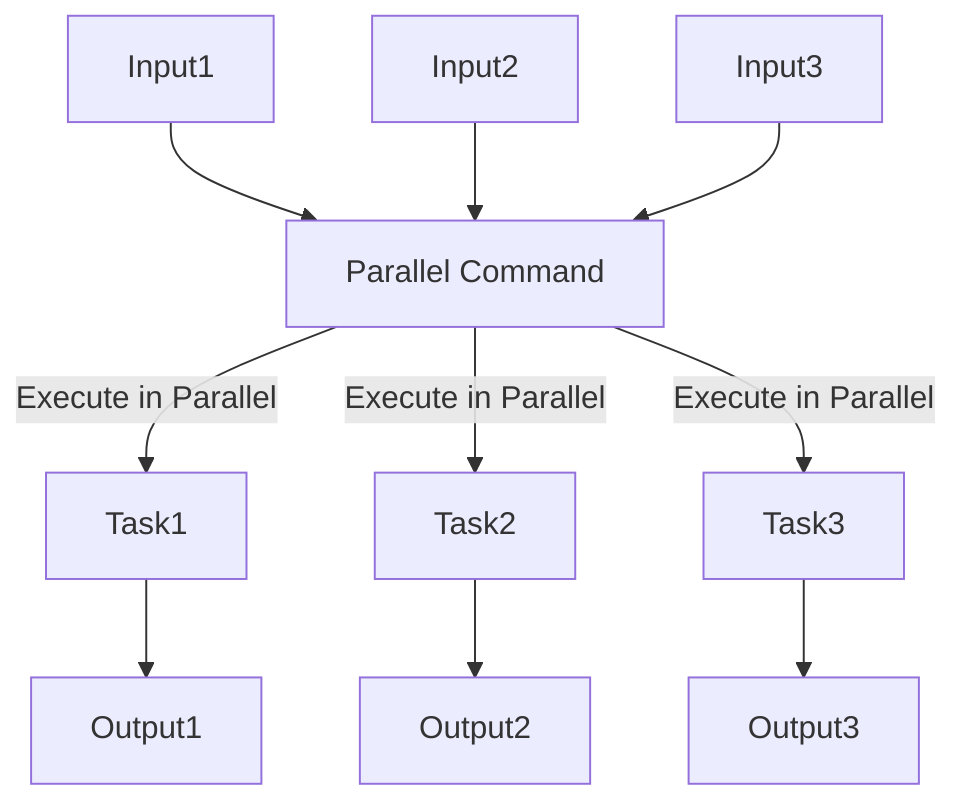

# راهنمای دستور `parallel` در Bash

## مقدمه‌ای بر پاراللیسم (Parallelism)

**پاراللیسم** (Parallelism) به مفهوم اجرای همزمان چندین عملیات به منظور بهبود کارایی و کاهش زمان اجرای کل برنامه است. در سیستم‌های چندپردازنده‌ای، می‌توان چندین کار را به‌صورت همزمان اجرا کرد. در Bash، از ابزارهایی مانند `parallel` برای اجرای دستورات به‌صورت موازی استفاده می‌شود. دستور `parallel` به شما امکان می‌دهد چندین کار یا دستور را به‌طور همزمان و کارآمد روی داده‌های ورودی اجرا کنید.

### چرا از پاراللیسم استفاده کنیم؟

1. **کاهش زمان اجرا**: با اجرای همزمان دستورات، زمان کلی کاهش می‌یابد.
2. **افزایش کارایی**: استفاده بهینه از منابع سیستم، به خصوص در سیستم‌های چندپردازنده.
3. **کارایی بالا در پردازش داده‌های بزرگ**: اجرای موازی برای پردازش سریع‌تر داده‌های حجیم.

## دستور `parallel`

دستور `parallel` یک ابزار خط فرمان در یونیکس و لینوکس است که به کاربر امکان می‌دهد دستورات را به‌صورت همزمان روی چندین ورودی اجرا کند. این دستور به‌خصوص برای عملیات‌هایی که می‌توانند به‌طور مستقل انجام شوند مفید است.

### نحوه نصب `parallel`

روی اکثر سیستم‌های لینوکسی، می‌توانید `parallel` را با استفاده از مدیر بسته‌ها نصب کنید. برای مثال:

```bash
# در Debian و Ubuntu
sudo apt-get install parallel

# در Red Hat و CentOS
sudo yum install parallel
```

### سینتکس کلی

```bash
parallel [گزینه‌ها] دستور ::: ورودی‌ها
```

در اینجا:

- `دستور` همان دستوری است که می‌خواهید به‌صورت موازی اجرا کنید.
- `::: ورودی‌ها` لیستی از ورودی‌ها است که برای هر یک از آن‌ها دستور به‌طور همزمان اجرا می‌شود.

### مثال‌های ساده

1. **اجرای همزمان چندین دستور `echo`**:

   ```bash
   parallel echo ::: "سلام" "به" "دنیای" "پاراللیسم" "خوش‌آمدید"
   ```

   این دستور عبارت‌های مختلف را به‌طور همزمان نمایش می‌دهد.

2. **اجرای همزمان یک اسکریپت روی فایل‌های مختلف**:

   فرض کنید اسکریپتی به نام `process.sh` دارید که روی یک فایل ورودی پردازش خاصی انجام می‌دهد. می‌توانید این اسکریپت را برای هر فایل به‌صورت موازی اجرا کنید:

   ```bash
   parallel ./process.sh ::: file1.txt file2.txt file3.txt
   ```

3. **پردازش همزمان داده‌های خروجی یک دستور دیگر**:

   فرض کنید می‌خواهید روی نتایج دستور `ls` پردازش موازی انجام دهید:

   ```bash
   ls | parallel -j 4 gzip
   ```

   این دستور تمامی فایل‌های موجود در دایرکتوری فعلی را به صورت موازی و با استفاده از 4 پردازنده، فشرده می‌کند.

## گزینه‌های پرکاربرد دستور `parallel`

- **`-j`**: تعیین تعداد پردازنده‌ها. با استفاده از `-j` می‌توانید تعداد پردازش‌های همزمان را مشخص کنید. برای مثال، `-j 4` به معنای استفاده از 4 پردازنده است.
- **`-a`**: خواندن ورودی‌ها از یک فایل.
- **`--dry-run`**: نمایش دستورات بدون اجرا؛ برای خطایابی قبل از اجرا مفید است.
- **`--bar`**: نمایش نوار پیشرفت در حین اجرا.
- **`--timeout`**: تنظیم حداکثر زمان اجرا برای هر دستور.

### مثال‌های پیشرفته با گزینه‌ها

1. **محدود کردن تعداد پردازنده‌ها با `-j`**:

   ```bash
   parallel -j 2 echo ::: "Task 1" "Task 2" "Task 3" "Task 4"
   ```

   در این مثال، تنها دو دستور به‌طور همزمان اجرا می‌شود.

2. **استفاده از `--bar` برای نمایش نوار پیشرفت**:

   ```bash
   parallel --bar echo ::: {1..100}
   ```

   این دستور اعداد 1 تا 100 را چاپ می‌کند و نوار پیشرفت را در طول اجرا نمایش می‌دهد.

3. **استفاده از `--dry-run` برای پیش‌نمایش دستورات**:

   ```bash
   parallel --dry-run echo ::: "سلام" "جهان"
   ```

   این دستور بدون اجرا، تنها دستوراتی که قرار است اجرا شوند را نمایش می‌دهد.

## مفهوم پاراللیسم با دستور `parallel`

به کمک `parallel`، می‌توانید به صورت همزمان چندین دستور یا اسکریپت را بر روی مجموعه‌ای از داده‌ها اجرا کنید. به این ترتیب، هر دستور بدون انتظار برای اتمام دستورات دیگر اجرا می‌شود، که این فرآیند را می‌توان به شکل زیر نشان داد:



### توضیحات گراف

1. ورودی‌های مختلف (Input1, Input2, Input3) وارد `parallel` می‌شوند.
2. `parallel` این ورودی‌ها را به صورت همزمان برای اجرای دستورات (Task1, Task2, Task3) می‌فرستد.
3. هر کار (Task) به طور مستقل اجرا می‌شود و خروجی خاص خود را تولید می‌کند.

## مزایای استفاده از `parallel`

- **افزایش سرعت پردازش**: به دلیل استفاده از چندین پردازش همزمان، عملیات‌ها سریع‌تر انجام می‌شوند.
- **استفاده بهینه از منابع سیستم**: به‌ویژه در سرورها و سیستم‌های چندپردازنده‌ای، `parallel` به شما اجازه می‌دهد که از تمامی منابع سیستم بهینه استفاده کنید.
- **سادگی در کدنویسی**: با `parallel` نیازی به نوشتن حلقه‌ها و مدیریت دستی پردازش‌ها نیست.

## نکات و ترفندها

1. **استفاده از `--eta` برای پیش‌بینی زمان اتمام**:

   اگر می‌خواهید زمان تخمینی اتمام عملیات را ببینید، می‌توانید از `--eta` استفاده کنید.

   ```bash
   parallel --eta echo ::: {1..100}
   ```

2. **پردازش خطوط فایل با `-a`**:

   می‌توانید ورودی‌ها را از یک فایل با استفاده از `-a` بخوانید.

   ```bash
   parallel -a input_file.txt echo
   ```

3. **اجرا به صورت تعاملی**:

   اگر می‌خواهید دستورات به صورت تعاملی اجرا شوند و خروجی بلافاصله نمایش داده شود، از `--tty` استفاده کنید.

   ```bash
   parallel --tty echo ::: "Hello" "World"
   ```

## جمع‌بندی

دستور `parallel` یک ابزار قدرتمند برای مدیریت پردازش‌های موازی در Bash است که با استفاده از آن می‌توانید چندین کار را به‌طور همزمان اجرا کنید و بهره‌وری سیستم را افزایش دهید. این دستور با گزینه‌های متنوع خود، امکان کنترل دقیق تعداد پردازنده‌ها، مدیریت ورودی‌ها و خروجی‌ها و بهبود سرعت اجرا را فراهم می‌کند.
